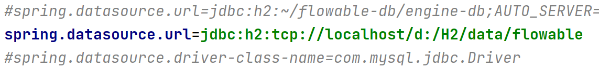

# BPMN 2.0 

## 介绍

### 什么是BPMN 2.0

BPMN是一个被广泛接受与支持的，展现流程的注记方法，他是一个行业标准

### 定义流程

BPMN 2.0 流程定义文件（后面统称流程定义文件）以 `.bpmn20.xml` 或 `.bpmn` 为文件后缀

流程定义文件的根元素是 `definitions` ，在根元素内可以定义多个流程定义（对应 `process` 元素），但是为了方便以后的维护，官方建议一个流程定义文件里只定义一个流程定义。

一个空的流程定义如下所示：

```xml
<definitions
  xmlns="http://www.omg.org/spec/BPMN/20100524/MODEL"
  xmlns:flowable="http://flowable.org/bpmn"
  targetNamespace="Examples">

  <process id="myProcess" name="My First Process">
    ..
  </process>

</definitions>
```

注意 `definitions` 元素至少需要包含 `xmlns` 与 `targetNamespace` 声明，但是 `targetNamespace` 允许为空。关于 `targetNamespace` 的作用，查看[部署](部署.md#类别)部分内容。

这里介绍表示流程定义的 `process` 元素的两个属性：

* id 必填，对应 `ProcessDefinition` 对象实例的 `key` 属性。此id属性通常还会被用来启动流程实例 —— `ProcessInstance processInstance = runtimeService.startProcessInstanceByKey("myProcess");` 。前面的方法每次调用时都取最近的部署版本的流程定义。注意 `startProcessInstanceByKey` 方法与 `startProcessInstanceById` 方法不同，后者接受的是部署时产生的[id](部署.md#流程定义的版本)，并且长度也有限制（64个字符）。
* name 选填，[将映射为 `ProcessDefinition` 对象实例的 `name` 属性](部署.md#流程定义的版本)。引擎本身不会使用这个参数，但它可以提升用户交互性（比如显示更容易让人理解的名字）。


### 示例

###### 前置准备

1. 本地独立的h2服务器，并修改数据库连接url为 `jdbc.url=jdbc:h2:tcp://localhost/flowable` 
2. 修改 `flowable-ui` 的[配置文件](https://github.com/flowable/flowable-engine/blob/main/modules/flowable-ui/flowable-ui-app/src/main/resources/flowable-default.properties)，把数据源信息修改为本地独立的h2服务器信息：
   1. 

   2. 

###### 用例

有一个公司，叫做BPMCorp。在BPMCorp中，由会计部门负责，每月需要为股东撰写一份报告。在报告完成后，需要高层经理中的一人进行审核，然后才能发给所有投资人。

###### 流程图


如上所示，流程图由启动事件、撰写月度财务报告的用户任务、审核月度财务报告的用户任务和结束事件组成。

###### XML格式

```xml
<definitions id="definitions"
  targetNamespace="http://flowable.org/bpmn20"
  xmlns:flowable="http://flowable.org/bpmn"
  xmlns="http://www.omg.org/spec/BPMN/20100524/MODEL">

    <process id="financialReport" name="Monthly financial report reminder process">

      <startEvent id="theStart" />

      <sequenceFlow id="flow1" sourceRef="theStart" targetRef="writeReportTask" />

      <userTask id="writeReportTask" name="Write monthly financial report" >
        <documentation>
          Write monthly financial report for publication to shareholders.
        </documentation>
        <potentialOwner>
          <resourceAssignmentExpression>
            <formalExpression>accountancy</formalExpression>
          </resourceAssignmentExpression>
        </potentialOwner>
      </userTask>

      <sequenceFlow id="flow2" sourceRef="writeReportTask" targetRef="verifyReportTask" />

      <userTask id="verifyReportTask" name="Verify monthly financial report" >
        <documentation>
          Verify monthly financial report composed by the accountancy department.
          This financial report is going to be sent to all the company shareholders.
        </documentation>
        <potentialOwner>
          <resourceAssignmentExpression>
            <formalExpression>management</formalExpression>
          </resourceAssignmentExpression>
        </potentialOwner>
      </userTask>

      <sequenceFlow id="flow3" sourceRef="verifyReportTask" targetRef="theEnd" />

      <endEvent id="theEnd" />

    </process>

</definitions>
```

上述xml代码中，启动事件对应 `startEvent` 元素，用户任务对应 `userTask` 元素，结束事件对应 `endEvent` 元素。每个元素之间通过 `sequenceFlow` (顺序流) 元素连接，并且用顺序流元素的 `sourceRef` 属性和 `targetRef` 属性指定流向。其中用户任务被分别分配给了 `accountancy` 和 `management` 组。// TODO: 补充任务分配部分链接

###### 启动流程实例

在这个例子中，一个流程实例将对应某一月份的财经报告创建与审核工作，所有月份的流程实例共享相同的流程定义。

启动流程实例前，我们需要先部署流程定义：

```java
Deployment deployment = repositoryService.createDeployment()
                .addClasspathResource("FinancialReportProcess.bpmn20.xml")
                .deploy();
```

部署完流程定义就可以启动流程实例了：

```java
ProcessInstance processInstance = runtimeService.startProcessInstanceByKey("financialReport");
```

流程实例启动后到用户任务处会停止，因为用户任务需要人工处理，这被叫做等待状态。flowable的[事务特性](开始.md#题外话，事务)和[持久化特性](Flowable-API.md#瞬时变量)会与等待状态有关。

###### 任务列表

我们可以通过下列代码获取任务列表：

```java
TaskService taskService = processEngine.getTaskService();
List<Task> tasks = taskService.createTaskQuery().taskCandidateGroup("accountancy").list();
```

上面的代码获取了属于会计组的用户任务。

然后我们启动 `flowable-ui` [这个应用](https://github.com/flowable/flowable-engine/blob/main/modules/flowable-ui/flowable-ui-app/src/main/java/org/flowable/ui/application/FlowableUiApplication.javahttps://github.com/flowable/flowable-engine/blob/main/modules/flowable-ui/flowable-ui-app/src/main/java/org/flowable/ui/application/FlowableUiApplication.java)，创建两个新用户 `kermit` 和 `fozzie` :


再创建两个组 `accountancy` 和 `management` : 

// TODO: 待验证 `flowable-ui` 中的组的组id和名称到底哪个才是被使用的


把 `kermit` 分配给 `accountancy` 组，把 `fozzie` 组分配给 `management` 组：


我们再给 `accountancy` 和 `management` 两个组分配权限：


现在用 `kermit` 重新登录 `flowable-ui` 应用，点击下面的页面，可以启动流程实例：


流程执行到用户任务处会停止，第一个用户任务便是由会计组处理的，由于 `kermit` 是会计组的一员，所以可以在下面的页面查看到它有任务待处理。并且会计组的每一个成员都能看到这个任务，也有权限去处理。


注意上面的筛选条件。

###### 申领任务

会计组的成员可以申领任务，申领任务后，申领任务的用户会成为任务的执行人（assignee）。任务被申领后，该任务会从会计组中其它成员中的任务列表中消失，出现在申领任务者的个人任务列表中。

下面的代码可以实现申领任务：

```java
taskService.claim(task.getId(), "kermit");
```

下面的代码可以实现查询任务执行人为某个人的任务列表：

```java
List<Task> kermitTasks = taskService.createTaskQuery().taskAssignee("kermit").list();
```

// FIXME: 与Github `flowable-ui` 同样版本的Maven `flowable-engine` 数据库版本不一致

你也可以通过点击如下 `flowable-ui` 应用里的位置进行申领任务：


###### 完成任务

代码上通过 `TaskService` 的 `complete` 方法实现：

```java
taskService.complete(task.getId());
```

你也可以通过 `flowable-ui` 应用进行操作：


当任务完成后，流程又会继续执行直到下一个用户任务，这里是“经理进行审批”。对于“经理进行审批”的用户任务上面所描述的同样也适用。

###### 结束流程

示例中的“经理进行审批”的用户任务执行完，流程会移至结束事件并结束流程实例，同时所有相关的运行时执行数据都会从数据库中移除。

我们可以通过下面的代码验证流程是否结束：

```java
HistoryService historyService = processEngine.getHistoryService();
HistoricProcessInstance historicProcessInstance =
                historyService.createHistoricProcessInstanceQuery().processInstanceId(processInstance.getProcessInstanceId()).singleResult();
logger.info("Process instance end time: " + historicProcessInstance.getEndTime());
```

我们也可以通过 `flowable-ui` 验证流程是否结束：


###### 完整的代码流程

```java
package org.fade.demo.flowabledemo.bpmn;

import cn.hutool.core.lang.Assert;
import cn.hutool.setting.dialect.Props;
import org.flowable.engine.*;
import org.flowable.engine.history.HistoricProcessInstance;
import org.flowable.engine.impl.cfg.StandaloneProcessEngineConfiguration;
import org.flowable.engine.repository.Deployment;
import org.flowable.engine.runtime.ProcessInstance;
import org.flowable.task.api.Task;
import org.slf4j.Logger;
import org.slf4j.LoggerFactory;

import java.util.List;

/**
 * @author fade
 * @date 2021/10/09
 */
public class Main {

    private static final Logger logger = LoggerFactory.getLogger(Main.class);

    public static void main(String[] args) {
        Props props = new Props("db.properties");
//        String jdbcUrl = props.getProperty("ui-url");
        String jdbcUrl = props.getProperty("java-url");
        String username = props.getProperty("username");
        String password = props.getProperty("password");
        Assert.notBlank(jdbcUrl, "jdbcUrl is illegal");
        Assert.notBlank(username, "username is illegal");
        Assert.notNull(password, "password can not be null");
        ProcessEngineConfiguration cfg = new StandaloneProcessEngineConfiguration()
                .setJdbcUrl(jdbcUrl)
                .setJdbcUsername(username)
                .setJdbcPassword(password)
                .setJdbcDriver("org.h2.Driver")
                .setDatabaseSchemaUpdate(ProcessEngineConfiguration.DB_SCHEMA_UPDATE_TRUE);
        ProcessEngine processEngine = cfg.buildProcessEngine();
        // 部署流程定义
        RepositoryService repositoryService = processEngine.getRepositoryService();
        Deployment deployment = repositoryService.createDeployment()
                .addClasspathResource("FinancialReportProcess.bpmn20.xml")
                .deploy();
        // 启动流程实例
        RuntimeService runtimeService = processEngine.getRuntimeService();
        ProcessInstance processInstance = runtimeService.startProcessInstanceByKey("financialReport");
        // 获取任务列表
        TaskService taskService = processEngine.getTaskService();
        List<Task> tasks = taskService.createTaskQuery().taskCandidateGroup("accountancy").list();
        logger.info("Accountancy group has " + tasks.size() + " task(s)");
        // 申领任务
        taskService.claim(tasks.get(0).getId(), "kermit");
        // 查询任务执行人为kermit的任务列表
        List<Task> kermitTasks = taskService.createTaskQuery().taskAssignee("kermit").list();
        logger.info("Kermit has " + kermitTasks.size() + " task(s)");
        // 完成任务
//        taskService.complete(tasks.get(0).getId());
        tasks.forEach(task -> {
            taskService.complete(task.getId());
        });
        kermitTasks = taskService.createTaskQuery().taskAssignee("kermit").list();
        logger.info("Kermit has " + kermitTasks.size() + " task(s)");
        tasks = taskService.createTaskQuery().taskCandidateGroup("management").list();
        logger.info("Management group has " + tasks.size() + " task(s)");
        tasks.forEach(task -> {
            taskService.complete(task.getId());
        });
        tasks = taskService.createTaskQuery().taskCandidateGroup("management").list();
        logger.info("Management group has " + tasks.size() + " task(s)");
        // 验证流程是否结束
        HistoryService historyService = processEngine.getHistoryService();
        HistoricProcessInstance historicProcessInstance =
                historyService.createHistoricProcessInstanceQuery().processInstanceId(processInstance.getProcessInstanceId()).singleResult();
        logger.info("Process instance end time: " + historicProcessInstance.getEndTime());
    }

}
```

## 结构

### 自定义扩展

Flowable将开发者的感受放在最高优先级，因此它引入了一些'Flowable BPMN扩展（extensions）'。这些“扩展”并不在BPMN 2.0规格中，有些是新结构，有些是对特定结构的简化。尽管BPMN 2.0规格明确指出可以支持自定义扩展，但是flowable仍做了一些保证：

* 自定义扩展保证是在标准方式的基础上进行简化
* 使用自定义扩展时，总是通过flowable:命名空间前缀，明确标识出XML元素、属性等。注意Flowable引擎也支持activiti:命名空间前缀。

### 事件

事件（event）通常用于为流程生命周期中发生的事情建模。事件总是被图形化为圆圈。在BPMN 2.0中，有两种主要的事件：捕获（catching）与抛出（throwing）事件。


* `Catching` 当流程执行到达这个事件时，会等待直到触发器触发。捕获事件内部的图标没有填充（即是白色的）。
* `Throwing` 当流程执行到达这个事件时，会触发一个触发器。抛出事件内部的图标填充为黑色。

###### 事件定义

事件定义（event definition），用于定义事件的语义。没有事件定义的话，事件就“不做什么特别的事情”。例如，一个没有事件定义的开始事件，并不限定具体是什么启动了流程。如果为这个开始事件添加事件定义（例如定时器事件定义），就声明了启动流程的“类型”。

###### 定时器事件定义

定时器事件（ `timerEventDefinition` ），是由定时器所触发的事件。可以用于开始事件，中间事件，或边界事件。定时器事件的行为取决于所使用的业务日历（business calendar）。定时器事件有默认的业务日历，但也可以为每个定时器事件单独定义业务日历。


// TODO: 补充开始事件、中间事件和边界事件链接

