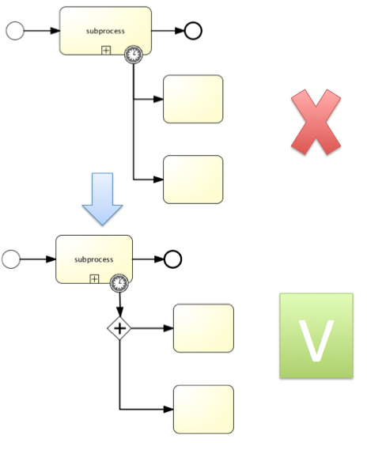
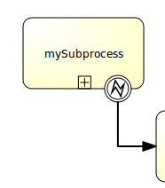
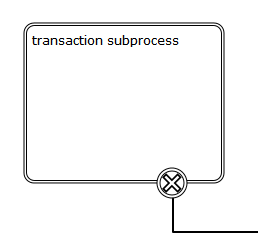

# BPMN 2.0 

## 介绍

### 什么是BPMN 2.0

BPMN是一个被广泛接受与支持的，展现流程的注记方法，他是一个行业标准

### 定义流程

BPMN 2.0 流程定义文件（后面统称流程定义文件）以 `.bpmn20.xml` 或 `.bpmn` 为文件后缀

流程定义文件的根元素是 `definitions` ，在根元素内可以定义多个流程定义（对应 `process` 元素），但是为了方便以后的维护，官方建议一个流程定义文件里只定义一个流程定义。

一个空的流程定义如下所示：

```xml
<definitions
  xmlns="http://www.omg.org/spec/BPMN/20100524/MODEL"
  xmlns:flowable="http://flowable.org/bpmn"
  targetNamespace="Examples">

  <process id="myProcess" name="My First Process">
    ..
  </process>

</definitions>
```

注意 `definitions` 元素至少需要包含 `xmlns` 与 `targetNamespace` 声明，但是 `targetNamespace` 允许为空。关于 `targetNamespace` 的作用，查看[部署](部署.md#类别)部分内容。

这里介绍表示流程定义的 `process` 元素的两个属性：

* id 必填，对应 `ProcessDefinition` 对象实例的 `key` 属性。此id属性通常还会被用来启动流程实例 —— `ProcessInstance processInstance = runtimeService.startProcessInstanceByKey("myProcess");` 。前面的方法每次调用时都取最近的部署版本的流程定义。注意 `startProcessInstanceByKey` 方法与 `startProcessInstanceById` 方法不同，后者接受的是部署时产生的[id](部署.md#流程定义的版本)，并且长度也有限制（64个字符）。
* name 选填，[将映射为 `ProcessDefinition` 对象实例的 `name` 属性](部署.md#流程定义的版本)。引擎本身不会使用这个参数，但它可以提升用户交互性（比如显示更容易让人理解的名字）。


### 示例

###### 前置准备

1. 本地独立的h2服务器，并修改数据库连接url为 `jdbc.url=jdbc:h2:tcp://localhost/flowable` 
2. 修改 `flowable-ui` 的[配置文件](https://github.com/flowable/flowable-engine/blob/main/modules/flowable-ui/flowable-ui-app/src/main/resources/flowable-default.properties)，把数据源信息修改为本地独立的h2服务器信息：
   1. 

   2. 

###### 用例

有一个公司，叫做BPMCorp。在BPMCorp中，由会计部门负责，每月需要为股东撰写一份报告。在报告完成后，需要高层经理中的一人进行审核，然后才能发给所有投资人。

###### 流程图


如上所示，流程图由启动事件、撰写月度财务报告的用户任务、审核月度财务报告的用户任务和结束事件组成。

###### XML格式

```xml
<definitions id="definitions"
  targetNamespace="http://flowable.org/bpmn20"
  xmlns:flowable="http://flowable.org/bpmn"
  xmlns="http://www.omg.org/spec/BPMN/20100524/MODEL">

    <process id="financialReport" name="Monthly financial report reminder process">

      <startEvent id="theStart" />

      <sequenceFlow id="flow1" sourceRef="theStart" targetRef="writeReportTask" />

      <userTask id="writeReportTask" name="Write monthly financial report" >
        <documentation>
          Write monthly financial report for publication to shareholders.
        </documentation>
        <potentialOwner>
          <resourceAssignmentExpression>
            <formalExpression>accountancy</formalExpression>
          </resourceAssignmentExpression>
        </potentialOwner>
      </userTask>

      <sequenceFlow id="flow2" sourceRef="writeReportTask" targetRef="verifyReportTask" />

      <userTask id="verifyReportTask" name="Verify monthly financial report" >
        <documentation>
          Verify monthly financial report composed by the accountancy department.
          This financial report is going to be sent to all the company shareholders.
        </documentation>
        <potentialOwner>
          <resourceAssignmentExpression>
            <formalExpression>management</formalExpression>
          </resourceAssignmentExpression>
        </potentialOwner>
      </userTask>

      <sequenceFlow id="flow3" sourceRef="verifyReportTask" targetRef="theEnd" />

      <endEvent id="theEnd" />

    </process>

</definitions>
```

上述xml代码中，启动事件对应 `startEvent` 元素，用户任务对应 `userTask` 元素，结束事件对应 `endEvent` 元素。每个元素之间通过 `sequenceFlow` (顺序流) 元素连接，并且用顺序流元素的 `sourceRef` 属性和 `targetRef` 属性指定流向。其中用户任务被分别分配给了 `accountancy` 和 `management` 组。// TODO: 补充任务分配部分链接

###### 启动流程实例

在这个例子中，一个流程实例将对应某一月份的财经报告创建与审核工作，所有月份的流程实例共享相同的流程定义。

启动流程实例前，我们需要先部署流程定义：

```java
Deployment deployment = repositoryService.createDeployment()
                .addClasspathResource("FinancialReportProcess.bpmn20.xml")
                .deploy();
```

部署完流程定义就可以启动流程实例了：

```java
ProcessInstance processInstance = runtimeService.startProcessInstanceByKey("financialReport");
```

流程实例启动后到用户任务处会停止，因为用户任务需要人工处理，这被叫做等待状态。flowable的[事务特性](开始.md#题外话，事务)和[持久化特性](Flowable-API.md#瞬时变量)会与等待状态有关。

###### 任务列表

我们可以通过下列代码获取任务列表：

```java
TaskService taskService = processEngine.getTaskService();
List<Task> tasks = taskService.createTaskQuery().taskCandidateGroup("accountancy").list();
```

上面的代码获取了属于会计组的用户任务。

然后我们启动 `flowable-ui` [这个应用](https://github.com/flowable/flowable-engine/blob/main/modules/flowable-ui/flowable-ui-app/src/main/java/org/flowable/ui/application/FlowableUiApplication.javahttps://github.com/flowable/flowable-engine/blob/main/modules/flowable-ui/flowable-ui-app/src/main/java/org/flowable/ui/application/FlowableUiApplication.java)，创建两个新用户 `kermit` 和 `fozzie` :


再创建两个组 `accountancy` 和 `management` : 

// TODO: 待验证 `flowable-ui` 中的组的组id和名称到底哪个才是被使用的


把 `kermit` 分配给 `accountancy` 组，把 `fozzie` 组分配给 `management` 组：


我们再给 `accountancy` 和 `management` 两个组分配权限：


现在用 `kermit` 重新登录 `flowable-ui` 应用，点击下面的页面，可以启动流程实例：


流程执行到用户任务处会停止，第一个用户任务便是由会计组处理的，由于 `kermit` 是会计组的一员，所以可以在下面的页面查看到它有任务待处理。并且会计组的每一个成员都能看到这个任务，也有权限去处理。


注意上面的筛选条件。

###### 申领任务

会计组的成员可以申领任务，申领任务后，申领任务的用户会成为任务的执行人（assignee）。任务被申领后，该任务会从会计组中其它成员中的任务列表中消失，出现在申领任务者的个人任务列表中。

下面的代码可以实现申领任务：

```java
taskService.claim(task.getId(), "kermit");
```

下面的代码可以实现查询任务执行人为某个人的任务列表：

```java
List<Task> kermitTasks = taskService.createTaskQuery().taskAssignee("kermit").list();
```

// FIXME: 与Github `flowable-ui` 同样版本的Maven `flowable-engine` 数据库版本不一致

你也可以通过点击如下 `flowable-ui` 应用里的位置进行申领任务：


###### 完成任务

代码上通过 `TaskService` 的 `complete` 方法实现：

```java
taskService.complete(task.getId());
```

你也可以通过 `flowable-ui` 应用进行操作：


当任务完成后，流程又会继续执行直到下一个用户任务，这里是“经理进行审批”。对于“经理进行审批”的用户任务上面所描述的同样也适用。

###### 结束流程

示例中的“经理进行审批”的用户任务执行完，流程会移至结束事件并结束流程实例，同时所有相关的运行时执行数据都会从数据库中移除。

我们可以通过下面的代码验证流程是否结束：

```java
HistoryService historyService = processEngine.getHistoryService();
HistoricProcessInstance historicProcessInstance =
                historyService.createHistoricProcessInstanceQuery().processInstanceId(processInstance.getProcessInstanceId()).singleResult();
logger.info("Process instance end time: " + historicProcessInstance.getEndTime());
```

我们也可以通过 `flowable-ui` 验证流程是否结束：


###### 完整的代码流程

```java
package org.fade.demo.flowabledemo.bpmn;

import cn.hutool.core.lang.Assert;
import cn.hutool.setting.dialect.Props;
import org.flowable.engine.*;
import org.flowable.engine.history.HistoricProcessInstance;
import org.flowable.engine.impl.cfg.StandaloneProcessEngineConfiguration;
import org.flowable.engine.repository.Deployment;
import org.flowable.engine.runtime.ProcessInstance;
import org.flowable.task.api.Task;
import org.slf4j.Logger;
import org.slf4j.LoggerFactory;

import java.util.List;

/**
 * @author fade
 * @date 2021/10/09
 */
public class Main {

    private static final Logger logger = LoggerFactory.getLogger(Main.class);

    public static void main(String[] args) {
        Props props = new Props("db.properties");
//        String jdbcUrl = props.getProperty("ui-url");
        String jdbcUrl = props.getProperty("java-url");
        String username = props.getProperty("username");
        String password = props.getProperty("password");
        Assert.notBlank(jdbcUrl, "jdbcUrl is illegal");
        Assert.notBlank(username, "username is illegal");
        Assert.notNull(password, "password can not be null");
        ProcessEngineConfiguration cfg = new StandaloneProcessEngineConfiguration()
                .setJdbcUrl(jdbcUrl)
                .setJdbcUsername(username)
                .setJdbcPassword(password)
                .setJdbcDriver("org.h2.Driver")
                .setDatabaseSchemaUpdate(ProcessEngineConfiguration.DB_SCHEMA_UPDATE_TRUE);
        ProcessEngine processEngine = cfg.buildProcessEngine();
        // 部署流程定义
        RepositoryService repositoryService = processEngine.getRepositoryService();
        Deployment deployment = repositoryService.createDeployment()
                .addClasspathResource("FinancialReportProcess.bpmn20.xml")
                .deploy();
        // 启动流程实例
        RuntimeService runtimeService = processEngine.getRuntimeService();
        ProcessInstance processInstance = runtimeService.startProcessInstanceByKey("financialReport");
        // 获取任务列表
        TaskService taskService = processEngine.getTaskService();
        List<Task> tasks = taskService.createTaskQuery().taskCandidateGroup("accountancy").list();
        logger.info("Accountancy group has " + tasks.size() + " task(s)");
        // 申领任务
        taskService.claim(tasks.get(0).getId(), "kermit");
        // 查询任务执行人为kermit的任务列表
        List<Task> kermitTasks = taskService.createTaskQuery().taskAssignee("kermit").list();
        logger.info("Kermit has " + kermitTasks.size() + " task(s)");
        // 完成任务
//        taskService.complete(tasks.get(0).getId());
        tasks.forEach(task -> {
            taskService.complete(task.getId());
        });
        kermitTasks = taskService.createTaskQuery().taskAssignee("kermit").list();
        logger.info("Kermit has " + kermitTasks.size() + " task(s)");
        tasks = taskService.createTaskQuery().taskCandidateGroup("management").list();
        logger.info("Management group has " + tasks.size() + " task(s)");
        tasks.forEach(task -> {
            taskService.complete(task.getId());
        });
        tasks = taskService.createTaskQuery().taskCandidateGroup("management").list();
        logger.info("Management group has " + tasks.size() + " task(s)");
        // 验证流程是否结束
        HistoryService historyService = processEngine.getHistoryService();
        HistoricProcessInstance historicProcessInstance =
                historyService.createHistoricProcessInstanceQuery().processInstanceId(processInstance.getProcessInstanceId()).singleResult();
        logger.info("Process instance end time: " + historicProcessInstance.getEndTime());
    }

}
```

## 结构

### 自定义扩展

Flowable将开发者的感受放在最高优先级，因此它引入了一些'Flowable BPMN扩展（extensions）'。这些“扩展”并不在BPMN 2.0规格中，有些是新结构，有些是对特定结构的简化。尽管BPMN 2.0规格明确指出可以支持自定义扩展，但是flowable仍做了一些保证：

* 自定义扩展保证是在标准方式的基础上进行简化
* 使用自定义扩展时，总是通过flowable:命名空间前缀，明确标识出XML元素、属性等。注意Flowable引擎也支持activiti:命名空间前缀。

### 事件

事件（event）通常用于为流程生命周期中发生的事情建模。事件总是被图形化为圆圈。在BPMN 2.0中，有两种主要的事件：捕获（catching）与抛出（throwing）事件。


* `Catching` 当流程执行到达这个事件时，会等待直到触发器触发。捕获事件内部的图标没有填充（即是白色的）。
* `Throwing` 当流程执行到达这个事件时，会触发一个触发器。抛出事件内部的图标填充为黑色。

###### 事件

* ###### 开始事件（对应 `startEvent` 标签）

开始事件是流程的起点。启动事件的类型定义了流程如何启动，流程图中的启动事件中的小图标即代表启动事件的类型。


启动事件的类型在xml中由事件定义子元素定义：

```xml
<startEvent id="theStart">
  <timerEventDefinition>
    <timeDate>2011-03-11T12:13:14</timeDate>
  </timerEventDefinition>
</startEvent>
```

启动事件是捕获事件。

在启动事件中，可以使用下列Flowable自定义参数：

`flowable:initiator` 指明保存认证用户ID用的变量名。在流程启动时，操作用户的ID会保存在这个变量中。

```xml
<startEvent id="request" flowable:initiator="initiator" />
```

认证用户通过调用 `IdentityService` 的 `setAuthenticatedUserId` 方法设置，flowable应用已经集成了此方法的调用，可以在表单中使用。

// TODO: 补充示例

* ###### 空启动事件（对应 `startEvent` 标签）

即未指定启动流程实例触发的事件定义，引擎将无法预知何时启动流程实例，只能通过调用API启动流程实例：

```java
ProcessInstance processInstance = runtimeService.startProcessInstanceByXXX();
```

子流程必须要有空启动事件

空启动事件对应流程图中的图标为：


xml定义为无子元素的标签即可：

```xml
<startEvent id="start" name="my start event" />
```

下面是空启动事件的自定义扩展：

`flowable:formKey` 引用表单定义，用户需要在启动新流程实例时填写该表单。

```xml
<startEvent id="request" flowable:formKey="request" />
```

// TODO: 补充自定义扩展使用示例

* ###### 定时器启动事件（对应含有 `timerEventDefinition` 事件定义的 `startEvent` 标签）

用于创建定时启动的流程实例，子流程不能设置定时器启动事件。定时器事件在被部署时会被调度，无需通过调用API启动流程实例。当部署带有定时器启动事件的流程的新版本时，上一版本的定时器作业会被移除。

定时器启动事件对应流程图中的图标为：


定时器启动事件的xml表述如下所示，具体查看[定时器事件定义](#定时器事件定义)部分内容：

```xml
<startEvent id="theStart">
  <timerEventDefinition>
    <timeCycle>R4/2011-03-11T12:13/PT5M</timeCycle>
  </timerEventDefinition>
</startEvent>
```

* ###### 消息启动事件（对应含有 `messageEventDefinition` 事件定义的 `startEvent` 标签）

使用具名消息启动流程实例，一个流程定义中可以有多个消息启动事件。在部署有消息启动事件的流程定义时，会做如下判断：

* 给定流程定义中，消息启动事件的名字必须是唯一的。一个流程定义不得包含多个同名的消息启动事件。
* 在所有已部署的流程定义中，消息启动事件的名字必须是唯一的。
* 在部署流程定义的新版本时，会取消上一版本的消息订阅。

含有消息启动事件的流程实例可以通过调用 `RuntimeService` 的 `startProcessInstanceByMessage` 方法进行启动：

```java
runtimeService.startProcessInstanceByMessage(...)
```

传递给API的消息名是由 `messageEventDefinition` 标签的 `messageRef` 属性引用的 `message` 标签的name属性值。

并且在启动时还会做以下判断：

* 子流程不支持消息启动事件
* 如果一个流程定义中有多个消息启动事件，可以使用 `runtimeService.startProcessInstanceByMessage(…​)` 选择合适的启动事件
* 如果一个流程定义中有多个消息启动事件与一个空启动事件，则 `runtimeService.startProcessInstanceByKey(…​)` 与 `runtimeService.startProcessInstanceById(…​)` 会使用空启动事件启动流程实例
* 如果一个流程定义中有多个消息启动事件而没有空启动事件，则 `runtimeService.startProcessInstanceByKey(…​)与runtimeService.startProcessInstanceById(…​)` 会抛出异常
* 如果一个流程定义中只有一个消息启动事件，则 `runtimeService.startProcessInstanceByKey(…​)` 与 `runtimeService.startProcessInstanceById(…​)` 会使用这个消息启动事件启动新流程实例
* 如果流程由调用活动（call activity）启动，则只有在下列情况下才支持消息启动事件:
  * 除了消息启动事件之外，流程还有唯一的空启动事件
  * 流程只有唯一的消息启动事件，而没有其他启动事件

消息启动事件对应流程图中的图标为：


消息启动事件的xml表述如下所示，具体查看[消息事件定义](// TODO: 补充链接)部分内容：

```xml
<definitions id="definitions"
  xmlns="http://www.omg.org/spec/BPMN/20100524/MODEL"
  xmlns:flowable="http://flowable.org/bpmn"
  targetNamespace="Examples"
  xmlns:tns="Examples">

  <message id="newInvoice" name="newInvoiceMessage" />

  <process id="invoiceProcess">

    <startEvent id="messageStart" >
        <messageEventDefinition messageRef="tns:newInvoice" />
    </startEvent>
    ...
  </process>

</definitions>
```

// TODO: 补充使用示例

* ###### 信号启动事件（对应含有 `signalEventDefinition` 事件定义的 `startEvent` 标签）

使用具名信号启动流程实例，这个信号可以由[流程实例中的信号抛出中间事件](配置.md#为流程定义增加监听器)，或者API（runtimeService.signalEventReceivedXXX方法）触发。

信号启动事件可以选择异步还是同步启动流程实例。

传递给API的信号名是由 `signalEventDefinition` 标签的 `signalRef` 属性引用的 `signal` 标签的name属性值。

信号启动事件对应流程图中的图标为：


信号启动事件的xml表述如下所示，具体查看[信号事件定义](// TODO: 补充链接)部分内容：

```xml
<signal id="theSignal" name="The Signal" />

<process id="processWithSignalStart1">
  <startEvent id="theStart">
    <signalEventDefinition id="theSignalEventDefinition" signalRef="theSignal"  />
  </startEvent>
  <sequenceFlow id="flow1" sourceRef="theStart" targetRef="theTask" />
  <userTask id="theTask" name="Task in process A" />
  <sequenceFlow id="flow2" sourceRef="theTask" targetRef="theEnd" />
  <endEvent id="theEnd" />
</process>
```

// TODO: 补充使用示例

* ###### 错误启动事件（对应含有 `errorEventDefinition` 事件定义的 `startEvent` 标签）

错误启动事件不能用于启动流程实例，但可用于触发事件子流程。

错误启动事件总是中断。

错误启动事件对应流程图中的图标为：


错误启动事件的xml表述如下所示，具体查看[错误事件定义](// TODO: 补充链接)部分内容：

```xml
<startEvent id="messageStart" >
    <errorEventDefinition errorRef="someError" />
</startEvent>
```

// TODO: 补充使用示例

* ###### 结束事件（对应 `endEvent` 标签）

结束事件表示流程或子流程的结束。结束事件是抛出事件。这意味着当流程执行到达结束事件时，会抛出一个结果。

* ###### 空结束事件（对应 `endEvent` 标签）

空结束事件意味着当到达这个事件时，没有特别指定抛出的结果。因此，引擎除了结束当前执行分支之外，不会多做任何事情。

空结束事件对应流程图中的图标为：


空结束事件的xml表述如下所示：

```xml
<endEvent id="end" name="my end event" />
```

* ###### 错误结束事件（对应含有 `errorEventDefinition` 事件定义的 `endEvent` 标签）

当流程执行到达错误结束事件时，结束执行的当前分支，并抛出错误。这个错误可以由匹配的[错误边界中间事件](// TODO: 补充链接)捕获。如果找不到匹配的错误边界事件，将会抛出异常。

错误结束事件对应流程图中的图标为：


错误结束事件的xml表述如下所示，具体查看[错误事件定义](// TODO: 补充链接)部分内容：

```xml
<endEvent id="myErrorEndEvent">
  <errorEventDefinition errorRef="myError" />
</endEvent>
```

`errorEventDefinition` 的 `errorRef` 属性可以引用在流程外定义的error元素：

```xml
<error id="myError" errorCode="123" />
...
<process id="myProcess">
...
```

`error` 的 `errorCode` 属性用于查找匹配的错误捕获边界事件。如果 `errorEventDefinition` 的 `errorRef` 不匹配任何已定义的 `error` ，则该 `errorRef` 会用做 `errorCode` 的快捷方式。这个快捷方式是Flowable特有的。即下面的这两段代码作用是一样的：

```xml
<error id="myError" errorCode="error123" />
...
<process id="myProcess">
...
  <endEvent id="myErrorEndEvent">
    <errorEventDefinition errorRef="myError" />
  </endEvent>
...
```

```xml
<endEvent id="myErrorEndEvent">
  <errorEventDefinition errorRef="error123" />
</endEvent>
```

但请注意 `errorRef` 必须遵从BPMN 2.0 schema ，且必须是合法的QName //TODO: 待理解

// TODO: 待补充使用示例

* ###### 终止结束事件（对应含有 `terminateEventDefinition` 事件定义的 `endEvent` 标签）

当到达终止结束事件时，当前的流程实例或子流程会被终止。也就是说，当执行到达终止结束事件时，会判断第一个范围 scope（流程或子流程）并终止它。请注意在BPMN 2.0中，子流程可以是嵌入式子流程，调用活动，事件子流程，或事务子流程。有一条通用规则：当存在多实例的调用过程或嵌入式子流程时，只会终止一个实例，其他的实例与流程实例不会受影响。

可以添加一个可选属性terminateAll。当其为true时，无论该终止结束事件在流程定义中的位置，也无论它是否在子流程（甚至是嵌套子流程）中，都会终止（根）流程实例。

// TODO: 待理解，比如终止根流程实例，子流程会终止吗

终止结束事件对应流程图中的图标为：


终止结束事件的xml表述如下所示：

```xml
<endEvent id="myEndEvent >
  <terminateEventDefinition flowable:terminateAll="true"></terminateEventDefinition>
</endEvent>
```

// TODO: 补充使用示例

* ###### 取消终止事件（对应含有 `cancelEventDefinition` 事件定义的 `endEvent` 标签）

取消结束事件只能与BPMN事务子流程一起使用。当到达取消结束事件时，会抛出取消事件，且必须由取消边界事件捕获。取消边界事件将取消事务，并触发补偿。

取消结束事件对应流程图中的图标为：


取消结束事件的xml表述如下所示：

```xml
<endEvent id="myCancelEndEvent">
  <cancelEventDefinition />
</endEvent>
```

// TODO: 补充使用示例

* ###### 边界事件（对应 `boundaryEvent` 标签）

边界事件是捕获型事件，依附在活动上。边界事件永远不会抛出。这意味着当活动运行时，事件将监听特定类型的触发器。当捕获到事件时，会终止活动，并沿该事件的出口顺序流继续。

边界事件的xml表述大概如下所示：

```xml
<boundaryEvent id="myBoundaryEvent" attachedToRef="theActivity">
  <XXXEventDefinition/>
</boundaryEvent>
```

一个边界事件主要由以下部分组成：

* 全局唯一的标识符（即 `boundaryEvent` 标签的 `id` 属性）
* 对该事件所依附的活动的引用，边界事件及其所依附的活动，应定义在相同级别（即 `boundaryEvent` 的 `attachedToRef` 属性）
* 事件定义子元素（即 `XXXEventDefinition` 子标签）

边界事件存在的问题：

不能在边界事件上附加多个出口顺序流。这个问题的解决方案，是使用一条出口顺序流，指向[并行网关](// TODO: 补充链接)。



* ###### 定时器边界事件（对应含有 `timerEventDefinition` 事件定义的 `boundaryEvent` 标签）

当执行到达边界事件所依附的活动时，将启动定时器。当定时器触发时（例如在特定时间间隔后），可以中断活动，并沿着边界事件的出口顺序流继续执行。

定时器边界事件对应流程图中的图标为：


定时器边界事件的xml表述如下所示，具体查看[定时器事件定义](// TODO: 补充链接)部分内容：

```xml
<boundaryEvent id="escalationTimer" cancelActivity="true" attachedToRef="firstLineSupport">
  <timerEventDefinition>
    <timeDuration>PT4H</timeDuration>
  </timerEventDefinition>
</boundaryEvent>
```

中断与非中断定时器事件是不同的。非中断意味着最初的活动不会被中断，而会保持原样。默认为中断行为。在XML表示中，非中断需要将 `boundaryEvent` 的 `cancelActivity` 属性设置为false，对应流程图中的图标边框用虚线显示：


定时器边界事件只有在异步执行器启用时才能触发，配置启用异步执行器参考[这个链接](集成Spring-Boot.md#配置flowable应用)。

// TODO: 补充使用示例

* ###### 错误边界事件（对应含有 `errorEventDefinition` 事件定义的 `boundaryEvent` 标签）

错误边界事件捕获其所依附的活动范围内抛出的错误。

在嵌入式子流程或调用活动上定义错误边界事件最有意义，因为子流程的范围会包括其中的所有活动。错误可以由错误结束事件抛出。这样的错误会逐层向其上级父范围传播，直到在范围内找到一个匹配错误事件定义的错误边界事件。

当捕获错误事件时，会销毁边界事件定义所在的活动，同时销毁其中所有的当前执行（例如，并行活动，嵌套子流程，等等）。流程执行将沿着边界事件的出口顺序流继续。

错误边界事件对应流程图中的图标为：



错误边界事件的xml表述如下所示，具体查看[错误事件定义](// TODO: 补充链接)部分内容：

```xml
<boundaryEvent id="catchError" attachedToRef="mySubProcess">
  <errorEventDefinition errorRef="myError"/>
</boundaryEvent>
```

`errorEventDefinition` 的 `errorRef` 属性可以引用在流程外定义的error元素：

```xml
<error id="myError" errorCode="123" />
...
<process id="myProcess">
...
```

错误边界事件的捕获规则为：

* 如果省略了 `errorEventDefinition` 的 `errorRef` 属性，无论 `error` 的 `errorCode` 属性是什么，错误边界事件会捕获所有错误事件。
* 如果提供了 `errorEventDefinition` 的 `errorRef` 属性，并且其引用了存在的 `error` ，则边界事件只会捕获相同错误代码的错误。
* 如果提供了 `errorEventDefinition` 的 `errorRef` 属性，但BPMN 2.0文件中没有定义error，则 `errorEventDefinition` 的 `errorRef` 属性会用作 `error` 的 `errorCode` 属性（与错误结束事件类似）。

例子：


* 流程定义xml文件 `reviewSalesLead.bpmn20.xml`

```xml
<?xml version="1.0" encoding="UTF-8"?>
<definitions xmlns="http://www.omg.org/spec/BPMN/20100524/MODEL"
  xmlns:activiti="http://activiti.org/bpmn"
	xmlns:bpmndi="http://www.omg.org/spec/BPMN/20100524/DI" 
	xmlns:omgdc="http://www.omg.org/spec/DD/20100524/DC"
	xmlns:omgdi="http://www.omg.org/spec/DD/20100524/DI" 
	xmlns:xsi="http://www.w3.org/2001/XMLSchema-instance" 
	targetNamespace="Examples"
	xsi:schemaLocation="http://www.omg.org/spec/BPMN/20100524/MODEL http://www.omg.org/spec/BPMN/2.0/20100501/BPMN20.xsd">
	
	<error id="notEnoughInfoError" errorCode="not_enough_info" />
	
   <process id="reviewSaledLead" name="Review sales lead">
   
      <startEvent id="theStart" activiti:initiator="initiator" />
      <sequenceFlow id="flow1" sourceRef="theStart" targetRef="provideNewSalesLead"/>
      
      <userTask id="provideNewSalesLead" name="Provide new sales lead" activiti:assignee="${initiator}">
        <extensionElements>
          <activiti:formProperty id="customerName" name="Customer name" type="string" required="true"/>
          <activiti:formProperty id="potentialProfit" name="Potential profit" type="long" />
          <activiti:formProperty id="details" name="Details" type="string"/>
        </extensionElements>
      </userTask>
      <sequenceFlow id="flow2" sourceRef="provideNewSalesLead" targetRef="reviewSalesLeadSubProcess"/>
      
      <subProcess id="reviewSalesLeadSubProcess" name="Review sales lead">
         
         <startEvent id="subProcessStart" />
         <sequenceFlow id="flow3" sourceRef="subProcessStart" targetRef="fork"/>
         <sequenceFlow id="flow4" sourceRef="fork" targetRef="reviewProfitability"/>
         
         <parallelGateway id="fork" />
         <sequenceFlow id="flow5" sourceRef="fork" targetRef="reviewCustomerRating"/>
         
         <userTask id="reviewCustomerRating" name="Review customer rating" activiti:candidateGroups="accountancy" />
         <sequenceFlow id="flow6" sourceRef="reviewCustomerRating" targetRef="subProcessEnd1"/>
         
         <endEvent id="subProcessEnd1" />
         
         <userTask id="reviewProfitability" name="Review profitability" activiti:candidateGroups="management">
           <documentation>
             ${initiator} has published a new sales lead: ${customerName}. Details: ${details}
           </documentation> 
            <extensionElements>
			        <activiti:formProperty id="notEnoughInformation" name="Do you believe this customer is profitable?" type="enum" required="true">
			          <activiti:value id="false" name="Yes" />
			          <activiti:value id="true" name="No (= request more info)" />
			        </activiti:formProperty>
            </extensionElements>
         </userTask>
         <sequenceFlow id="flow7" sourceRef="reviewProfitability" targetRef="enoughInformationCheck"/>
         
         <exclusiveGateway id="enoughInformationCheck" name="Enough information?" />
         <sequenceFlow id="flow8" sourceRef="enoughInformationCheck" targetRef="notEnoughInformationEnd">
           <conditionExpression>${notEnoughInformation == 'true'}</conditionExpression>
         </sequenceFlow>
         <sequenceFlow id="flow9" sourceRef="enoughInformationCheck" targetRef="subProcessEnd2">
           <conditionExpression>${notEnoughInformation == 'false'}</conditionExpression>
         </sequenceFlow>
         
         <endEvent id="subProcessEnd2" />
         <endEvent id="notEnoughInformationEnd">
            <errorEventDefinition errorRef="notEnoughInfoError" />
         </endEvent>
         
      </subProcess>
      <sequenceFlow id="flow10" sourceRef="reviewSalesLeadSubProcess" targetRef="storeLeadInCrmSystem"/>
      
      <boundaryEvent attachedToRef="reviewSalesLeadSubProcess" cancelActivity="true" id="catchNotEnoughInformationError" >
         <errorEventDefinition errorRef="notEnoughInfoError" />
      </boundaryEvent>
      <sequenceFlow id="flow11" sourceRef="catchNotEnoughInformationError" targetRef="provideAdditionalDetails"/>
      
      <userTask id="provideAdditionalDetails" name="Provide additional details" activiti:assignee="${initiator}">
        <documentation>Provide additional details for ${customerName}.</documentation>
        <extensionElements>
          <activiti:formProperty id="details" name="Additional details" type="string" required="true"/>
        </extensionElements>
      </userTask>
      <sequenceFlow id="flow12" sourceRef="provideAdditionalDetails" targetRef="reviewSalesLeadSubProcess"/>
      
      <task id="storeLeadInCrmSystem" name="Store lead in CRM system" />
      <sequenceFlow id="flow13" sourceRef="storeLeadInCrmSystem" targetRef="processEnd"/>
      
      <endEvent id="processEnd" />
      
   </process>
   
   <bpmndi:BPMNDiagram id="sid-628a8d2c-0009-4da0-9c2a-412cf76015a8">
      <bpmndi:BPMNPlane bpmnElement="reviewSaledLead" id="sid-5cb2f8c3-3889-4a12-8a5b-b8f90551695e">
         <bpmndi:BPMNShape bpmnElement="theStart" id="theStart_gui">
            <omgdc:Bounds height="30.0" width="30.0" x="75.0" y="300.0"/>
         </bpmndi:BPMNShape>
         <bpmndi:BPMNShape bpmnElement="provideNewSalesLead" id="provideNewSalesLead_gui">
            <omgdc:Bounds height="80.0" width="100.0" x="165.0" y="275.0"/>
         </bpmndi:BPMNShape>
         <bpmndi:BPMNShape bpmnElement="reviewSalesLeadSubProcess" id="reviewSalesLeadSubProcess_gui" isExpanded="true">
            <omgdc:Bounds height="320.0" width="544.0" x="315.0" y="160.0"/>
         </bpmndi:BPMNShape>
         <bpmndi:BPMNShape bpmnElement="subProcessStart" id="subProcessStart_gui">
            <omgdc:Bounds height="30.0" width="30.0" x="360.0" y="300.0"/>
         </bpmndi:BPMNShape>
         <bpmndi:BPMNShape bpmnElement="fork" id="fork_gui">
            <omgdc:Bounds height="40.0" width="40.0" x="435.0" y="295.0"/>
         </bpmndi:BPMNShape>
         <bpmndi:BPMNShape bpmnElement="reviewCustomerRating" id="reviewCustomerRating_gui">
            <omgdc:Bounds height="80.0" width="100.0" x="517.0" y="210.0"/>
         </bpmndi:BPMNShape>
         <bpmndi:BPMNShape bpmnElement="subProcessEnd1" id="subProcessEnd1_gui">
            <omgdc:Bounds height="28.0" width="28.0" x="670.0" y="236.0"/>
         </bpmndi:BPMNShape>
         <bpmndi:BPMNShape bpmnElement="reviewProfitability" id="reviewProfitability_gui">
            <omgdc:Bounds height="80.0" width="100.0" x="517.0" y="360.0"/>
         </bpmndi:BPMNShape>
         <bpmndi:BPMNShape bpmnElement="enoughInformationCheck" id="enoughInformationCheck_gui" isMarkerVisible="true">
            <omgdc:Bounds height="40.0" width="40.0" x="664.0" y="380.0"/>
         </bpmndi:BPMNShape>
         <bpmndi:BPMNShape bpmnElement="subProcessEnd2" id="subProcessEnd2_gui">
            <omgdc:Bounds height="28.0" width="28.0" x="765.0" y="386.0"/>
         </bpmndi:BPMNShape>
         <bpmndi:BPMNShape bpmnElement="notEnoughInformationEnd" id="notEnoughInformationEnd_gui">
            <omgdc:Bounds height="28.0" width="28.0" x="765.0" y="345.0"/>
         </bpmndi:BPMNShape>
         <bpmndi:BPMNShape bpmnElement="provideAdditionalDetails" id="provideAdditionalDetails_gui">
            <omgdc:Bounds height="80.0" width="100.0" x="660.0" y="525.0"/>
         </bpmndi:BPMNShape>
         <bpmndi:BPMNShape bpmnElement="catchNotEnoughInformationError" id="catchNotEnoughInformationError_gui">
            <omgdc:Bounds height="30.0" width="30.0" x="783.8620689660311" y="465.0"/>
         </bpmndi:BPMNShape>
         <bpmndi:BPMNShape bpmnElement="storeLeadInCrmSystem" id="storeLeadInCrmSystem_gui">
            <omgdc:Bounds height="80.0" width="100.0" x="910.0" y="275.0"/>
         </bpmndi:BPMNShape>
         <bpmndi:BPMNShape bpmnElement="processEnd" id="processEnd_gui">
            <omgdc:Bounds height="28.0" width="28.0" x="1050.0" y="301.0"/>
         </bpmndi:BPMNShape>
         <bpmndi:BPMNEdge bpmnElement="flow12" id="flow12_gui">
            <omgdi:waypoint x="660.0" y="565.0"/>
            <omgdi:waypoint x="587.0" y="565.0"/>
            <omgdi:waypoint x="587.0" y="480.0"/>
         </bpmndi:BPMNEdge>
         <bpmndi:BPMNEdge bpmnElement="flow9" id="flow9_gui">
            <omgdi:waypoint x="704.0" y="400.0"/>
            <omgdi:waypoint x="765.0" y="400.0"/>
         </bpmndi:BPMNEdge>
         <bpmndi:BPMNEdge bpmnElement="flow7" id="flow7_gui">
            <omgdi:waypoint x="617.0" y="400.0"/>
            <omgdi:waypoint x="664.0" y="400.0"/>
         </bpmndi:BPMNEdge>
         <bpmndi:BPMNEdge bpmnElement="flow8" id="flow8_gui">
            <omgdi:waypoint x="684.0" y="380.0"/>
            <omgdi:waypoint x="684.5" y="359.0"/>
            <omgdi:waypoint x="765.0" y="359.0"/>
         </bpmndi:BPMNEdge>
         <bpmndi:BPMNEdge bpmnElement="flow3" id="flow3_gui">
            <omgdi:waypoint x="390.0" y="315.0"/>
            <omgdi:waypoint x="435.0" y="315.0"/>
         </bpmndi:BPMNEdge>
         <bpmndi:BPMNEdge bpmnElement="flow4" id="flow4_gui">
            <omgdi:waypoint x="455.0" y="335.0"/>
            <omgdi:waypoint x="455.5" y="400.0"/>
            <omgdi:waypoint x="517.0" y="400.0"/>
         </bpmndi:BPMNEdge>
         <bpmndi:BPMNEdge bpmnElement="flow6" id="flow6_gui">
            <omgdi:waypoint x="617.0" y="250.0"/>
            <omgdi:waypoint x="670.0" y="250.0"/>
         </bpmndi:BPMNEdge>
         <bpmndi:BPMNEdge bpmnElement="flow1" id="flow1_gui">
            <omgdi:waypoint x="105.0" y="315.0"/>
            <omgdi:waypoint x="165.0" y="315.0"/>
         </bpmndi:BPMNEdge>
         <bpmndi:BPMNEdge bpmnElement="flow10" id="flow10_gui">
            <omgdi:waypoint x="859.0" y="317.0"/>
            <omgdi:waypoint x="910.0" y="315.0"/>
         </bpmndi:BPMNEdge>
         <bpmndi:BPMNEdge bpmnElement="flow11" id="flow11_gui">
            <omgdi:waypoint x="798.0" y="495.0"/>
            <omgdi:waypoint x="798.8620689660311" y="565.0"/>
            <omgdi:waypoint x="760.0" y="565.0"/>
         </bpmndi:BPMNEdge>
         <bpmndi:BPMNEdge bpmnElement="flow2" id="flow2_gui">
            <omgdi:waypoint x="265.0" y="315.0"/>
            <omgdi:waypoint x="290.0" y="315.0"/>
            <omgdi:waypoint x="315.0" y="316.0"/>
         </bpmndi:BPMNEdge>
         <bpmndi:BPMNEdge bpmnElement="flow13" id="flow13_gui">
            <omgdi:waypoint x="1010.0" y="315.0"/>
            <omgdi:waypoint x="1050.0" y="315.0"/>
         </bpmndi:BPMNEdge>
         <bpmndi:BPMNEdge bpmnElement="flow5" id="flow5_gui">
            <omgdi:waypoint x="455.0" y="295.0"/>
            <omgdi:waypoint x="455.5" y="250.0"/>
            <omgdi:waypoint x="517.0" y="250.0"/>
         </bpmndi:BPMNEdge>
      </bpmndi:BPMNPlane>
   </bpmndi:BPMNDiagram>
</definitions>
```

* Java代码

```java
package org.fade.demo.flowabledemo.bpmn.constructs;

import cn.hutool.core.lang.Assert;
import org.fade.demo.flowabledemo.bpmn.util.DBUtil;
import org.flowable.common.engine.impl.identity.Authentication;
import org.flowable.engine.*;
import org.flowable.engine.impl.cfg.StandaloneProcessEngineConfiguration;
import org.flowable.engine.repository.Deployment;
import org.flowable.task.api.Task;
import org.slf4j.Logger;
import org.slf4j.LoggerFactory;

import java.util.HashMap;
import java.util.List;
import java.util.Map;

import static org.assertj.core.api.Assertions.assertThat;
import static org.flowable.engine.impl.test.TestHelper.assertProcessEnded;

/**
 * @author fade
 * @date 2021/10/13
 */
public class Main {

    private static final Logger logger = LoggerFactory.getLogger(Main.class);

    public static void main(String[] args) {
        logger.info("开始执行流程");
        // 设置认证用户 kermit被保存至initiator变量
        Authentication.setAuthenticatedUserId("kermit");
        // 获取引擎配置
        ProcessEngineConfiguration cfg = new StandaloneProcessEngineConfiguration()
                .setJdbcUrl(DBUtil.getJdbcUrl())
                .setJdbcUsername(DBUtil.getUsername())
                .setJdbcPassword(DBUtil.getPassword())
                .setJdbcDriver("org.h2.Driver")
                .setDatabaseSchemaUpdate(ProcessEngineConfiguration.DB_SCHEMA_UPDATE_TRUE);
        // 获取引擎
        ProcessEngine processEngine = cfg.buildProcessEngine();
        // 部署流程定义
        RepositoryService repositoryService = processEngine.getRepositoryService();
        Deployment deployment = repositoryService.createDeployment()
                .addClasspathResource("constructs/reviewSalesLead.bpmn20.xml")
                .deploy();
        // 启动流程实例
        Map<String, Object> variables = new HashMap<>(16);
        variables.put("details", "very interesting");
        variables.put("customerName", "Alfresco");
        RuntimeService runtimeService = processEngine.getRuntimeService();
        String procId = runtimeService.startProcessInstanceByKey("reviewSaledLead", variables).getId();
        // 处理第一个用户任务
        TaskService taskService = processEngine.getTaskService();
        Task task = taskService.createTaskQuery().taskAssignee("kermit").processInstanceId(procId).singleResult();
        Assert.isTrue(task.getName().equals("Provide new sales lead"));
        taskService.complete(task.getId());
        // 进入子流程
        // 查询会计组用户任务
        Task ratingTask = taskService.createTaskQuery().taskCandidateGroup("accountancy").processInstanceId(procId).singleResult();
        Assert.isTrue(ratingTask.getName().equals("Review customer rating"));
        // 处理经理组用户任务
        Task profitabilityTask = taskService.createTaskQuery().taskCandidateGroup("management").processInstanceId(procId).singleResult();
        Assert.isTrue(profitabilityTask.getName().equals("Review profitability"));
        variables = new HashMap<>(16);
        // 设置为信息不足够，走向错误结束事件
        variables.put("notEnoughInformation", true);
        taskService.complete(profitabilityTask.getId(), variables);
        // 被错误边界事件捕获后走向提供额外信息的用户任务
        Task provideDetailsTask = taskService.createTaskQuery().taskAssignee("kermit").processInstanceId(procId).singleResult();
        Assert.isTrue(provideDetailsTask.getName().equals("Provide additional details"));
        taskService.complete(provideDetailsTask.getId());
        // 重新进入子流程
        List<Task> reviewTasks = taskService.createTaskQuery().orderByTaskName().asc().processInstanceId(procId).list();
        assertThat(reviewTasks)
                .extracting(Task::getName)
                .containsExactly("Review customer rating", "Review profitability");
        // 完成会计组和经理组的用户任务
        taskService.complete(reviewTasks.get(0).getId());
        variables.put("notEnoughInformation", false);
        taskService.complete(reviewTasks.get(1).getId(), variables);
        // 判断流程是否结束
        assertProcessEnded(processEngine, procId);
        // 销毁认证用户
        Authentication.setAuthenticatedUserId(null);
        logger.info("执行流程完毕");
    }

}
```

上面的示例中当“审核盈利能力”的用户任务完成后，如果指定的信息不足，流程则会走向错误结束事件。错误结束事件会结束当前分支的执行，并抛出一个错误，错误会被边界错误事件捕获，流程将沿着边界事件的出口顺序继续执行至“提供更多信息”的用户任务。

// FIXME: 流程图“提供更多信息”是一个用户任务

* ###### 信号边界事件（对应含有 `signalEventDefinition` 事件定义的 `boundaryEvent` 标签）

信号边界事件依附在活动边界上捕获信号。

注意信号边界事件不只是可以捕获其所依附范围内抛出的信号，它可以捕获全局范围内抛出的信号。

与其他事件（如错误事件）不同，信号在被捕获后不会被消耗。如果有两个信号边界事件捕获了相同的信号，则两个边界事件都会被触发，哪怕它们不在同一个流程实例里。

信号边界事件对应流程图中的图标为：


信号边界事件的xml表述如下所示，具体查看[信号事件定义](// TODO: 补充链接)部分内容：

```xml
<boundaryEvent id="boundary" attachedToRef="task" cancelActivity="true">
    <signalEventDefinition signalRef="alertSignal"/>
</boundaryEvent>
```

// TODO: 补充使用示例

* ###### 消息边界事件（对应含有 `messageEventDefinition` 事件定义的 `boundaryEvent` 标签）

在活动边界上的捕获消息。

消息边界事件对应流程图中的图标为：


由上面的图标可以得知消息边界事件也有中断和非中断的区别，也是通过 `boundaryEvent` 标签的 `cancelActivity` 属性设置。

消息边界事件的xml表述如下所示，具体查看[消息事件定义](// TODO: 补充链接)部分内容：

```xml
<boundaryEvent id="boundary" attachedToRef="task" cancelActivity="true">
    <messageEventDefinition messageRef="newCustomerMessage"/>
</boundaryEvent>
```

// TODO: 补充使用示例

* ###### 取消边界事件（对应含有 `cancelEventDefinition` 事件定义的 `boundaryEvent` 标签）

依附在事务子流程边界上捕获取消事件。

取消边界事件在在事务被取消时触发，当它被触发时，会中断当前范围的所有活动执行。接下来，它会为事务范围内所有有效的补偿边界事件开始补偿。补偿会同步执行，也就是说在离开事务前，边界事件会等待补偿完成。当补偿完成时，沿取消边界事件的任何出口顺序流离开事务子流程。// TODO: 待理解 补偿

一个事务子流程只允许使用一个取消边界事件。

如果事务子流程中有嵌套的子流程，只会对成功完成的子流程触发补偿。

如果取消边界事件放置在具有多实例特性的事务子流程上，如果一个实例触发了取消，则边界事件将取消所有实例。

取消边界事件对应流程图中的图标为：



取消边界事件的xml表述如下所示:

```xml
<boundaryEvent id="boundary" attachedToRef="transaction" >
  <cancelEventDefinition />
</boundaryEvent>
```

取消边界事件总是中断型的，因此它没有cancelActivity属性

* ###### 补偿边界事件（对应含有 `compensateEventDefinition` 事件定义的 `boundaryEvent` 标签）

依附在活动边界上的捕获补偿事件，可以为活动附加补偿处理器。

补偿边界事件必须使用直接关联的方式引用单个补偿处理器。

补偿边界事件与其它边界事件的激活策略不同。其它边界事件，例如信号边界事件，在其依附的活动启动时激活；当该活动结束时会被解除，并取消相应的事件订阅。而补偿边界事件不是这样。补偿边界事件在其依附的活动成功完成时激活，同时创建补偿事件的相应订阅。当补偿事件被触发，或者相应的流程实例结束时，才会移除订阅。

总的来说，补偿边界事件遵循以下几个原则：

* 当补偿被触发时，会调用补偿边界事件关联的补偿处理器。调用次数与其依附的活动成功完成的次数相同。
* 如果补偿边界事件依附在具有多实例特性的活动上，则会为每一个实例创建补偿事件订阅。
* 如果补偿边界事件依附在位于循环内部的活动上，则每次该活动执行时，都会创建一个补偿事件订阅。
* 如果流程实例结束，则取消补偿事件的订阅。
* 在嵌入式子流程上不支持补偿边界事件。

补偿边界事件是捕获型事件。

补偿边界事件对应流程图中的图标为：


上面的图标中，补偿边界事件使用了单向连接关联补偿处理器。

补偿边界事件的xml表述如下所示:

```xml
<boundaryEvent id="compensateBookHotelEvt" attachedToRef="bookHotel" >
    <compensateEventDefinition />
</boundaryEvent>

<association associationDirection="One" id="a1"
    sourceRef="compensateBookHotelEvt" targetRef="undoBookHotel" />

<serviceTask id="undoBookHotel" isForCompensation="true" flowable:class="..." />
```

补偿边界事件在活动完成后才激活，因此也不支持cancelActivity属性。

* ###### 中间捕获事件（对应 `intermediateCatchEvent` 标签）

中间捕获事件的xml表述如下所示：

```xml
<intermediateCatchEvent id="myIntermediateCatchEvent" >
  <XXXEventDefinition/>
</intermediateCatchEvent>
```

中间捕获事件由下列元素定义：

* 唯一的标识符，对应 `intermediateCatchEvent` 的 `id` 属性
* 定义了中间捕获事件类型的，形如 `XXXEventDefinition` 的XML子元素（例如 `TimerEventDefinition` 等）。

* ###### 定时器中间捕获事件（对应含有 `timerEventDefinition` 事件定义的 `intermediateCatchEvent` 标签）

当流程执行到定时器中间捕获事件时，启动定时器；当定时器触发时（例如在一段时间间隔后），流程将沿定时器中间捕获事件的出口顺序流继续执行。

定时器中间捕获事件对应流程图中的图标为：


定时器中间捕获事件的xml表述如下所示，具体查看[定时器事件定义](// TODO: 补充链接)部分内容：

```xml
<intermediateCatchEvent id="timer">
  <timerEventDefinition>
    <timeDuration>PT5M</timeDuration>
  </timerEventDefinition>
</intermediateCatchEvent>
```

// TODO: 补充使用示例

* ###### 信号中间捕获事件（对应含有 `signalEventDefinition` 事件定义的 `intermediateCatchEvent` 标签）

信号中间捕获事件，捕获与其引用的信号事件定义具有相同信号名称的信号。

与其它事件不同，信号在被捕获后不会被消耗。如果有两个激活的信号中间捕获事件，他们捕获相同的信号事件，则两个中间事件都会被触发，哪怕它们不在同一个流程实例里。

信号中间捕获事件对应流程图中的图标为：


信号中间捕获事件的xml表述如下所示，具体查看[信号事件定义](// TODO: 补充链接)部分内容：

```xml
<intermediateCatchEvent id="signal">
  <signalEventDefinition signalRef="newCustomerSignal" />
</intermediateCatchEvent>
```

// TODO: 补充使用示例

* ###### 消息中间捕获事件（对应含有 `messageEventDefinition` 事件定义的 `intermediateCatchEvent` 标签）

消息中间捕获事件捕获特定名字的消息。

消息中间捕获事件对应流程图中的图标为：


消息中间捕获事件的xml表述如下所示，具体查看[消息事件定义](// TODO: 补充链接)部分内容：

```xml
<intermediateCatchEvent id="message">
  <messageEventDefinition signalRef="newCustomerMessage" />
</intermediateCatchEvent>
```

// TODO: 补充使用示例

* ###### 中间抛出事件（对应 `intermediateThrowEvent` 标签）

中间抛出事件的xml表述如下所示：

```xml
<intermediateThrowEvent id="myIntermediateThrowEvent" >
  <XXXEventDefinition/>
</intermediateThrowEvent>
```

中间抛出事件由下列元素定义：

* 唯一的标识符，对应 `intermediateThrowEvent` 的 `id` 属性
* 定义了中间捕获事件类型的，形如 `XXXEventDefinition` 的XML子元素（例如 `TimerEventDefinition` 等）。

* ###### 空中间抛出事件（对应没有事件定义的 `intermediateThrowEvent` 标签）

空中间抛出事件一般用于指示流程已经到达了某种状态。

空中间抛出事件虽然没有事件定义的子元素，但是可以给它添加执行监听器用于监控作用。在这种情况下，引擎本身不会做任何事情，只是从中穿过。

如：

```xml
<intermediateThrowEvent id="noneEvent">
  <extensionElements>
    <flowable:executionListener class="org.flowable.engine.test.bpmn.event.IntermediateNoneEventTest$MyExecutionListener" event="start" />
  </extensionElements>
</intermediateThrowEvent>
```

// TODO: 补充使用示例

* ###### 信号中间抛出事件（对应含有 `signalEventDefinition` 事件定义的 `intermediateThrowEvent` 标签）

信号抛出中间事件，抛出所定义的信号。

在flowable中，信号会广播至所有的激活的处理器（也就是说，所有的信号捕获事件）。flowable可以同步或异步地发布信号。

在默认配置中，信号是同步进行传递的。这意味着抛出信号的流程实例会等待，直到信号传递至所有的捕获信号的流程实例中。所有的捕获流程实例也会在与抛出流程实例相同的事务中，也就是说如果收到通知的流程实例中，有一个实例抛出了异常，则所有相关的实例都会失败。

信号也可以异步进行传递。这是由到达抛出信号事件时的发送处理器来决定的。对于每个激活的处理器，JobExecutor会为其存储并传递一个异步通知消息,即作业（Job）。 // TODO: 待理解

信号中间抛出事件对应流程图中的图标为：


信号中间抛出事件的xml表述如下所示，具体查看[信号事件定义](// TODO: 补充链接)部分内容：

```xml
<intermediateThrowEvent id="signal">
  <signalEventDefinition signalRef="newCustomerSignal" />
</intermediateThrowEvent>
```

如果你想使信号异步进行传递，你可以为信号事件定义设置 `flowable:async` 属性为 `true` 来实现：

```xml
<intermediateThrowEvent id="signal">
  <signalEventDefinition signalRef="newCustomerSignal" flowable:async="true" />
</intermediateThrowEvent>
```

// TODO: 待补充使用示例

* ###### 补偿中间抛出事件（对应含有 `compensateEventDefinition` 事件定义的 `intermediateThrowEvent` 标签）

补偿中间抛出事件用于触发补偿。

触发补偿：既可以为设计的活动触发补偿，也可以为补偿事件所在的范围触发补偿。补偿由活动所关联的补偿处理器执行。

* 活动抛出补偿时，活动关联的补偿处理器将执行的次数，为活动成功完成的次数。
* 抛出补偿时，当前范围中所有的活动，包括并行分支上的活动都会被补偿。
* 补偿分层触发：如果将要被补偿的活动是一个子流程，则该子流程中所有的活动都会触发补偿。如果该子流程有嵌套的活动，则会递归地抛出补偿。然而，补偿不会传播至流程的上层：如果子流程中触发了补偿，该补偿不会传播至子流程范围外的活动。BPMN规范指出，对“与子流程在相同级别”的活动触发补偿。
* 在flowable中，补偿按照执行的相反顺序运行。这意味着最后完成的活动会第一个补偿。
* 可以使用补偿抛出中间事件补偿已经成功完成的事务子流程。

如果抛出补偿的范围中有一个子流程，而该子流程包含有关联了补偿处理器的活动，则当抛出补偿时，只有该子流程成功完成时，补偿才会传播至该子流程。如果子流程内嵌套的部分活动已经完成，并附加了补偿处理器，但包含这些活动的子流程还没有完成，则这些补偿处理器仍不会执行。


上面的流程中，有两条并行的执行。其中一条执行子流程，并在 `review bookings` 用户任务处停止；另外一条执行 `charge credit card` 服务任务。假设 `charge credit card` 这个服务任务执行时抛出了错误，那么它将被依附在其边界上的错误边界事件捕获，沿着错误边界事件的出口执行，从而抛出补偿事件。但如果此时另一条执行的用户任务 `review bookings` 没有完成，这便意味着子流程也没有成功完成，此时补偿是不会传播至这个子流程的。

当补偿嵌入式子流程时，用于执行补偿处理器的执行，可以访问子流程的局部流程变量在子流程完成时的值。为此，会对范围内的执行（为执行子流程所创建的执行）所关联的流程变量进行快照。这意味着：

* 补偿执行器无法访问子流程范围内并行执行所添加的变量。
* 上层执行所关联的流程变量（例如流程实例关联的流程变量）不在该快照中。因为补偿处理器可以直接访问这些流程变量在抛出补偿时的值。
* 只会为嵌入式子流程进行变量快照。其他活动不会进行变量快照。

但是目前补偿中间抛出事件有一些限制：

* 目前不支持 `waitForCompletion="false"` 。当补偿中间抛出事件触发补偿时，只有在补偿成功完成时，才会离开该事件。
* 补偿由并行执行运行。并行执行会按照补偿活动完成的逆序启动。
* 补偿不会传播至调用活动（// TODO: 理解调用活动是什么）生成的子流程。

补偿中间抛出事件对应流程图中的图标为：


补偿中间抛出事件的xml表述如下所示:

```xml
<intermediateThrowEvent id="throwCompensation">
  <compensateEventDefinition />
</intermediateThrowEvent>
```

另外， `compensateEventDefinition` 标签的 `activityRef` 属性可用于为指定的范围或活动触发补偿：

```xml
<intermediateThrowEvent id="throwCompensation">
  <compensateEventDefinition activityRef="bookHotel" />
</intermediateThrowEvent>
```

// TODO: 补充使用示例

###### 事件定义

事件定义（event definition），用于定义事件的语义。没有事件定义的话，事件就“不做什么特别的事情”。例如，一个没有事件定义的开始事件，并不限定具体是什么启动了流程。如果为这个开始事件添加事件定义（例如定时器事件定义），就声明了启动流程的“类型”。

* ###### 定时器事件定义

定时器事件（对应 `timerEventDefinition` 标签），是由定时器所触发的事件。可以用于[开始事件](#开始事件-对应-startEvent-标签)，中间事件，或[边界事件](#边界事件-对应-boundaryEvent-标签)。定时器事件的行为取决于所使用的业务日历（business calendar）。定时器事件有默认的业务日历，但也可以为每个定时器事件单独定义业务日历。

```xml
<timerEventDefinition flowable:businessCalendarName="custom">
    ...
</timerEventDefinition>
```

其中 `timerEventDefinition` 的 `flowable:businessCalendarName` 属性指向流程引擎配置中的业务日历。如果省略业务日历定义，则使用默认业务日历。

定时器定义必须且只能包含下列的一种元素:

* `timeDate` 这个元素指定了[ISO 8601格式](https://en.wikipedia.org/wiki/ISO_8601#Dates)的固定时间，在这个时间就会触发触发器。

```xml
<timerEventDefinition>
  <timeDate>2011-03-11T12:13:14</timeDate>
</timerEventDefinition>
```

* `timeDuration` 定义了定时器需要等待多长时间再触发(基于当前时间)，也使用了[ISO 8601格式](https://en.wikipedia.org/wiki/ISO_8601#Durations)

```xml
<timerEventDefinition>
    <timeDuration>P10D</timeDuration>
</timerEventDefinition>
```

* `timeCycle` 指定重复周期，可用于周期性启动流程，或者为超期用户任务多次发送提醒。既可以使用[ISO 8601格式](https://en.wikipedia.org/wiki/ISO_8601#Repeating_intervals)，也可以使用[cron表达式](https://github.com/FadeDemo/QuartzDoc/blob/main/doc/tutorials-lesson6.md)指定定时周期。你可以通过 `timeCycle` 标签的 `flowable:endDate` 属性值或在事件表达式（如： `R3/PT10H/${EndDate}` ， `${EndDate}` 是一个流程变量）中指出结束时间，如果两者都指定了，优先 `flowable:endDate` 属性。目前只有定时器边界事件和定时器捕获事件支持配置结束时间。

```xml
<timerEventDefinition>
  <timeCycle flowable:endDate="2015-02-25T16:42:11+00:00">R3/PT10H</timeCycle>
</timerEventDefinition>

<timerEventDefinition>
  <timeCycle>R3/PT10H/${EndDate}</timeCycle>
</timerEventDefinition>
```

重复时间周期更适合使用相对时间，也就是从某个特定时间点开始计算（比如用户任务开始的时间）。而cron表达式可以使用绝对时间，因此更适合用于定时启动事件。

可以在定时事件定义中使用表达式，也就是使用流程变量控制定时。这个流程变量必须是包含合适时间格式的字符串，ISO 8601（或者循环类型的cron表达式）。另外， `timeDuration` 元素还可以使用 `java.time.Duration` 类型的流程变量。

**定时器只有在异步执行器启用时才能触发** ，这需要你在[配置文件中配置](集成Spring-Boot.md#配置flowable应用)。

// TODO: 补充使用示例

* ###### 错误事件定义

对应 `errorEventDefinition` 标签。

注意，BPMN错误与Java异常不是一回事。

对应的xml表述如下所示：

```xml
<endEvent id="myErrorEndEvent">
  <errorEventDefinition errorRef="myError" />
</endEvent>
```

// TODO: 补充使用示例

* ###### 信号事件定义

信号事件，对应 `signalEventDefinition` 标签，是引用具名信号的事件。信号是全局范围的事件，并会被传递给所有激活的处理器。

 `signalEventDefinition` 标签的 `signalRef` 属性引用一个 `signal` 元素，该 `signal` 元素需要声明为 `definitions` 根元素的子元素。

其xml表述如下所示：

```xml
<definitions... >
  <!-- declaration of the signal -->
  <signal id="alertSignal" name="alert" />

  <process id="catchSignal">
    <intermediateThrowEvent id="throwSignalEvent" name="Alert">
      <!-- signal event definition -->
      <signalEventDefinition signalRef="alertSignal" />
    </intermediateThrowEvent>
    ...
    <intermediateCatchEvent id="catchSignalEvent" name="On Alert">
      <!-- signal event definition -->
      <signalEventDefinition signalRef="alertSignal" />
    </intermediateCatchEvent>
    ...
  </process>
</definitions>
```

除了在流程定义文件里定义抛出事件抛出信号，你也可以通过Java API抛出一个信号：

```java
RuntimeService.signalEventReceived(String signalName);
RuntimeService.signalEventReceived(String signalName, String executionId);
```

上面的方法的区别在于前者在全局范围为所有已订阅处理器抛出信号，而后者只为指定的执行传递信号。

你还可以通过Java API查询信号事件订阅：

```java
List<Execution> executions = runtimeService.createExecutionQuery()
      .signalEventSubscriptionName("alert")
      .list();
```

如果你希望限制信号事件的范围，可以为 `signal` 标签添加 `flowable:scope` 属性，该属性默认为 `global` (全局)，设置为 `processInstance` 可以使只在同一个流程实例中响应信号事件。

```xml
<signal id="alertSignal" name="alert" flowable:scope="processInstance"/>
```

// TODO: 补充使用示例

* ###### 消息事件定义

对应 `messageEventDefinition` 标签。

消息事件，是指引用具名消息的事件。消息具有名字与载荷。与信号不同，消息事件只有一个接收者。

`messageEventDefinition` 标签的 `messageRef` 属性引用一个 `message` 元素，该 `message` 元素需要声明为 `definitions` 根元素的子元素。

其xml表述如下所示：

```xml
<definitions id="definitions"
  xmlns="http://www.omg.org/spec/BPMN/20100524/MODEL"
  xmlns:flowable="http://flowable.org/bpmn"
  targetNamespace="Examples"
  xmlns:tns="Examples">

  <message id="newInvoice" name="newInvoiceMessage" />
  <message id="payment" name="paymentMessage" />

  <process id="invoiceProcess">

    <startEvent id="messageStart" >
        <messageEventDefinition messageRef="newInvoice" />
    </startEvent>
    ...
    <intermediateCatchEvent id="paymentEvt" >
        <messageEventDefinition messageRef="payment" />
    </intermediateCatchEvent>
    ...
  </process>

</definitions>
```

你可以通过下面的Java API使用消息启动流程实例：

```java
ProcessInstance startProcessInstanceByMessage(String messageName);
ProcessInstance startProcessInstanceByMessage(String messageName, Map<String, Object> processVariables);
ProcessInstance startProcessInstanceByMessage(String messageName, String businessKey,
    Map<String, Object> processVariables);
```

flowable的 `RuntimeService` 也提供了下列Java API触发订阅了消息事件的执行：

```java
void messageEventReceived(String messageName, String executionId);
void messageEventReceived(String messageName, String executionId, HashMap<String, Object> processVariables);
```

对于消息启动事件，可以通过下列的Java API查询消息事件订阅：

```java
ProcessDefinition processDefinition = repositoryService.createProcessDefinitionQuery()
      .messageEventSubscription("newCallCenterBooking")
      .singleResult();
```

因为一个消息只能被一个流程定义订阅，因此上面这个查询总是返回0或1个结果。如果流程定义更新了，只有该流程定义的最新版本会订阅这个消息事件。

对于消息捕获中间事件，可以通过下列的Java API查询事件订阅：

```java
Execution execution = runtimeService.createExecutionQuery()
      .messageEventSubscriptionName("paymentReceived")
      .variableValueEquals("orderId", message.getOrderId())
      .singleResult();
```

// TODO: 补充使用示例

### 顺序流

###### 描述

顺序流用来连接流程的两个元素，在流程执行过程中，一个元素被访问后，会沿着其所有出口顺序流继续执行。这意味着BPMN 2.0默认是允许并行执行的：有两个出口顺序流就会创建两个独立的、并行的执行路径。

###### 图标


图标的箭头总是指向目标元素。

###### xml表述

```xml
<sequenceFlow id="flow1" sourceRef="theStart" targetRef="theTask" />
```

顺序流需要有流程唯一的 `id` 属性值，并引用存在的源(对应 `sourceRef` 属性)与目标元素(对应 `targetRef` 属性)。

###### 条件顺序流

对应含有 `conditionExpression` 元素的 `sequenceFlow` 标签

即在顺序流上定义条件，当条件计算为 `true` 时，选择该出口顺序流。但是注意对于网关，会用不同方式处理条件顺序流。

条件顺序流对应流程图的图标为：


条件顺序流对应的xml表述如下所示：

```xml
<sequenceFlow id="flow" sourceRef="theStart" targetRef="theTask">
  <conditionExpression xsi:type="tFormalExpression">
    <![CDATA[${order.price > 100 && order.price < 250}]]>
  </conditionExpression>
</sequenceFlow>
```

但是 `conditionExpression` 目前只支持 `tFormalExpressions` 。可以省略 `xsi:type=""` 定义，默认为唯一支持的表达式类型。

目前 `conditionalExpression` 只能使用UEL。详细信息可以在[表达式章节](Flowable-API.md#表达式)找到。使用的表达式需要能解析为boolean值，否则当计算条件时会抛出异常。

// TODO: 待补充示例

###### 默认顺序流

所有的任务和网关可以有一个默认顺序流。只有当没有其他顺序流可以选择时，才会选择默认顺序流作为活动的出口顺序流。流程会忽略默认顺序流上的条件。

默认顺序流对应流程图中的图标为：


默认顺序流通过活动上的 `default` 属性指定：

```xml
<exclusiveGateway id="exclusiveGw" name="Exclusive Gateway" default="flow2" />

<sequenceFlow id="flow1" sourceRef="exclusiveGw" targetRef="task1">
    <conditionExpression xsi:type="tFormalExpression">${conditionA}</conditionExpression>
</sequenceFlow>

<sequenceFlow id="flow2" sourceRef="exclusiveGw" targetRef="task2"/>

<sequenceFlow id="flow3" sourceRef="exclusiveGw" targetRef="task3">
    <conditionExpression xsi:type="tFormalExpression">${conditionB}</conditionExpression>
</sequenceFlow>
```

上面的xml代码中定义了一个[排他网关](// TODO: 补充链接)，它连接着3条顺序流，当conditionA和conditionB都为false时，它会选择flow2作为活动的出口顺序。

// TODO: 待补充示例

### 网关

网关用于控制执行（BPMN 2.0 中的 `token`）的流向，网关可以消费和生产执行。

网关对应流程图中的图标为：


###### 排他网关

对应 `exclusiveGateway` 标签

排他网关（异或网关或着基于数据的排他网关）对流程中的决策进行建模，会对所有顺序流按它们定义的顺序进行计算， **第一个条件计算结果为true的顺序流（没有条件认为是true）** 将作为活动的出口。当没有顺序流可选时，将抛出一个异常。

排他网关对应流程图中的图标为：


上面图片中左边的图标也是排他网关，但是BPMN 2.0 标准不允许上面的两种图标同时使用。（// TODO: 上图左边的图标对应在xml中是什么）

排他网关对应的xml表述如下所示：

```xml
<exclusiveGateway id="exclusiveGw" name="Exclusive Gateway" />

<sequenceFlow id="flow2" sourceRef="exclusiveGw" targetRef="theTask1">
  <conditionExpression xsi:type="tFormalExpression">${input == 1}</conditionExpression>
</sequenceFlow>

<sequenceFlow id="flow3" sourceRef="exclusiveGw" targetRef="theTask2">
  <conditionExpression xsi:type="tFormalExpression">${input == 2}</conditionExpression>
</sequenceFlow>

<sequenceFlow id="flow4" sourceRef="exclusiveGw" targetRef="theTask3">
  <conditionExpression xsi:type="tFormalExpression">${input == 3}</conditionExpression>
</sequenceFlow>
```

上面的xml代码展示为流程图是这个样子的：


###### 并行网关

对应 `parallelGateway` 标签，一般用来对流程中的并行执行建模。

并行网关有两种行为，采取哪种行为是由顺序流决定的：

* `fork` 所有的 **出口顺序流** 都并行执行，为每一条顺序流创建一个并行执行。当所有的顺序流上的执行都到达结束事件后，该网关所属的流程才被认为是结束。
* `join` 所有到达并行网关的并行执行都会在网关处等待，直到每一条 **入口顺序流** 都到了网关。然后流程经过网关合并后继续。

对于一个并行网关，上述的两种行为可以同时存在，只要同时有多条出口顺序流和多条入口顺序流连接在它上面。

并行网关不计算顺序流上的条件，如果顺序流上定义了条件，并行网关会忽略它。

并行网关对于流程图中的图标为：


并行网关对应的xml表述如下所示：

```xml
<parallelGateway id="myParallelGateway" />
```

例子：

以上面的流程图为例

* Java代码

```java
package org.fade.demo.flowabledemo.bpmn.constructs;

import org.fade.demo.flowabledemo.bpmn.util.DBUtil;
import org.flowable.engine.*;
import org.flowable.engine.impl.cfg.StandaloneProcessEngineConfiguration;
import org.flowable.engine.repository.Deployment;
import org.flowable.engine.runtime.ProcessInstance;
import org.flowable.task.api.Task;
import org.flowable.task.api.TaskQuery;

import java.util.List;

import static org.assertj.core.api.Assertions.assertThat;

/**
 * @author fade
 * @date 2021/10/15
 */
public class ParallelGateway {

    public static void main(String[] args) {
        // 获取引擎配置
        ProcessEngineConfiguration cfg = new StandaloneProcessEngineConfiguration()
                .setJdbcUrl(DBUtil.getMemoryJdbcUrl())
                .setJdbcUsername(DBUtil.getUsername())
                .setJdbcDriver("org.h2.Driver")
                .setDatabaseSchemaUpdate(ProcessEngineConfiguration.DB_SCHEMA_UPDATE_TRUE);
        // 获取引擎
        ProcessEngine processEngine = cfg.buildProcessEngine();
        // 部署流程定义
        RepositoryService repositoryService = processEngine.getRepositoryService();
        Deployment deployment = repositoryService.createDeployment()
                .addClasspathResource("constructs/parallelGatewayTest.bpmn20.xml")
                .deploy();
        // 启动流程实例
        RuntimeService runtimeService = processEngine.getRuntimeService();
        ProcessInstance pi = runtimeService.startProcessInstanceByKey("parallelGatewayTest");
        TaskService taskService = processEngine.getTaskService();
        TaskQuery query = taskService.createTaskQuery()
                .processInstanceId(pi.getId())
                .orderByTaskName()
                .asc();
        // 查询此时的任务是不是两个
        List<Task> tasks = query.list();
        assertThat(tasks.size()).isEqualTo(2);
        // 判断第一个任务是不是"Receive Payment"
        Task task1 = tasks.get(0);
        assertThat(task1.getName()).isEqualTo("Receive Payment");
        // 判断第二个任务是不是“Ship Order”
        Task task2 = tasks.get(1);
        assertThat(task2.getName()).isEqualTo("Ship Order");
        // 完成上面的两个用户任务
        taskService.complete(task1.getId());
        taskService.complete(task2.getId());
        List<Task> list = taskService.createTaskQuery().processInstanceId(pi.getProcessInstanceId()).list();
        // 判断此时是否只有一个用户任务
        assertThat(list.size()).isEqualTo(1);
        // 判断当前用户任务是不是"Archive Order"
        assertThat(list.get(0).getName()).isEqualTo("Archive Order");
    }

}
```

* 流程定义xml代码

```xml
<?xml version="1.0" encoding="UTF-8"?>
<definitions xmlns="http://www.omg.org/spec/BPMN/20100524/MODEL"
             xmlns:xsi="http://www.w3.org/2001/XMLSchema-instance"
             xmlns:xsd="http://www.w3.org/2001/XMLSchema"
             xmlns:bpmndi="http://www.omg.org/spec/BPMN/20100524/DI"
             xmlns:omgdc="http://www.omg.org/spec/DD/20100524/DC"
             xmlns:omgdi="http://www.omg.org/spec/DD/20100524/DI"
             xmlns:flowable="http://flowable.org/bpmn"
             typeLanguage="http://www.w3.org/2001/XMLSchema"
             expressionLanguage="http://www.w3.org/1999/XPath"
             targetNamespace="http://www.flowable.org/processdef">

    <process id="parallelGatewayTest" name="test parallel gateway" isExecutable="true">

        <startEvent id="theStart" />
        <sequenceFlow id="flow1" sourceRef="theStart" targetRef="fork" />

        <parallelGateway id="fork" />
        <sequenceFlow sourceRef="fork" targetRef="receivePayment" />
        <sequenceFlow sourceRef="fork" targetRef="shipOrder" />

        <userTask id="receivePayment" name="Receive Payment" />
        <sequenceFlow sourceRef="receivePayment" targetRef="join" />

        <userTask id="shipOrder" name="Ship Order" />
        <sequenceFlow sourceRef="shipOrder" targetRef="join" />

        <parallelGateway id="join" />
        <sequenceFlow sourceRef="join" targetRef="archiveOrder" />

        <userTask id="archiveOrder" name="Archive Order" />
        <sequenceFlow sourceRef="archiveOrder" targetRef="theEnd" />

        <endEvent id="theEnd" />

    </process>

</definitions>
```

根据并行网关的功能，上面的Java代码中 `assertThat(tasks.size()).isEqualTo(2);` 这个断言将不会抛出异常，因为第一个并行网关会fork出两个执行。并且，后面的断言也不会抛出异常。

并行网关不需要平衡入口和出口的顺序流数量。

###### 包容网关

对应 `inclusiveGateway` 标签

包容网关也会计算定义在顺序流上的条件，但是不同的是它会选择所有条件计算结果为true的顺序流。

包容网关也有两种行为，采取哪种行为也是由顺序流决定的：

* `fork` 对所有出口顺序流进行计算，会为所有条件计算结果为true的顺序流创建并行执行
* `join` 所有并行执行的顺序流都在包容网关处等待直到每一条具有流程标志（process token）的入口顺序流，都有一个执行到达。这是与并行网关的重要区别。换句话说， **包容网关只会等待可以被执行的入口顺序流** 。在合并后，流程穿过包容网关继续执行。

对于包容网关，上面的行为可以同时存在。

包容网关对于流程图中的图标为：


包容网关对应的xml表述为：

```xml
<inclusiveGateway id="myInclusiveGateway" />
```

例子：

以上面的流程图为例

* 流程定义xml代码

```xml
<?xml version="1.0" encoding="UTF-8"?>
<definitions xmlns="http://www.omg.org/spec/BPMN/20100524/MODEL"
             xmlns:xsi="http://www.w3.org/2001/XMLSchema-instance"
             xmlns:xsd="http://www.w3.org/2001/XMLSchema"
             xmlns:bpmndi="http://www.omg.org/spec/BPMN/20100524/DI"
             xmlns:omgdc="http://www.omg.org/spec/DD/20100524/DC"
             xmlns:omgdi="http://www.omg.org/spec/DD/20100524/DI"
             xmlns:flowable="http://flowable.org/bpmn"
             typeLanguage="http://www.w3.org/2001/XMLSchema"
             expressionLanguage="http://www.w3.org/1999/XPath"
             targetNamespace="http://www.flowable.org/processdef">

    <process id="inclusiveGateway" name="test inclusive gateway" isExecutable="true">

        <startEvent id="theStart" />
        <sequenceFlow id="flow1" sourceRef="theStart" targetRef="fork" />

        <inclusiveGateway id="fork" />
        <sequenceFlow sourceRef="fork" targetRef="receivePayment" >
            <conditionExpression xsi:type="tFormalExpression">${paymentReceived == false}</conditionExpression>
        </sequenceFlow>
        <sequenceFlow sourceRef="fork" targetRef="shipOrder" >
            <conditionExpression xsi:type="tFormalExpression">${shipOrder == true}</conditionExpression>
        </sequenceFlow>

        <userTask id="receivePayment" name="Receive Payment" />
        <sequenceFlow sourceRef="receivePayment" targetRef="join" />

        <userTask id="shipOrder" name="Ship Order" />
        <sequenceFlow sourceRef="shipOrder" targetRef="join" />

        <inclusiveGateway id="join" />
        <sequenceFlow sourceRef="join" targetRef="archiveOrder" />

        <userTask id="archiveOrder" name="Archive Order" />
        <sequenceFlow sourceRef="archiveOrder" targetRef="theEnd" />

        <endEvent id="theEnd" />

    </process>

</definitions>
```

* Java代码

```java
package org.fade.demo.flowabledemo.bpmn.constructs;

import org.fade.demo.flowabledemo.bpmn.util.DBUtil;
import org.flowable.engine.*;
import org.flowable.engine.impl.cfg.StandaloneProcessEngineConfiguration;
import org.flowable.engine.repository.Deployment;
import org.flowable.engine.runtime.ProcessInstance;
import org.flowable.task.api.Task;
import org.slf4j.Logger;
import org.slf4j.LoggerFactory;

import java.util.HashMap;
import java.util.List;

import static org.assertj.core.api.Assertions.assertThat;

/**
 * @author fade
 * @date 2021/10/15
 */
public class InclusiveGateway {

    private static final Logger logger = LoggerFactory.getLogger(InclusiveGateway.class);

    public static void main(String[] args) {
        // 获取引擎配置
        ProcessEngineConfiguration cfg = new StandaloneProcessEngineConfiguration()
                .setJdbcUrl(DBUtil.getMemoryJdbcUrl())
                .setJdbcUsername(DBUtil.getUsername())
                .setJdbcDriver("org.h2.Driver")
                .setDatabaseSchemaUpdate(ProcessEngineConfiguration.DB_SCHEMA_UPDATE_TRUE);
        // 获取引擎
        ProcessEngine processEngine = cfg.buildProcessEngine();
        // 部署流程定义
        RepositoryService repositoryService = processEngine.getRepositoryService();
        Deployment deployment = repositoryService.createDeployment()
                .addClasspathResource("constructs/inclusiveGateway.bpmn20.xml")
                .deploy();
        // 设置流程变量并启动流程实例
        RuntimeService runtimeService = processEngine.getRuntimeService();
        HashMap<String, Object> processVariables = new HashMap<>(16);
        processVariables.put("paymentReceived", false);
//        processVariables.put("paymentReceived", true);
//        processVariables.put("shipOrder", false);
        processVariables.put("shipOrder", true);
        ProcessInstance pi = runtimeService.startProcessInstanceByKey("inclusiveGateway", processVariables);
        // 查询用户任务数量
        TaskService taskService = processEngine.getTaskService();
        List<Task> tasks = taskService.createTaskQuery()
                .processInstanceId(pi.getProcessInstanceId())
                .orderByTaskName()
                .asc()
                .list();
        logger.info("The number of task before join gateway is " + tasks.size());
        tasks.forEach(task -> {
            logger.info("Task's name is " + task.getName());
            taskService.complete(task.getId());
        });
        tasks = taskService.createTaskQuery()
                .processInstanceId(pi.getProcessInstanceId())
                .orderByTaskName()
                .asc()
                .list();
        assertThat(tasks.size()).isEqualTo(1);
    }

}
```

这里例子中在启动流程实例时传入流程变量。根据传入变量的值的不同，可以验证包容网关的功能。比如根据 `logger.info("The number of task before join gateway is " + tasks.size());` 的输出判断包容网关是否会为每一个条件计算结果为true的顺序流创建并行执行。

包容网关也不需要平衡入口顺序流的数量和出口顺序流的数量。

###### 基于事件的网关

对应 `eventBasedGateway` 标签

基于事件的网关提供了根据事件做选择的方式，会选择捕获了事件的顺序流。网关的每一条出口顺序流都连接着一个中间捕获事件。当流程执行到达基于事件的网关时，与等待状态类似，网关会暂停执行，并且为每一条出口顺序流创建一个事件订阅。

基于事件的网关的出口顺序流与一般的顺序流不同。这些顺序流从不实际执行。相反，它们用于告知流程引擎：当执行到达一个基于事件的网关时，需要订阅什么事件。它有以下限制：

* 必须有两条或者更多的出口顺序流
* 出口顺序流只能连接至中间捕获事件类型的元素，不支持在基于事件的网关后连接任务
* 连接至基于事件的网关的中间捕获事件只能有一个入口顺序流

基于事件的网关对应流程图中的图标为：


基于事件的网关对应的xml表述如下所示：

```xml
<eventBasedGateway id="gw1" />
```

例子：

* 流程图


* 流程定义xml代码

```xml
<definitions id="definitions"
             xmlns="http://www.omg.org/spec/BPMN/20100524/MODEL"
             xmlns:flowable="http://flowable.org/bpmn"
             targetNamespace="Examples">

    <signal id="alertSignal" name="alert" />

    <process id="catchSignal">

        <startEvent id="start" />

        <sequenceFlow sourceRef="start" targetRef="gw1" />

        <eventBasedGateway id="gw1" />

        <sequenceFlow sourceRef="gw1" targetRef="signalEvent" />
        <sequenceFlow sourceRef="gw1" targetRef="timerEvent" />

        <intermediateCatchEvent id="signalEvent" name="Alert">
            <signalEventDefinition signalRef="alertSignal" />
        </intermediateCatchEvent>

        <intermediateCatchEvent id="timerEvent" name="Alert">
            <timerEventDefinition>
                <timeDuration>PT30S</timeDuration>
            </timerEventDefinition>
        </intermediateCatchEvent>

        <sequenceFlow sourceRef="timerEvent" targetRef="exGw1" />
        <sequenceFlow sourceRef="signalEvent" targetRef="task" />

        <userTask id="task" name="Handle alert"/>

        <exclusiveGateway id="exGw1" />

        <sequenceFlow sourceRef="task" targetRef="exGw1" />
        <sequenceFlow sourceRef="exGw1" targetRef="end" />

        <endEvent id="end" />
    </process>
</definitions>
```

* Java代码

```java
package org.fade.demo.flowabledemo.bpmn.constructs;

import org.fade.demo.flowabledemo.bpmn.util.DBUtil;
import org.flowable.engine.*;
import org.flowable.engine.impl.cfg.StandaloneProcessEngineConfiguration;
import org.flowable.engine.repository.Deployment;
import org.flowable.engine.runtime.ProcessInstance;
import org.flowable.task.api.Task;
import org.slf4j.Logger;
import org.slf4j.LoggerFactory;

import java.util.List;

import static org.flowable.engine.impl.test.TestHelper.assertProcessEnded;

/**
 * @author fade
 * @date 2021/10/15
 */
public class EventBasedGateway {

    private static final Logger logger = LoggerFactory.getLogger(EventBasedGateway.class);

    public static void main(String[] args) {
        // 获取引擎配置
        ProcessEngineConfiguration cfg = new StandaloneProcessEngineConfiguration()
                .setJdbcUrl(DBUtil.getMemoryJdbcUrl())
                .setJdbcUsername(DBUtil.getUsername())
                .setJdbcDriver("org.h2.Driver")
//                .setDatabaseSchemaUpdate(ProcessEngineConfiguration.DB_SCHEMA_UPDATE_TRUE);
                .setDatabaseSchemaUpdate(ProcessEngineConfiguration.DB_SCHEMA_UPDATE_TRUE)
                // 需要开启异步执行器
                .setAsyncExecutorActivate(true);
        // 获取引擎
        ProcessEngine processEngine = cfg.buildProcessEngine();
        // 部署流程定义
        RepositoryService repositoryService = processEngine.getRepositoryService();
        Deployment deployment = repositoryService.createDeployment()
                .addClasspathResource("constructs/eventBasedGateway.bpmn20.xml")
                .deploy();
        // 启动流程实例
        RuntimeService runtimeService = processEngine.getRuntimeService();
        ProcessInstance pi = runtimeService.startProcessInstanceByKey("catchSignal");
        // 等2分钟继续执行
        try {
            Thread.sleep(45000);
        } catch (InterruptedException e) {
            e.printStackTrace();
        }
        assertProcessEnded(processEngine, pi.getProcessInstanceId());
        logger.info("Process is finished");
        // 或者发送信号继续执行
//        runtimeService.signalEventReceived("alert");
//        TaskService taskService = processEngine.getTaskService();
//        List<Task> tasks = taskService.createTaskQuery()
//                .processInstanceId(pi.getProcessInstanceId())
//                .orderByTaskName()
//                .asc()
//                .list();
//        logger.info("There is(are) " + tasks.size() + " task(s) currently");
//        tasks.forEach(task -> {
//            logger.info("Task's name is " + task.getName());
//            taskService.complete(task.getId());
//        });
//        assertProcessEnded(processEngine, pi.getProcessInstanceId());
        // TODO: 验证流程引擎即使结束也未修改ProcessInstance的状态
//        logger.info("Process is finished: " + pi.isEnded());
    }

}
```

上面的例子中，流程执行到基于事件的网关时，执行会被暂停，并会为上边的出口顺序流创建一个三十秒后触发的定时器订阅，会为下边的出口顺序流创建一个对名字为 `alert` 的信号的订阅。这样如果在三十秒内出现了名字为 `alert` 的信号，流程将沿着下边的出口顺序流执行；如果三十秒内没有出现名字为 `alert` 的信号，则会沿上边的出口顺序流执行，并取消对名字为 `alert` 的信号的订阅。

### 任务

###### 用户任务

用户任务用来对需要人类处理的工作进行建模，对应 `userTask` 标签。当流程执行到用户任务时，流程进入等待状态，用户任务会出现在任务所被分配的用户或组的任务列表上。

用户任务对应流程图中的图标为：


用户任务对应的xml表述如下所示：

```xml
<userTask id="theTask" name="Important task" />
```

对于 `userTask` 标签来说， `id` 属性是必填的， `name` 属性是可选的。

用户任务可以用 `documentation` 子标签定义描述（事实上所有BPMN 2.0 标签都可以通过添加 `documentation` 子标签定义一个描述）：

```xml
<userTask id="theTask" name="Schedule meeting" >
  <documentation>
      Schedule an engineering meeting for next week with the new hire.
  </documentation>
</userTask>  
```

此时用户任务的描述可以通过下面的Java API 获取：

```java
task.getDescription()
```

每个任务都可以用 `flowable:dueDate` 来指明任务的到期时间，并且可以通过Java API 来查询在指定日期（前、后）过期的任务。但是注意 `flowable:dueDate` 有下面的格式要求：

* `java.util.Date`
*  ISO8601 格式的 `java.util.String` (可以是日期或time-duration)
*  null // TODO: 验证null是不填还是填一个null

```xml
<userTask id="theTask" name="Important task" flowable:dueDate="${dateVariable}"/>
```

过期时间也可以通过 `TaskService` 或 在 `TaskListener` 中使用传递进来的 `DelegateTask` 修改。

用户任务的分配方式有两种：

* 直接分配给一个用户

这种方式可以通过在 `userTask` 标签下定义 `humanPerformer` 子标签实现：

```xml
<userTask id='theTask' name='important task' >
  <humanPerformer>
    <resourceAssignmentExpression>
      <formalExpression>kermit</formalExpression>
    </resourceAssignmentExpression>
  </humanPerformer>
</userTask>
```

`humanPerformer` 只能指定一个用户，这个用户一般被叫做任务办理人（assignee）。

或者你也可以通过flowable提供的 `flowable:assignee` 属性实现:

```xml
<userTask id="theTask" name="my task" flowable:assignee="kermit" />
```

直接分配给某个用户的用户任务可以通过类似下面的Java API 进行查询：

```java
List<Task> tasks = taskService.createTaskQuery().taskAssignee("kermit").list();
```

用户任务直接分配给某个用户后，会只能在这个用户的任务列表里才能找到。

* 作为候选任务分配给用户

// TODO: 验证能否同时直接分配和作为候选任务分配

这种方式可以通过在 `userTask` 标签下定义 `potentialOwner` 子标签实现：

```xml
<userTask id='theTask' name='important task' >
  <potentialOwner>
    <resourceAssignmentExpression>
      <formalExpression>user(kermit), group(management)</formalExpression>
    </resourceAssignmentExpression>
  </potentialOwner>
</userTask>
```

`potentialOwner` 可以同时指定多个用户或组，所以为了区别到底哪个是用户哪个是组，你很有必要指明哪个是用户哪个是组，例如上面xml代码中的 `user(kermit), group(management)` 。如果你未指定谁是用户谁是组，则默认会被认为是组，即：

```xml
<userTask id='theTask' name='important task' >
  <potentialOwner>
    <resourceAssignmentExpression>
      <formalExpression>management</formalExpression>
    </resourceAssignmentExpression>
  </potentialOwner>
</userTask>
```

等价于

```xml
<userTask id='theTask' name='important task' >
  <potentialOwner>
    <resourceAssignmentExpression>
      <formalExpression>group(management)</formalExpression>
    </resourceAssignmentExpression>
  </potentialOwner>
</userTask>
```

或者你也可以通过flowable提供的 `flowable:candidateUsers` 和 `flowable:candidateGroups` 属性实现：

```xml
<userTask id="theTask" name="my task" flowable:candidateUsers="kermit, gonzo" />
```

```xml
<userTask id="theTask" name="my task" flowable:candidateGroups="management, accountancy" />
```

上面的代码上者等同于：

```xml
<userTask id='theTask' name='my task' >
  <potentialOwner>
    <resourceAssignmentExpression>
      <formalExpression>user(kermit, gonzo)</formalExpression>
    </resourceAssignmentExpression>
  </potentialOwner>
</userTask>
```

下者等同于：

```xml
<userTask id='theTask' name='important task' >
  <potentialOwner>
    <resourceAssignmentExpression>
      <formalExpression>group(management, accountancy)</formalExpression>
    </resourceAssignmentExpression>
  </potentialOwner>
</userTask>
```

`flowable:candidateUsers` 和 `flowable:candidateGroups` 属性可以同时定义在用户任务上。

用户的候选任务可以通过下面的Java API 进行查询：

```java
List<Task> tasks = taskService.createTaskQuery().taskCandidateUser("kermit");
```

组的候选任务可以通过下面的Java API 进行查询：

```java
List<Task> tasks = taskService.createTaskQuery().taskCandidateGroup("managers").list();
```

flowable 的用户和组可以通过 `IdentityService` 进行管理，但它实际上并不会检查给定的用户或组是否实际存在，这便于我们实现自定义的身份管理解决方案。

flowable 为用户任务提供的拓展属性在 `org.flowable.identitylink.api.IdentityLinkType` 中可见：

```java
public class IdentityLinkType {

    public static final String ASSIGNEE = "assignee";

    public static final String CANDIDATE = "candidate";

    public static final String OWNER = "owner";

    public static final String STARTER = "starter";

    public static final String PARTICIPANT = "participant";

    public static final String REACTIVATOR = "reactivator";
}
```

为了在生产中使用，我们一般需要继承 `` 自定义额外的关联类型：

```xml

```