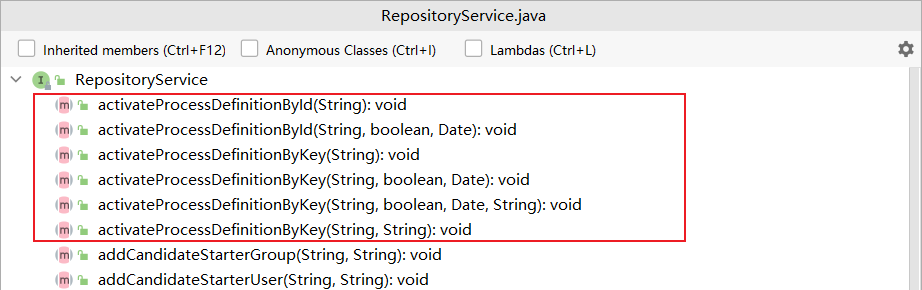
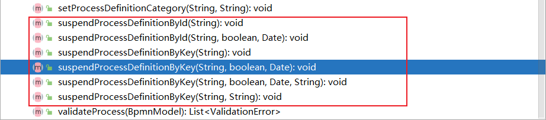
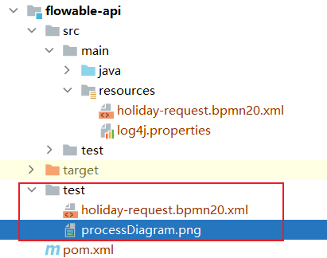
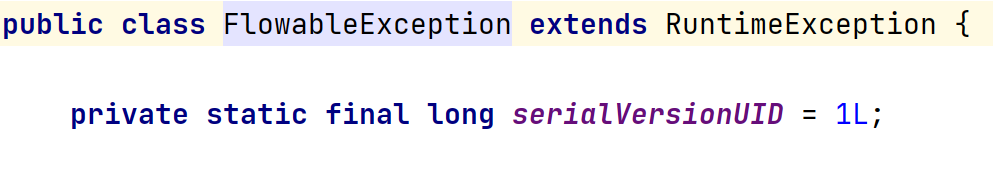
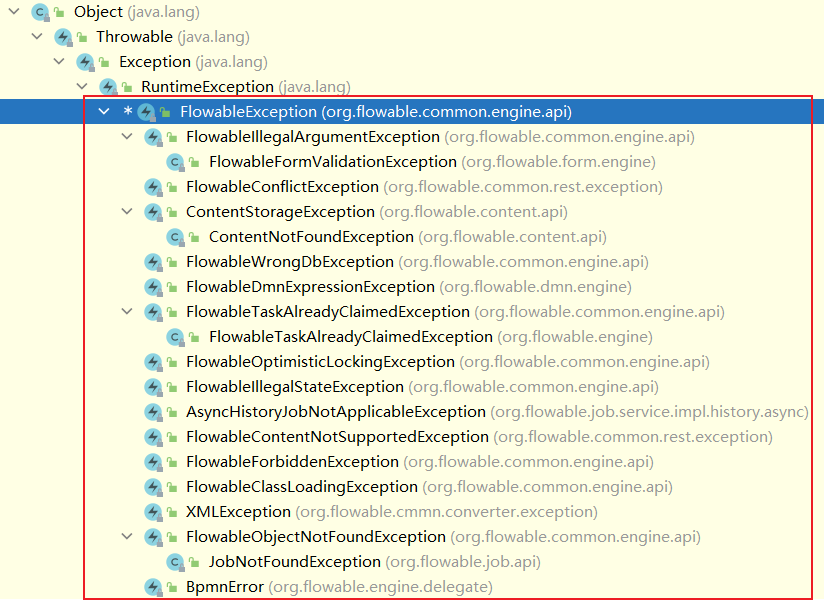
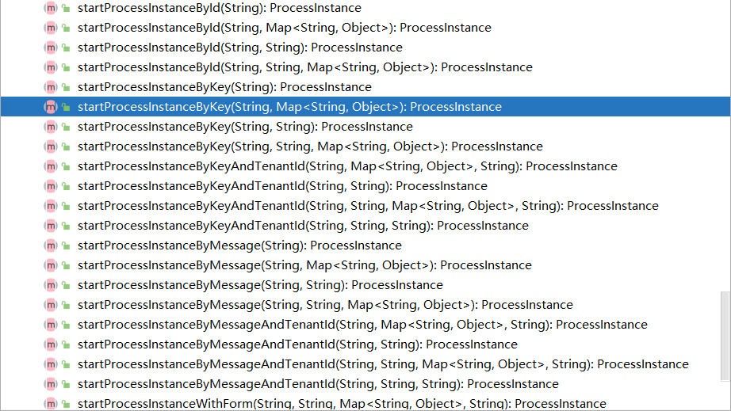
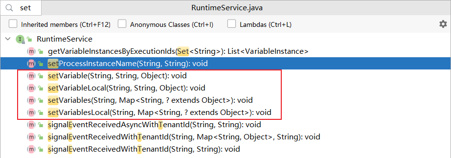
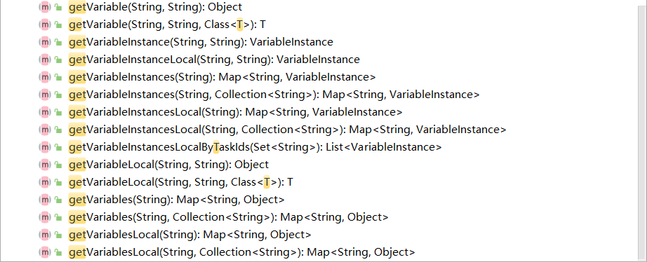
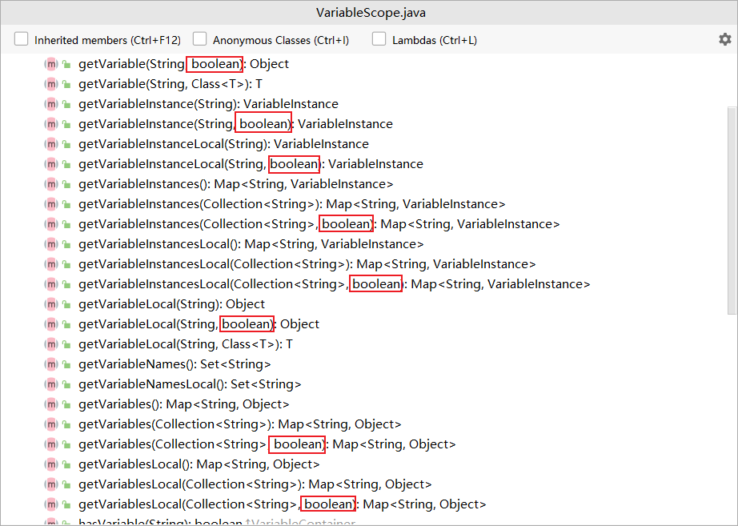
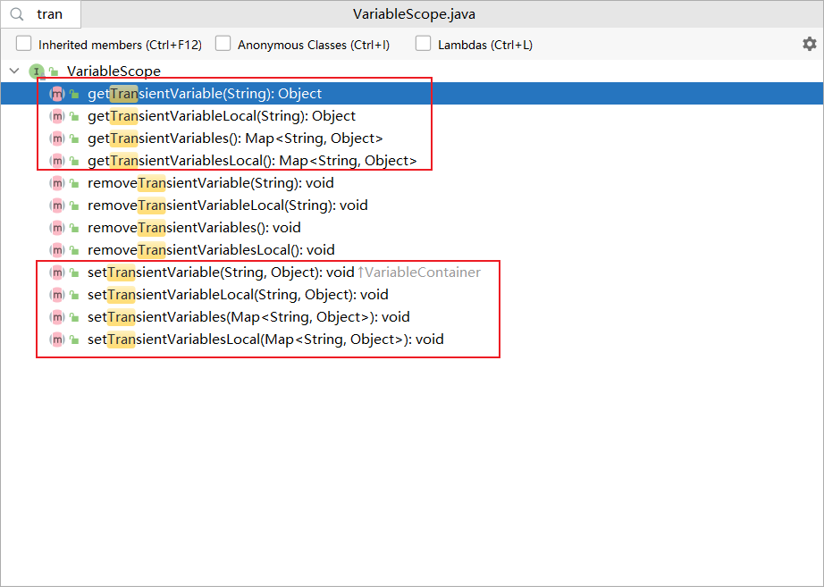

# Flowable API

### 流程引擎API与服务

通过 `ProcessEngine` ，可以获得各种提供工作流/BPM方法的 services 。 `ProcessEngine` 与 services 对象都是线程安全的，因此可以在服务器中保存并共用同一个引用。


可以通过下面的代码获取这些 services：

```java
ProcessEngine processEngine = ProcessEngines.getDefaultProcessEngine();

RuntimeService runtimeService = processEngine.getRuntimeService();
RepositoryService repositoryService = processEngine.getRepositoryService();
TaskService taskService = processEngine.getTaskService();
ManagementService managementService = processEngine.getManagementService();
IdentityService identityService = processEngine.getIdentityService();
HistoryService historyService = processEngine.getHistoryService();
FormService formService = processEngine.getFormService();
DynamicBpmnService dynamicBpmnService = processEngine.getDynamicBpmnService();
```

在 `ProcessEngines.getDefaultProcessEngine()` 第一次被调用时，将初始化并构建流程引擎，之后的重复调用都会返回同一个流程引擎。可以通过 `ProcessEngines.init()` 创建流程引擎，并由 `ProcessEngines.destroy()` 关闭流程引擎。

`ProcessEngines` 会扫描 `flowable.cfg.xml` 与 `flowable-context.xml` 文件。对于 `flowable.cfg.xml` 文件，流程引擎会以标准Flowable方式构建引擎： `ProcessEngineConfiguration.createProcessEngineConfigurationFromInputStream(inputStream).buildProcessEngine()` 。对于 `flowable-context.xml` 文件，流程引擎会以Spring的方式构建：首先构建Spring应用上下文，然后从该上下文中获取流程引擎。

所有的 services 都是无状态的。这意味着你可以很容易的在集群环境的多个节点上运行Flowable，使用同一个数据库，而不用担心上一次调用实际在哪台机器上执行。不论在哪个节点执行，对任何 services 的任何调用都是幂等（idempotent）的。

`RepositoryService` 很可能是你使用Flowable引擎要用到的第一个 service 。这个 service 提供了管理与控制 部署( `Deployment` )与流程定义( `ProcessDefinition` )的操作。在这里简单说明一下，流程定义是BPMN 2.0流程对应的Java对象，体现流程中每一步的结构与行为。部署是Flowable引擎中的包装单元，一个部署中可以包含多个BPMN 2.0 XML文件及其他资源。开发者可以决定在一个部署中包含的内容，可以是单个流程的BPMN 2.0 XML文件，也可以包含多个流程及其相关资源（如’hr-processes’部署可以包含所有与人力资源流程相关的的东西）。 `RepositoryService` 可用于部署这样的包。部署意味着将它上传至引擎，引擎将在储存至数据库之前检查与分析所有的流程。在部署操作后，可以在系统中使用这个部署包，部署包中的所有流程都可以启动。

`RepositoryService` 还允许你：

* 查询引擎现有的部署与流程定义。

```java
List<Deployment> query = repositoryService.createDeploymentQuery().orderByDeploymentId().asc().list();
logger.info("Found " + query.size() + " deployment");
ProcessDefinition processDefinition = repositoryService.createProcessDefinitionQuery()
                .deploymentId(deployment.getId())
                .singleResult();
logger.info("Found process definition : " + processDefinition.getName());
```

* 暂停或激活部署中的某些流程，或整个部署。暂停意味着不能再对它进行操作，激活刚好相反，重新使它可以操作。

```java
repositoryService.suspendProcessDefinitionById(processDefinition.getId());
repositoryService.activateProcessDefinitionById(processDefinition.getId());
```





* 获取各种资源，比如部署中保存的文件，或者引擎自动生成的流程图。

```java
BpmnModel bpmnModel = repositoryService.getBpmnModel(processDefinition.getId());
ProcessDiagramGenerator processDiagramGenerator = cfg.getProcessDiagramGenerator();
BpmnAutoLayout bpmnAutoLayout = new BpmnAutoLayout(bpmnModel);
bpmnAutoLayout.setTaskWidth(200);
bpmnAutoLayout.setTaskHeight(70);
bpmnAutoLayout.execute();
InputStream processDiagramInput = processDiagramGenerator.generateDiagram(bpmnModel, "png", new ArrayList<>(), 1.0, true);
InputStream resourceInput = new BufferedInputStream(repositoryService.getResourceAsStream(deployment.getId(), "holiday-request.bpmn20.xml"));
OutputStream processDiagramOutput = null;
OutputStream resourceOutput = null;
String userDir = System.getProperty("user.dir") + "\\flowable-api";
try {
    processDiagramOutput = new BufferedOutputStream(new FileOutputStream(userDir + "\\test\\processDiagram.png"));
    resourceOutput = new BufferedOutputStream(new FileOutputStream(userDir + "\\test\\holiday-request.bpmn20.xml"));
    byte[] buffer = new byte[10240];
    int length = 0;
    while ((length = processDiagramInput.read(buffer)) != -1) {
        processDiagramOutput.write(buffer, 0, length);
    }
    processDiagramOutput.flush();
    buffer = new byte[10240];
    length = 0;
    while ((length = resourceInput.read(buffer)) != -1) {
        resourceOutput.write(buffer, 0, length);
    }
    resourceOutput.flush();
} catch (FileNotFoundException e) {
    e.printStackTrace();
} catch (IOException e) {
    e.printStackTrace();
} finally {
    if (processDiagramOutput != null) {
        try {
            processDiagramOutput.close();
        } catch (IOException e) {
            e.printStackTrace();
        }
    }
    if (resourceOutput != null) {
        try {
            resourceOutput.close();
        } catch (IOException e) {
            e.printStackTrace();
        }
    }
    try {
        processDiagramInput.close();
    } catch (IOException e) {
        e.printStackTrace();
    }
    try {
        resourceInput.close();
    } catch (IOException e) {
        e.printStackTrace();
    }
}
```




// TODO: `RepositoryService.getProcessDiagram()为什么为空

* 获取POJO版本的流程定义。它可以用Java而不是XML的方式查看流程

与提供静态信息（也就是不会改变，至少不会经常改变的信息）的 `RepositoryService` 相反， `RuntimeService` 用于启动流程定义的新流程实例。同一时刻，一个流程定义通常有多个运行中的实例。 `RuntimeService` 也用于读取与存储流程变量。流程变量是流程实例中的数据，可以在流程的许多地方使用（例如排他网关经常使用流程变量判断流程下一步要走的路径）。

`RuntimeService` 还可以用于查询流程实例与执行(Execution)

```java
// 执行流程实例
ProcessInstance processInstance =
                runtimeService.startProcessInstanceByKey("holidayRequest", variables);
// 查询流程实例
List<ProcessInstance> processInstances = runtimeService.createProcessInstanceQuery().list();
logger.info("Found " + processInstances.size() + " process instances");
// 查询执行
List<Execution> executions = runtimeService.createExecutionQuery().list();
logger.info("Found " + executions.size() + " executions");
```

执行也就是BPMN 2.0中 'token' 的概念。通常执行是指向流程实例当前位置的指针。

最后，还可以在流程实例等待外部触发时使用 `RuntimeService` ，使流程可以继续运行。一个流程实例可以有很多许多等待状态， `RuntimeService` 提供了许多操作用于“通知”流程实例：已经接收到外部触发，流程实例可以继续运行。

// TODO: 待补充使用示例

对于像Flowable这样的BPM引擎来说，核心是需要人类用户操作的任务。所有任务相关的东西都在 `TaskService` 中被分组：

* 查询分派给用户或组的任务

查询分派给用户的任务

```xml
<userTask id="holidayApprovedTask" name="Holiday approved" flowable:assignee="${employee}" />
```

```java
List<Task> taskList = taskService.createTaskQuery().taskAssignee(employee).list();
```

查询分派给组的任务

```xml
<userTask id="approveTask" name="Approve or reject request" flowable:candidateGroups="managers"/>
```

```java
List<Task> tasks = taskService.createTaskQuery().taskCandidateGroup("managers").list();
```

* 创建独立运行(standalone)任务。这是一种没有关联到流程实例的任务。

// TODO: 待补充使用示例

* 决定任务的执行用户(assignee)，或者将用户通过某种方式与任务关联。

// TODO: 待补充使用示例

* 认领(claim)与完成(complete)任务。认领是指某人决定成为任务的执行用户，也即他将会完成这个任务。完成任务是指“做这个任务要求的工作”，通常是填写某个表单。

// TODO: 待补充使用示例

`IdentityService` 用于管理（创建，更新，删除，查询……）组与用户。请注意，Flowable实际上在运行时并不做任何用户检查。例如任务可以分派给任何用户，而引擎并不会验证系统中是否存在该用户。这是因为Flowable有时要与LDAP、Active Directory等服务结合使用。

// TODO: 待补充使用示例

`FormService` 是可选择的。也就是说Flowable没有它也能很好地运行，而不必牺牲任何功能。这个服务引入了开始表单(start form)与任务表单(task form)的概念。 开始表单是在流程实例启动前显示的表单，而任务表单是用户完成任务时显示的表单。Flowable可以在BPMN 2.0流程定义中定义这些表单。 `FormService` 通过简单的方式暴露这些数据。表单不一定要嵌入流程定义，因此这个服务是可选的。

// TODO: 待补充使用示例

`HistoryService` 暴露Flowable引擎收集的所有历史数据。当执行流程时，引擎会保存许多数据（可配置），例如流程实例启动时间、谁在执行哪个任务、完成任务花费的事件、每个流程实例的执行路径，等等。这个service主要提供查询这些数据的能力。

```java
HistoryService historyService = processEngine.getHistoryService();
List<HistoricActivityInstance> activities =
                historyService.createHistoricActivityInstanceQuery()
                        .processInstanceId(processInstance.getId())
                        .finished()
                        .orderByHistoricActivityInstanceEndTime().asc()
                        .list();

for (HistoricActivityInstance activity : activities) {
    logger.info(activity.getActivityId() + " took "
                    + activity.getDurationInMillis() + " milliseconds");
}
```

`ManagementService` 通常不在用Flowable编写用户应用时使用。它可以读取数据库表与表原始数据的信息，也提供了对作业(job)的查询与管理操作。Flowable中很多地方都使用作业，例如定时器(timer)，异步操作(asynchronous continuation)，延时暂停/激活(delayed suspension/activation)等等。

```java
// 使用ManagementService获取数据库表信息
ManagementService managementService = processEngine.getManagementService();
String tableName = managementService.getTableName(Task.class);
logger.info("Task's tableName is " + tableName);
```

// TODO: 待补充使用示例

DynamicBpmnService可用于修改流程定义中的部分内容，而不需要重新部署它。例如可以修改流程定义中一个用户任务的办理人设置，或者修改一个服务任务中的类名。

// TODO: 待补充使用示例

### 异常策略

flowable的异常基类是 `org.flowable.common.engine.api.FlowableException` ，这是一个免检异常：



它大概有以下子类：



### 查询API

从引擎中查询数据有两种方式：

* 查询API

```java
List<Task> tasks = taskService.createTaskQuery()
    .taskAssignee("kermit")
    .processVariableValueEquals("orderId", "0815")
    .orderByDueDate().asc()
    .list();
```

上面是使用查询API的一个例子，这里查询的所有条件都用AND连接。

* 原生(native)查询

有时候你可能更复杂的查询，比如用OR连接查询条件，或者使用查询API不能满足你的需求，这时你可以使用原生查询。

返回类型由使用的查询对象决定，数据会映射到正确的对象中（ `Task` 、 `ProcessInstance` 、 `Execution` ，等等）。查询在数据库中进行，因此需要使用数据库中定义的表名与列名。这需要你对内部数据结构有所了解，因此建议小心使用原生查询。数据库表名可以通过API读取，这样可以将依赖关系减到最小。

```java
List<Task> nativeQueryTasks = taskService.createNativeTaskQuery().sql("select * from " + tableName).list();
logger.info("The whole application has " + nativeQueryTasks.size() + " task(s)");
```

### 变量

流程实例在执行时，需要使用一些数据，在flowable中，这些数据被称作变量，并被保存在数据库中。

流程实例、用户任务及执行都可以持有变量，流程实例可以持有任意数量的变量，每个变量都存储在表名为 `ACT_RU_VARIABLE` 的表中。

`RuntimeService` 所有的 `startProcessInstanceXXX` 方法都有一个可选参数，用于在流程实例创建及启动时设置变量。

```java
Map<String, Object> variables = new HashMap<String, Object>();
variables.put("employee", employee);
variables.put("nrOfHolidays", nrOfHolidays);
variables.put("description", description);
// 执行流程实例
ProcessInstance processInstance =
                runtimeService.startProcessInstanceByKey("holidayRequest", variables);
```



当然也可以通过 `RuntimeService` 的一些方法给执行设置变量：



流程实例由一颗执行的树(tree of executions)组成，给某个执行设置的局部变量只在该执行中可见，对执行树的上层不可见，这可以用于数据不暴露给流程实例其它执行的情况或者变量在流程实例的不同路径有不同的值的情况。

// TODO: 待补充使用示例

在 `TaskService` 中有一些方法可以获取变量：



从上面的图片得知，在 `Task` 中也可以有局部变量存在。

在 `VariableScope` 中定义了一些方法用于在任务和执行中获取变量。

这些方法还使用了缓存，即在调用上面的方法时，引擎会从数据库中取出所有变量。当然也可以通过设置可选的参数进行精细控制数据库查询与流量，即不缓存所有变量。



// TODO: 补充使用示例


### 瞬时变量

瞬时变量不会被持久化。它具有以下特性：

* 不存储历史
* 与普通变量类似，设置瞬时变量时会存入最上层父中。这意味着在一个执行中设置一个变量时，瞬时变量实际上会存储在流程实例执行中。与普通变量类似，可以使用局部(local)的对应方法，将变量设置为某个执行或任务的局部变量。
* 瞬时变量只能在下一个“等待状态”之前访问。之后该变量即消失。等待状态意味着流程实例会异步持久化至数据存储中。
* 只能使用 `setTransientVariable(name, value)` 设置瞬时变量，但是调用 `getVariable(name)` 也会返回瞬时变量（也有 `getTransientVariable(name)` 方法，它只会返回瞬时变量）。这是为了简化表达式的撰写，并保证已有逻辑可以使用这两种类型的变量。



* 瞬时变量屏蔽同名的持久化变量。也就是说当一个流程实例中设置了同名的持久化变量与瞬时变量时， `getVariable("someVariable")` 会返回瞬时变量的值。

// TODO: 待补充使用示例

### 表达式

Flowable使用UEL进行表达式解析。

表达式可以用于Java服务任务(Java Service task)、执行监听器(Execution Listener)、任务监听器(Task Listener) 与 条件顺序流(Conditional sequence flow)等。

flowable中表达式有以下两种类型：

* 值表达式

默认情况下，所有流程变量都可以使用。（若使用Spring）所有的Spring bean也可以用在表达式里。

```
${myVar}
${myBean.myProperty}
```

* 方法表达式

调用一个方法，可以带或不带参数。当调用不带参数的方法时，要确保在方法名后添加空括号（以避免与值表达式混淆）。传递的参数可以是字面值，也可以是表达式，它们会被自动解析。

```
${printer.print()}
${myBean.addNewOrder('orderName')}
${myBean.doSomething(myVar, execution)}
```

注意表达式只支持解析和比较原始类型、beans, lists, arrays 和maps。

除了所有的流程变量外，还有一些默认对象可在表达式中使用：

* execution

有正在运行的执行的额外信息的执行代理

* task

有当前任务的额外信息的任务代理，只在任务监听器的表达式中可用

* authenticatedUserId

当前已验证的用户id。如果没有已验证的用户，该变量不可用

* variableContainer

// FIXME: 表达式应用的容器？？？

### 表达式函数

variables命名空间下开箱即用的函数

* `variables:get(varName)` : 返回一个变量的值，与使用表达式的区别是当变量不存在时，在某些情况下它不会抛出异常。如： `${variables:get(myVariable) == 'hello'}`  在myVariable不存在时不会抛出异常，而 `${myVariable == "hello"}` 则会抛出异常。

使用示例：

```xml
<sequenceFlow sourceRef="decision" targetRef="externalSystemCall">
    <conditionExpression xsi:type="tFormalExpression">
        <![CDATA[
            ${variables:get(approved)}
        ]]>
    </conditionExpression>
</sequenceFlow>
```

* `variables:getOrDefault(varName, defaultValue)` : 与get类似，但是提供了一个参数用于配置默认值，不至于当变量不存在时返回null

使用示例：

```xml
<sequenceFlow  sourceRef="decision" targetRef="sendRejectionMail">
    <conditionExpression xsi:type="tFormalExpression">
        <![CDATA[
            ${!variables:getOrDefault(approved,false)}
        ]]>
    </conditionExpression>
</sequenceFlow>
```

* `variables:exists(varName)` : 判断是否存在变量

使用示例：

```xml
<sequenceFlow  sourceRef="decision" targetRef="sendRejectionMail">
    <conditionExpression xsi:type="tFormalExpression">
        <![CDATA[
            ${variables:exists(approved) && variables:get(approved)}
        ]]>
    </conditionExpression>
</sequenceFlow>
```

* `variables:isEmpty(varName)` 或 `variables:empty(varName)` : 判断变量是否为空，行为由变量类型决定
  * `java.lang.String` :  空字符串（null、""）
  * `java.util.Collection` : 空集合（null、size()==0）
  * `ArrayNode` : length()==0
  * 变量为空
* `variables:isNotEmpty(varName)` 或 `variables:notEmpty(varName)` : 与上面的表达式函数行为相反
* `variables:equals(varName, value)` 或 `variables:eq(varName, value)` : 判断变量的值是否和给定的值相等，会对变量进行为空的判断 // TODO: 校验null==null
* `variables:notEquals(varName, value)` 或 `variables:ne(varName, value)` : 判断变量的值是否不相等
* `variables:contains(varName, value1, value2, …​)` : 判断变量是否包含所给出的所有值，行为也是由变量类型决定
  * `java.lang.String` : 给定的值是否是变量的子串
  * `java.util.Collection` : 给定的值是否是变量的一个元素
  * `ArrayNode` : 变量是否包含给定的 `JsonNode`
  * 变量是否为空
* `variables:containsAny(varName, value1, value2, …​)` : 与上面的表达式函数类似，不过只要给定的一个值在变量中，就会返回true
* `variables:base64(varName)` : 把二进制或字符串变量转换为Base64字符串
* 比较器函数：
  * `variables:lowerThan(varName, value)` 或 `variables:lessThan(varName, value)` 或 `variables:lt(varName, value)` : `${execution.getVariable("varName") != null && execution.getVariable("varName") < value}` 的简写
  * `variables:lowerThanOrEquals(varName, value)` 或 `variables:lessThanOrEquals(varName, value)` 或 `variables:lte(varName, value)` : `${execution.getVariable("varName") != null && execution.getVariable("varName") <= value}` 的简写
  * `variables:greaterThan(varName, value)` 或 `variables:gt(varName, value)` : `${execution.getVariable("varName") != null && execution.getVariable("varName") > value}` 的简写
  * `variables:greaterThanOrEquals(varName, value)` 或 `variables:gte(varName, value)` : `${execution.getVariable("varName") != null && execution.getVariable("varName") >= value}` 的简写
  
上面的表达式函数，命名空间 `variables` 可以写成 `vars` 或 `var` 

作为参数的变量名无需用引号引住 

上面的表达式函数中不需要将 `execution` 作为参数传递进去，流程引擎会自动合适的变量注入。这也意味着这些函数可以在CMMN标准中以相同的方式被应用。

当然你也可以注册自定义的表达式函数，但是你需要实现 `org.flowable.common.engine.api.delegate.FlowableFunctionDelegate` 接口

// TODO: 待补充使用示例

### 单元测试

Flowable支持JUnit 3、4和5的单元测试风格

JUnit 5 风格可以使用 `org.flowable.engine.test.FlowableTest` 注解或者手动注册 `org.flowable.engine.test.FlowableExtension` 。`FlowableTest` 注解通过 `@ExtendWith(FlowableExtension.class)` 来完成向 `FlowableExtension` 注册。这使得流程引擎和services在测试和生命周期（ `@BeforeAll` , `@BeforeEach` , `@AfterEach` , `@AfterAll` ）方法中作为参数可以被使用。流程引擎默认会根据classpath目录下的 `flowable.cfg.xml` 文件实例化，如果你需要使用不同的配置文件，你可以使用 `org.flowable.engine.test.ConfigurationResource` 注解指出。当配置文件相同时，流程引擎会在多个单元测试中静态缓存。

通过 `org.flowable.engine.test.Deployment` 注解可以声明测试方法。如果没有在 `Deployment` 注解中声明 `resources` 属性， `Deployment` 注解默认会在同一包下去找 `测试类名.测试方法名.bpmn20.xml` 资源文件。在测试结束时，会删除这个部署，包括所有相关的流程实例、任务，等等。你也可以通过 `org.flowable.engine.test.DeploymentId` 注解将部署id作为参数注入到你的测试或生命周期方法中。

下面是一个JUnit 5 风格的使用示例：

```java
package org.fade.demo.flowabledemo.flowableapi.test;

import org.flowable.engine.ProcessEngine;
import org.flowable.engine.RuntimeService;
import org.flowable.engine.TaskService;
import org.flowable.engine.test.ConfigurationResource;
import org.flowable.engine.test.Deployment;
import org.flowable.engine.test.DeploymentId;
import org.flowable.engine.test.FlowableTest;
import org.flowable.task.api.Task;
import org.junit.jupiter.api.BeforeEach;
import org.junit.jupiter.api.Test;
import org.slf4j.Logger;
import org.slf4j.LoggerFactory;

@FlowableTest
@ConfigurationResource("flowable.custom.cfg.xml")
public class Example {

    private static final Logger logger = LoggerFactory.getLogger(Example.class);

    private ProcessEngine processEngine;
    private RuntimeService runtimeService;
    private TaskService taskService;

    @BeforeEach
    void setUp(ProcessEngine processEngine) {
        this.processEngine = processEngine;
        this.runtimeService = processEngine.getRuntimeService();
        this.taskService = processEngine.getTaskService();
    }

    @Test
    @Deployment(resources = {"holiday-request.bpmn20.xml"})
//    void testSimpleProcess() {
    void testSimpleProcess(@DeploymentId String deploymentId) {
        logger.info("Deployment id is " + deploymentId);
        runtimeService.startProcessInstanceByKey("holidayRequest");
        Task task = taskService.createTaskQuery().singleResult();
        logger.info("Task's name is " + task.getName());
    }

}
```

JUnit 3 风格下，测试类必须继承 `org.flowable.engine.test.FlowableTestCase` 。在 `FlowableTestCase` 的 `setup()` 方法中，流程引擎默认会根据classpath目录下的 `flowable.cfg.xml` 文件实例化。如果你要指定一个不同的配置文件，你需要重写 `getConfigurationResource()` 方法。当配置文件相同时，流程引擎会在多个单元测试中静态缓存。

至于测试方法的声明等，可以参考JUnit 5

下面是一个JUnit 3 风格的使用示例：

```java
package org.fade.demo.flowabledemo.flowableapi.test;

import org.flowable.engine.test.Deployment;
import org.flowable.engine.test.DeploymentId;
import org.flowable.engine.test.FlowableTestCase;
import org.flowable.task.api.Task;
import org.slf4j.Logger;
import org.slf4j.LoggerFactory;

public class JUnit3Example extends FlowableTestCase {

    private static final Logger logger = LoggerFactory.getLogger(JUnit3Example.class);

    @Override
    public String getConfigurationResource() {
        return "flowable.custom.cfg.xml";
    }

    @Deployment(resources = {"holiday-request.bpmn20.xml"})
    public void test() {
        logger.info("Deployment id is " + deploymentId);
        runtimeService.startProcessInstanceByKey("holidayRequest");
        Task task = taskService.createTaskQuery().singleResult();
        logger.info("Task's name is " + task.getName());
    }

}
```

这里需要注意一些JUnit 3 的使用特点，比如无法直接在测试方法上传递参数，像JUnit 5 的注入 `Deployment` id可以无须操作， `FlowableTestCase` 里已有 `deploymentId` 属性。

JUnit 4 风格下要实现相同的效果，需要用到 `org.flowable.engine.test.FlowableRule` 。通过 `FlowableRule` ，可以使用getter方法获取流程引擎和services。其余特点JUnit 4 和JUnit 5 与 JUnit 3 一样。

下面是一个JUnit 4 风格的使用示例：

```java
package org.fade.demo.flowabledemo.flowableapi.test;

import org.flowable.engine.RepositoryService;
import org.flowable.engine.RuntimeService;
import org.flowable.engine.TaskService;
import org.flowable.engine.test.Deployment;
import org.flowable.engine.test.FlowableRule;
import org.flowable.task.api.Task;
import org.junit.Rule;
import org.junit.Test;
import org.slf4j.Logger;
import org.slf4j.LoggerFactory;

public class JUnit4Example {

    private static final Logger logger = LoggerFactory.getLogger(JUnit4Example.class);

    @Rule
    public FlowableRule flowableRule = new FlowableRule("flowable.custom.cfg.xml");

    @Test
    @Deployment(resources = {"holiday-request.bpmn20.xml"})
    public void test() {
        RepositoryService repositoryService = flowableRule.getRepositoryService();
        org.flowable.engine.repository.Deployment deployment = repositoryService.createDeploymentQuery().singleResult();
        logger.info("Deployment id is " + deployment.getId());
        RuntimeService runtimeService = flowableRule.getRuntimeService();
        runtimeService.startProcessInstanceByKey("holidayRequest");
        TaskService taskService = flowableRule.getTaskService();
        Task task = taskService.createTaskQuery().singleResult();
        logger.info("Task's name is " + task.getName());
    }

}
```

上面的例子中测试方法也是无法直接传递参数的，但是要打印 `Deployment` id 可以通过 `RepositoryService` 创建查询获取。自定义配置文件位置可通过 `FlowableRule` 的构造方法实现。

### 调试单元测试

// FIXME: 调试时连接h2数据库，并没有数据

### Web应用中的流程引擎

`ProcessEngine` 是线程安全的类，可以很容易地在多个线程间共享。在web应用中，这意味着可以在容器启动时创建引擎，并在容器关闭时关闭引擎。

// TODO: 待补充

