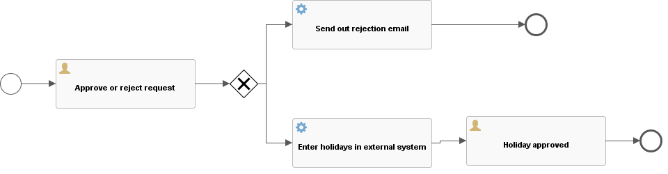

# Flowable API

### 流程引擎API与服务

通过 `ProcessEngine` ，可以获得各种提供工作流/BPM方法的 services 。 `ProcessEngine` 与 services 对象都是线程安全的，因此可以在服务器中保存并共用同一个引用。


可以通过下面的代码获取这些 services：

```java
ProcessEngine processEngine = ProcessEngines.getDefaultProcessEngine();

RuntimeService runtimeService = processEngine.getRuntimeService();
RepositoryService repositoryService = processEngine.getRepositoryService();
TaskService taskService = processEngine.getTaskService();
ManagementService managementService = processEngine.getManagementService();
IdentityService identityService = processEngine.getIdentityService();
HistoryService historyService = processEngine.getHistoryService();
FormService formService = processEngine.getFormService();
DynamicBpmnService dynamicBpmnService = processEngine.getDynamicBpmnService();
```

在 `ProcessEngines.getDefaultProcessEngine()` 第一次被调用时，将初始化并构建流程引擎，之后的重复调用都会返回同一个流程引擎。可以通过 `ProcessEngines.init()` 创建流程引擎，并由 `ProcessEngines.destroy()` 关闭流程引擎。

`ProcessEngines` 会扫描 `flowable.cfg.xml` 与 `flowable-context.xml` 文件。对于 `flowable.cfg.xml` 文件，流程引擎会以标准Flowable方式构建引擎： `ProcessEngineConfiguration.createProcessEngineConfigurationFromInputStream(inputStream).buildProcessEngine()` 。对于 `flowable-context.xml` 文件，流程引擎会以Spring的方式构建：首先构建Spring应用上下文，然后从该上下文中获取流程引擎。

所有的 services 都是无状态的。这意味着你可以很容易的在集群环境的多个节点上运行Flowable，使用同一个数据库，而不用担心上一次调用实际在哪台机器上执行。不论在哪个节点执行，对任何 services 的任何调用都是幂等（idempotent）的。

`RepositoryService` 很可能是你使用Flowable引擎要用到的第一个 service 。这个 service 提供了管理与控制 部署( `Deployment` )与流程定义( `ProcessDefinition` )的操作。在这里简单说明一下，流程定义是BPMN 2.0流程对应的Java对象，体现流程中每一步的结构与行为。部署是Flowable引擎中的包装单元，一个部署中可以包含多个BPMN 2.0 XML文件及其他资源。开发者可以决定在一个部署中包含的内容，可以是单个流程的BPMN 2.0 XML文件，也可以包含多个流程及其相关资源（如’hr-processes’部署可以包含所有与人力资源流程相关的的东西）。 `RepositoryService` 可用于部署这样的包。部署意味着将它上传至引擎，引擎将在储存至数据库之前检查与分析所有的流程。在部署操作后，可以在系统中使用这个部署包，部署包中的所有流程都可以启动。

`RepositoryService` 还允许你：

* 查询引擎现有的部署与流程定义。

```java
List<Deployment> query = repositoryService.createDeploymentQuery().orderByDeploymentId().asc().list();
logger.info("Found " + query.size() + " deployment");
ProcessDefinition processDefinition = repositoryService.createProcessDefinitionQuery()
                .deploymentId(deployment.getId())
                .singleResult();
logger.info("Found process definition : " + processDefinition.getName());
```

* 暂停或激活部署中的某些流程，或整个部署。暂停意味着不能再对它进行操作，激活刚好相反，重新使它可以操作。

```java
repositoryService.suspendProcessDefinitionById(processDefinition.getId());
repositoryService.activateProcessDefinitionById(processDefinition.getId());
```


* 获取各种资源，比如部署中保存的文件，或者引擎自动生成的流程图。

```java
BpmnModel bpmnModel = repositoryService.getBpmnModel(processDefinition.getId());
ProcessDiagramGenerator processDiagramGenerator = cfg.getProcessDiagramGenerator();
BpmnAutoLayout bpmnAutoLayout = new BpmnAutoLayout(bpmnModel);
bpmnAutoLayout.setTaskWidth(200);
bpmnAutoLayout.setTaskHeight(70);
bpmnAutoLayout.execute();
InputStream processDiagramInput = processDiagramGenerator.generateDiagram(bpmnModel, "png", new ArrayList<>(), 1.0, true);
InputStream resourceInput = new BufferedInputStream(repositoryService.getResourceAsStream(deployment.getId(), "holiday-request.bpmn20.xml"));
OutputStream processDiagramOutput = null;
OutputStream resourceOutput = null;
String userDir = System.getProperty("user.dir") + "\\flowable-api";
try {
    processDiagramOutput = new BufferedOutputStream(new FileOutputStream(userDir + "\\test\\processDiagram.png"));
    resourceOutput = new BufferedOutputStream(new FileOutputStream(userDir + "\\test\\holiday-request.bpmn20.xml"));
    byte[] buffer = new byte[10240];
    int length = 0;
    while ((length = processDiagramInput.read(buffer)) != -1) {
        processDiagramOutput.write(buffer, 0, length);
    }
    processDiagramOutput.flush();
    buffer = new byte[10240];
    length = 0;
    while ((length = resourceInput.read(buffer)) != -1) {
        resourceOutput.write(buffer, 0, length);
    }
    resourceOutput.flush();
} catch (FileNotFoundException e) {
    e.printStackTrace();
} catch (IOException e) {
    e.printStackTrace();
} finally {
    if (processDiagramOutput != null) {
        try {
            processDiagramOutput.close();
        } catch (IOException e) {
            e.printStackTrace();
        }
    }
    if (resourceOutput != null) {
        try {
            resourceOutput.close();
        } catch (IOException e) {
            e.printStackTrace();
        }
    }
    try {
        processDiagramInput.close();
    } catch (IOException e) {
        e.printStackTrace();
    }
    try {
        resourceInput.close();
    } catch (IOException e) {
        e.printStackTrace();
    }
}
```




// TODO: `RepositoryService.getProcessDiagram()为什么为空

* 获取POJO版本的流程定义。它可以用Java而不是XML的方式查看流程

与提供静态信息（也就是不会改变，至少不会经常改变的信息）的 `RepositoryService` 相反， `RuntimeService` 用于启动流程定义的新流程实例。同一时刻，一个流程定义通常有多个运行中的实例。 `RuntimeService` 也用于读取与存储流程变量。流程变量是流程实例中的数据，可以在流程的许多地方使用（例如排他网关经常使用流程变量判断流程下一步要走的路径）。

`RuntimeService` 还可以用于查询流程实例与执行(Execution)

```java
// 执行流程实例
ProcessInstance processInstance =
                runtimeService.startProcessInstanceByKey("holidayRequest", variables);
// 查询流程实例
List<ProcessInstance> processInstances = runtimeService.createProcessInstanceQuery().list();
logger.info("Found " + processInstances.size() + " process instances");
// 查询执行
List<Execution> executions = runtimeService.createExecutionQuery().list();
logger.info("Found " + executions.size() + " executions");
```

执行也就是BPMN 2.0中 'token' 的概念。通常执行是指向流程实例当前位置的指针。

最后，还可以在流程实例等待外部触发时使用 `RuntimeService` ，使流程可以继续运行。一个流程实例可以有很多许多等待状态， `RuntimeService` 提供了许多操作用于“通知”流程实例：已经接收到外部触发，流程实例可以继续运行。

// TODO: 待补充使用示例

对于像Flowable这样的BPM引擎来说，核心是需要人类用户操作的任务。所有任务相关的东西都在 `TaskService` 中被分组：

* 查询分派给用户或组的任务

查询分派给用户的任务

```xml
<userTask id="holidayApprovedTask" name="Holiday approved" flowable:assignee="${employee}" />
```

```java
List<Task> taskList = taskService.createTaskQuery().taskAssignee(employee).list();
```

查询分派给组的任务

```xml
<userTask id="approveTask" name="Approve or reject request" flowable:candidateGroups="managers"/>
```

```java
List<Task> tasks = taskService.createTaskQuery().taskCandidateGroup("managers").list();
```

* 创建独立运行(standalone)任务。这是一种没有关联到流程实例的任务。

// TODO: 待补充使用示例

* 决定任务的执行用户(assignee)，或者将用户通过某种方式与任务关联。

// TODO: 待补充使用示例

* 认领(claim)与完成(complete)任务。认领是指某人决定成为任务的执行用户，也即他将会完成这个任务。完成任务是指“做这个任务要求的工作”，通常是填写某个表单。

// TODO: 待补充使用示例

`IdentityService` 用于管理（创建，更新，删除，查询……）组与用户。请注意，Flowable实际上在运行时并不做任何用户检查。例如任务可以分派给任何用户，而引擎并不会验证系统中是否存在该用户。这是因为Flowable有时要与LDAP、Active Directory等服务结合使用。

// TODO: 待补充使用示例

`FormService` 是可选择的。也就是说Flowable没有它也能很好地运行，而不必牺牲任何功能。这个服务引入了开始表单(start form)与任务表单(task form)的概念。 开始表单是在流程实例启动前显示的表单，而任务表单是用户完成任务时显示的表单。Flowable可以在BPMN 2.0流程定义中定义这些表单。 `FormService` 通过简单的方式暴露这些数据。表单不一定要嵌入流程定义，因此这个服务是可选的。

// TODO: 待补充使用示例

`HistoryService` 暴露Flowable引擎收集的所有历史数据。当执行流程时，引擎会保存许多数据（可配置），例如流程实例启动时间、谁在执行哪个任务、完成任务花费的事件、每个流程实例的执行路径，等等。这个service主要提供查询这些数据的能力。

```java
HistoryService historyService = processEngine.getHistoryService();
List<HistoricActivityInstance> activities =
                historyService.createHistoricActivityInstanceQuery()
                        .processInstanceId(processInstance.getId())
                        .finished()
                        .orderByHistoricActivityInstanceEndTime().asc()
                        .list();

for (HistoricActivityInstance activity : activities) {
    logger.info(activity.getActivityId() + " took "
                    + activity.getDurationInMillis() + " milliseconds");
}
```

`ManagementService` 通常不在用Flowable编写用户应用时使用。它可以读取数据库表与表原始数据的信息，也提供了对作业(job)的查询与管理操作。Flowable中很多地方都使用作业，例如定时器(timer)，异步操作(asynchronous continuation)，延时暂停/激活(delayed suspension/activation)等等。

// TODO: 待补充使用示例

DynamicBpmnService可用于修改流程定义中的部分内容，而不需要重新部署它。例如可以修改流程定义中一个用户任务的办理人设置，或者修改一个服务任务中的类名。

// TODO: 待补充使用示例

### 异常策略

flowable的异常基类是 `org.flowable.common.engine.api.FlowableException` ，这是一个免检异常：


它大概有以下子类：


### 查询API

从引擎中查询数据有两种方式：

* 查询API

```java
List<Task> tasks = taskService.createTaskQuery()
    .taskAssignee("kermit")
    .processVariableValueEquals("orderId", "0815")
    .orderByDueDate().asc()
    .list();
```

上面是使用查询API的一个例子，这里查询的所有条件都用AND连接。


* 原生(native)查询