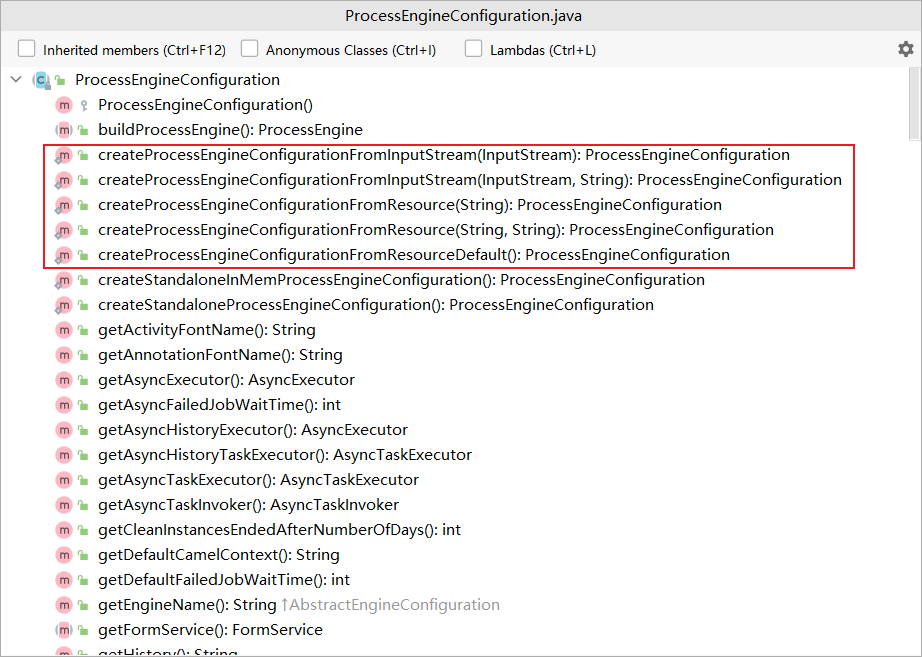

# 配置

### 创建 `ProcessEngine` 

创建 `ProcessEngine` 的方式有挺多，其中一种方式是通过 `flowable.cfg.xml` 配置文件创建（与Spring环境下创建 `ProcessEngine` 不同）。

在通过下面的代码获取 `ProcessEngine` 时，程序会在 `classpath` 下寻找 `flowable.cfg.xml` 配置文件，并根据配置文件来构造引擎：

```java
ProcessEngine processEngine = ProcessEngines.getDefaultProcessEngine();
```

`flowable.cfg.xml` 示例：

```xml
<beans xmlns="http://www.springframework.org/schema/beans"
       xmlns:xsi="http://www.w3.org/2001/XMLSchema-instance"
       xsi:schemaLocation="http://www.springframework.org/schema/beans http://www.springframework.org/schema/beans/spring-beans.xsd">

  <bean id="processEngineConfiguration" class="org.flowable.engine.impl.cfg.StandaloneProcessEngineConfiguration">

    <property name="jdbcUrl" value="jdbc:h2:mem:flowable;DB_CLOSE_DELAY=1000" />
    <property name="jdbcDriver" value="org.h2.Driver" />
    <property name="jdbcUsername" value="sa" />
    <property name="jdbcPassword" value="" />

    <property name="databaseSchemaUpdate" value="true" />

    <property name="asyncExecutorActivate" value="false" />

    <property name="mailServerHost" value="mail.my-corp.com" />
    <property name="mailServerPort" value="5025" />
  </bean>

</beans>
```

上面的配置文件你可能会发现有 `springframework` 字样，是不是很熟悉，没错，实际上这就是一个Spring配置文件，但这并不意味着如此就必须在Spring环境下使用，flowable只是利用Spring内部的解析与依赖注入功能来简化引擎的构建过程。

当然你也可以手动指定配置文件：

```java
ProcessEngineConfiguration cfg = ProcessEngineConfiguration.createProcessEngineConfigurationFromResource("flowable.cfg.xml");
ProcessEngine processEngine = cfg.buildProcessEngine();
```

手动指定配置文件还有许多方法：



上面的方法中就有可以通过指定配置文件和配置文件的bean id创建 `ProcessEngineConfiguration` 的方法

如果不想使用配置文件，也可以使用默认配置：

```java
ProcessEngineConfiguration.createStandaloneProcessEngineConfiguration();
ProcessEngineConfiguration.createStandaloneInMemProcessEngineConfiguration();
```

```java
ProcessEngine processEngine = ProcessEngineConfiguration.createStandaloneInMemProcessEngineConfiguration()
                .setDatabaseSchemaUpdate(ProcessEngineConfiguration.DB_SCHEMA_UPDATE_TRUE)
                .setJdbcUrl("jdbc:h2:mem:my-own-db;DB_CLOSE_DELAY=1000")
                .setAsyncExecutorActivate(false)
                .buildProcessEngine();
```

### `ProcessEngineConfiguration` bean

有多个类可以用于定义 `ProcessEngineConfiguration` ,这些类根据不同的环境选择使用哪种：

* `org.flowable.engine.impl.cfg.StandaloneProcessEngineConfiguration` 

流程引擎独立运行。Flowable自行处理事务。在默认情况下，数据库检查只在引擎启动时进行。

* `org.flowable.engine.impl.cfg.StandaloneInMemProcessEngineConfiguration` 

这是一个便于使用单元测试的类。Flowable自行处理事务。默认使用H2内存数据库。数据库会在引擎启动时创建，并在引擎关闭时删除。

* `org.flowable.spring.SpringProcessEngineConfiguration` 

在流程引擎处于Spring环境时使用。

* `org.flowable.engine.impl.cfg.JtaProcessEngineConfiguration` 

用于引擎独立运行，并使用JTA事务的情况。

### 数据库配置

目前有两种方式配置工作流引擎使用的数据库：

* 