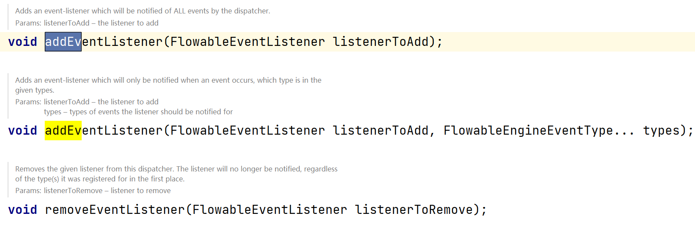

# 配置

### 创建 `ProcessEngine` 

创建 `ProcessEngine` 的方式有挺多，其中一种方式是通过 `flowable.cfg.xml` 配置文件创建（与Spring环境下创建 `ProcessEngine` 不同）。

在通过下面的代码获取 `ProcessEngine` 时，程序会在 `classpath` 下寻找 `flowable.cfg.xml` 配置文件，并根据配置文件来构造引擎：

```java
ProcessEngine processEngine = ProcessEngines.getDefaultProcessEngine();
```

`flowable.cfg.xml` 示例：

```xml
<beans xmlns="http://www.springframework.org/schema/beans"
       xmlns:xsi="http://www.w3.org/2001/XMLSchema-instance"
       xsi:schemaLocation="http://www.springframework.org/schema/beans http://www.springframework.org/schema/beans/spring-beans.xsd">

  <bean id="processEngineConfiguration" class="org.flowable.engine.impl.cfg.StandaloneProcessEngineConfiguration">

    <property name="jdbcUrl" value="jdbc:h2:mem:flowable;DB_CLOSE_DELAY=1000" />
    <property name="jdbcDriver" value="org.h2.Driver" />
    <property name="jdbcUsername" value="sa" />
    <property name="jdbcPassword" value="" />

    <property name="databaseSchemaUpdate" value="true" />

    <property name="asyncExecutorActivate" value="false" />

    <property name="mailServerHost" value="mail.my-corp.com" />
    <property name="mailServerPort" value="5025" />
  </bean>

</beans>
```

上面的配置文件你可能会发现有 `springframework` 字样，是不是很熟悉，没错，实际上这就是一个Spring配置文件，但这并不意味着如此就必须在Spring环境下使用，flowable只是利用Spring内部的解析与依赖注入功能来简化引擎的构建过程。

当然你也可以手动指定配置文件：

```java
ProcessEngineConfiguration cfg = ProcessEngineConfiguration.createProcessEngineConfigurationFromResource("flowable.cfg.xml");
ProcessEngine processEngine = cfg.buildProcessEngine();
```

手动指定配置文件还有许多方法：


上面的方法中就有可以通过指定配置文件和配置文件的bean id创建 `ProcessEngineConfiguration` 的方法

如果不想使用配置文件，也可以使用默认配置：

```java
ProcessEngineConfiguration.createStandaloneProcessEngineConfiguration();
ProcessEngineConfiguration.createStandaloneInMemProcessEngineConfiguration();
```

```java
ProcessEngine processEngine = ProcessEngineConfiguration.createStandaloneInMemProcessEngineConfiguration()
                .setDatabaseSchemaUpdate(ProcessEngineConfiguration.DB_SCHEMA_UPDATE_TRUE)
                .setJdbcUrl("jdbc:h2:mem:my-own-db;DB_CLOSE_DELAY=1000")
                .setAsyncExecutorActivate(false)
                .buildProcessEngine();
```

### `ProcessEngineConfiguration` bean

有多个类可以用于定义 `ProcessEngineConfiguration` ,这些类根据不同的环境选择使用哪种：

* `org.flowable.engine.impl.cfg.StandaloneProcessEngineConfiguration` 

流程引擎独立运行。Flowable自行处理事务。在默认情况下，数据库检查只在引擎启动时进行。

* `org.flowable.engine.impl.cfg.StandaloneInMemProcessEngineConfiguration` 

这是一个便于使用单元测试的类。Flowable自行处理事务。默认使用H2内存数据库。数据库会在引擎启动时创建，并在引擎关闭时删除。

* `org.flowable.spring.SpringProcessEngineConfiguration` 

在流程引擎处于Spring环境时使用。

* `org.flowable.engine.impl.cfg.JtaProcessEngineConfiguration` 

用于引擎独立运行，并使用JTA事务的情况。

### 数据库配置

目前有两种方式配置工作流引擎使用的数据库：

* 定义数据库的JDBC属性


使用上面的JDBC属性构造的数据源默认使用MyBatis连接池。

通过以下JDBC属性的设置，还可以调整这个连接池：


* 自定义数据源注入引擎配置

在处理大量并发请求时，MyBatis连接池并不是最有效的，这时我们可以自定义数据源，并将其注入进引擎配置中。

下面是一个例子：

```xml
<beans xmlns="http://www.springframework.org/schema/beans"
       xmlns:xsi="http://www.w3.org/2001/XMLSchema-instance"
       xsi:schemaLocation="http://www.springframework.org/schema/beans http://www.springframework.org/schema/beans/spring-beans.xsd">

    <bean id="processEngineConfigurationTest" class="org.flowable.engine.impl.cfg.StandaloneProcessEngineConfiguration">

        <property name="dataSource" ref="dataSource" />

        <property name="databaseSchemaUpdate" value="true" />

        <property name="asyncExecutorActivate" value="false" />

        <property name="mailServerHost" value="mail.my-corp.com" />
        <property name="mailServerPort" value="5025" />
    </bean>

    <bean id="dataSource" class="com.alibaba.druid.pool.DruidDataSource">
        <property name="url" value="jdbc:h2:mem:flowable;DB_CLOSE_DELAY=1000" />
        <property name="driverClassName" value="org.h2.Driver" />
        <property name="username" value="sa" />
        <property name="password" value="" />
        <property name="validationQuery" value="SELECT 1" />
     </bean>

</beans>
```

上面的例子中使用了Druid连接池，注意连接池的 `validationQuery` 最好设置，不然控制台会有报错信息。

下面的两个属性，无论使用哪种方式配置数据库都可以使用：

* `databaseType` 

通常不需要专门设置这个参数，因为它可以从数据库连接信息中自动检测得出。只有在自动检测失败时才需要设置。可用值：{h2, mysql, oracle, postgres, mssql, db2}。

* `databaseSchemaUpdate`

用于设置流程引擎启动关闭时使用的数据库表结构控制策略。false (默认): 当引擎启动时，检查数据库表结构的版本是否匹配库文件版本。版本不匹配时抛出异常。true: 构建引擎时，检查并在需要时更新表结构。表结构不存在则会创建。create-drop: 引擎创建时创建表结构，并在引擎关闭时删除表结构。

### `JNDI` 数据源配置

// TODO: 与使用的servlet容器有关

### 支持的数据库


### 创建数据库表

创建数据库表有许多方式：

* 创建 `ProcessEngineConfiguration` 的时候通过 `setDatabaseSchemaUpdate(**)` 方法指定策略（ `ProcessEngineConfiguration.DB_SCHEMA_UPDATE_TRUE` 或 `ProcessEngineConfigurationImpl.DB_SCHEMA_UPDATE_CREATE` ）(也可以在配置文件中配置)
* 通过建表sql创建，建表sql可在[这个地址](https://github.com/flowable/flowable-engine/tree/main/distro/sql/create)找到

注意MySQL版本尽量使用5.6.4+，不然有可能会出现问题

### 数据库表名说明

flowable所有数据库表都以ACT_开头：

* ACT_RE_*: 'RE’代表repository。带有这个前缀的表包含“静态”信息，例如流程定义与流程资源（图片、规则等）。
* ACT_RU_*: 'RU’代表runtime。这些表存储运行时信息，例如流程实例（process instance）、用户任务（user task）、变量（variable）、作业（job）等。Flowable只在流程实例运行中保存运行时数据，并在流程实例结束时删除记录。这样保证运行时表小和快。
* ACT_HI_*: 'HI’代表history。这些表存储历史数据，例如已完成的流程实例、变量、任务等。
* ACT_GE_*: 通用数据。在多处使用。

### 数据库升级

代码（ `setDatabaseSchemaUpdate(DB_SCHEMA_UPDATE_TRUE)` ）/ 配置文件 ( `<property name="databaseSchemaUpdate" value="true" />` ) / 手动执行[数据库脚本](https://github.com/flowable/flowable-engine/tree/main/distro/sql/upgrade)

### 作业执行器（Flowable V6+特性）

在Flowable V6+中只能使用Flowable V5中的异步执行器(async executor)。

在Java EE7下运行参考[官方](https://flowable.com/open-source/docs/bpmn/ch03-Configuration/#job-executor-from-version-600-onwards)

### 启用作业执行器

`AsyncExecutor` 是管理线程池的组件，用于触发定时器与其他异步任务。也可以使用其他实现，如：消息队列

默认情况下， `AsyncExecutor` 并未启用，也不会启动。使用下面代码开启：

```xml
<property name="asyncExecutorActivate" value="true" />
```

### 邮箱服务器配置

// TODO: 详情参考[]()

### 历史配置

可通过下面的代码开启：

```xml
<property name="history" value="audit" />
```

// TODO: 详情参考[]()

### 异步历史配置

Flowable 6.1.0+ 功能，不稳定，通过下面的代码开启：

```xml
<property name="asyncHistoryEnabled" value="true" />
```

// TODO: 详情参考()[]

### 配置在表达式与脚本中可用的bean

默认情况下，所有通过 `flowable.cfg.xml` 或你自己的Spring配置文件声明的bean，都可以在表达式与脚本中使用。如果你希望限制配置文件中bean的可见性，可以使用流程引擎配置的 `beans` 参数。 `ProcessEngineConfiguration` 中的 `beans` 参数是一个map。当你配置这个参数时，只有在这个map中声明的bean可以在表达式与脚本中使用。bean会使用你在map中指定的名字暴露。

// TODO: 补充使用示例

### 部署缓存配置

因为流程定义信息不会改变，为了避免每次使用流程定义时都读取数据库，所有的流程定义都会（在解析后）被缓存。默认情况下，这个缓存没有限制。要限制流程定义缓存，加上如下的参数：

```xml
<property name="processDefinitionCacheLimit" value="10" />
```

设置这个参数，会将默认的hashmap缓存替换为LRU缓存，以进行限制。当然，参数的“最佳”取值，取决于总的流程定义数量，以及实际使用的流程定义数量。

当然你也可以自定义缓存实现，但是前提是你要实现 `org.flowable.engine.impl.persistence.deploy.DeploymentCache` 接口。

然后再通过配置 `processDefinitionCache` 属性指定你自定义的缓存。

你也可以使用名为 `knowledgeBaseCacheLimit` 与 `knowledgeBaseCache` 的参数配置规则缓存(rules cache)。这只有在流程中使用规则任务(rules task)时才需要设置。

// TODO: 补充使用示例

### 日志

所有的日志都通过sl4j路由，并允许你自己选择sl4j的实现。

默认情况下flowable不提供sl4j实现

当使用classpath中带有commons-logging的容器时：为了将spring的日志路由至SLF4j，需要使用[桥接](http://www.slf4j.org/legacy.html#jclOverSLF4J)。如果你的容器提供了commons-logging实现，请按照[页面](http://www.slf4j.org/codes.html#release)的指示调整。

// TODO: 待理解

### 映射诊断上下文

Flowable支持SLF4J的映射诊断上下文特性。下列基本信息会与需要日志记录的信息一起，传递给底层日志实现：

* processDefinition Id 作为 mdcProcessDefinitionID
* processInstance Id 作为 mdcProcessInstanceID
* execution Id 作为 mdcExecutionId

默认情况下这些信息都不会被日志记录，但是可以在 `log4j.properties` 中通过如下配置使其与日志信息一起显示：

```properties
log4j.appender.consoleAppender.layout.ConversionPattern=ProcessDefinitionId=%X{mdcProcessDefinitionID}
executionId=%X{mdcExecutionId} mdcProcessInstanceID=%X{mdcProcessInstanceID} mdcBusinessKey=%X{mdcBusinessKey} %m%n
```

// TODO: 补充使用示例

### 事件处理器

Flowable引擎中的事件机制可以让你在引擎中发生多种事件的时候得到通知。

可以只为特定种类的事件注册监听器，而不是在任何类型的事件发生时都被通知。你可以通过配置添加引擎全局的事件监听器，在运行时通过API添加引擎全局的事件监听器，也可以在BPMN XML文件为个别流程定义添加事件监听器。

所有被分发的事件都是 `org.flowable.engine.common.api.delegate.event.FlowableEvent` 的子类。事件（在可用时）提供 `type` , `executionId` , `processInstanceId` 与 `processDefinitionId` 。部分事件含有关于发生事件的上下文信息。

###### 实现事件监听器

事件监听器需实现 `org.flowable.engine.delegate.event.FlowableEventListener` 接口

```java
package org.fade.demo.flowabledemo.configuration;

import org.flowable.common.engine.api.delegate.event.FlowableEngineEventType;
import org.flowable.common.engine.api.delegate.event.FlowableEvent;
import org.flowable.common.engine.api.delegate.event.FlowableEventListener;

/**
 * @author fade
 * @date 2021/09/26
 */
public class MyEventListener implements FlowableEventListener {

    @Override
    public void onEvent(FlowableEvent event) {

        if(event.getType() == FlowableEngineEventType.JOB_EXECUTION_SUCCESS) {
            System.out.println("A job well done!");
        } else if (event.getType() == FlowableEngineEventType.JOB_EXECUTION_FAILURE) {
            System.out.println("A job has failed...");
        } else {
            System.out.println("Event received: " + event.getType());
        }
    }

    @Override
    public boolean isFailOnException() {
        // The logic in the onEvent method of this listener is not critical, exceptions
        // can be ignored if logging fails...
        return false;
    }

    @Override
    public boolean isFireOnTransactionLifecycleEvent() {
        return false;
    }

    @Override
    public String getOnTransaction() {
        return null;
    }
}
```

上面的代码中 `isFailOnException()` 方法决定了 `onEvent(FlowableEvent event)` 方法抛出异常时的行为。若 `isFailOnException()` 方法返回 `false` ，异常会被忽略；如果 `isFailOnException()` 方法返回 `true` ，异常不被忽略，而是被抛出，使当前的执行命令失败。

`isFireOnTransactionLifecycleEvent()` 方法决定了事件监听器是否在由 `getOnTransaction()` 方法返回的事务生命周期事件发生时立即触发。事务生命周期事件允许以下值：`COMMITTED` , `ROLLED_BACK` , `COMMITTING` , `ROLLINGBACK` 

flowable官方也提供了一些基础实现，这些实现可以被用作基类或者监听器实现的示例：

* `org.flowable.engine.delegate.event.BaseEntityEventListener` 

事件监听器基类，可用来监听实体（entity）相关事件，特定或所有实体的事件都可以。它隐藏了类型检测，提供了4个需要覆盖的方法： `onCreate(..)` , `onUpdate(..)` 与 `onDelete(..)` 在实体创建、更新及删除时调用；对所有其他实体相关事件， `onEntityEvent(..)` 会被调用。

###### 配置与使用

在流程引擎中配置的事件监听器会在流程引擎启动时生效，引擎重启后也会保持有效。

`ProcessEngineConfiguration` 的 `eventListeners` 属性是 `List` 类型的。下面是一个通过xml进行配置的示例：

```xml
<bean id="processEngineConfiguration" class="org.flowable.engine.impl.cfg.StandaloneProcessEngineConfiguration">

  <!--......-->

  <property name="eventListeners">
    <list>
      <bean class="org.fade.demo.flowabledemo.configuration.MyEventListener"></bean>
    </list>
  </property>

</bean>
```

要在特定类型的事件分发时得到通知，使用 `typedEventListeners` 参数，值为 `Map` 。map的key为逗号分隔的事件名字列表（或者一个事件的名字），取值为 `org.flowable.engine.delegate.event.FlowableEventListener` 实例的列表。下面是一个只处理 `ENGINE_CREATED` 事件的示例：

```xml
<bean id="processEngineConfiguration" class="org.flowable.engine.impl.cfg.StandaloneProcessEngineConfiguration">

  <!--......-->

  <property name="typedEventListeners">
    <map>
      <entry key="ENGINE_CREATED">
        <bean class="org.fade.demo.flowabledemo.configuration.MyEventListener"></bean>
      </entry>
    </map>
  </property>

</bean>
```

事件分发的顺序由监听器被加入的顺序决定。首先，所有普通( `eventListeners` 参数定义的)事件监听器按照在list里的顺序被调用；之后，如果分发的是某类型的事件，则( `typedEventListeners` 参数定义的)该类型监听器被调用。

###### 在运行时添加监听器

可以通过 `RuntimeService` 在运行时添加或删除监听器：



下面是一个在运行时添加监听器的例子：

```java
runtimeService.addEventListener(new MyEventListener());
runtimeService.addEventListener(new MyEventListener(), FlowableEngineEventType.ENTITY_CREATED);
```

###### 为流程定义增加监听器

为某一流程定义增加监听器时，只有与该流程定义相关，或使用该流程定义启动的流程实例相关的事件，才会调用这个监听器。监听器实现可以用完全限定类名（fully qualified classname）定义；也可以定义为表达式，该表达式需要能被解析为实现监听器接口的bean；也可以配置为抛出消息（message）/信号（signal）/错误（error）的BPMN事件。

下面是用完全限定类名和bean为流程定义增加监听器的示例：

```xml
<process id="holidayRequest" name="Holiday Request" isExecutable="true">

  <extensionElements>
    <!-- <flowable:eventListener class="org.fade.demo.flowabledemo.configuration.MyEventListener" /> -->
    <!-- <flowable:eventListener delegateExpression="${testEventListener}" events="ACTIVITY_STARTED" /> -->
    <flowable:eventListener throwEvent="signal" signalName="My signal" events="TASK_ASSIGNED" />
    <!-- <flowable:eventListener throwEvent="globalSignal" signalName="My signal" events="TASK_ASSIGNED" />
    <flowable:eventListener throwEvent="message" messageName="My message" events="TASK_ASSIGNED" />
    <flowable:eventListener throwEvent="error" errorCode="123" events="TASK_ASSIGNED" /> -->
  </extensionElements>

</process>
```

bean的配置方式需要在 `flowable.cfg.xml` 里配置bean

```xml
<bean id="testEventListener" class="org.fade.demo.flowabledemo.configuration.MyEventListener"></bean>
```

抛出消息（message）/信号（signal）/错误（error）的BPMN事件的配置如 `<flowable:eventListener throwEvent="signal" signalName="My signal" events="TASK_ASSIGNED" />` 所示，此时程序会根据配置自动实例化flowable定义的 `org.flowable.engine.impl.bpmn.helper.SignalThrowingEventListener` 、 `org.flowable.engine.impl.bpmn.helper.MessageThrowingEventListener` 和 `org.flowable.engine.impl.bpmn.helper.ErrorThrowingEventListener` 中一个。

如果需要使用额外的逻辑判断是否需要抛出BPMN事件，可以继承上面的三个类。

// TODO: 补充继承配置为抛出消息（message）/信号（signal）/错误（error）的BPMN事件的使用方法

当事件与entity有关时，可以指定只有在特定实体类型的事件发生时得到通知。下面是一个示例：

```xml
<process id="holidayRequest" name="Holiday Request" isExecutable="true">

  <extensionElements>
    <!-- <flowable:eventListener class="org.fade.demo.flowabledemo.configuration.MyEventListener" entityType="task" /> -->
    <flowable:eventListener delegateExpression="${testEventListener}" events="ENTITY_CREATED" entityType="task" />
  </extensionElements>

</process>
```

entityType可取：attachment（附件）, comment（备注）, execution（执行）, identity-link（身份关联）, job（作业）, process-instance（流程实例）, process-definition（流程定义）, task（任务）。

下面是关于流程定义监听器的一些说明：

* 事件监听器只能作为 `extensionElements` 的子元素，声明在 `process` 元素上。不能在个别节点（activity）上定义（事件）监听器。
* `delegateExpression` 中的表达式，与其他表达式（例如在网关中的）不一样，不可以访问执行上下文。只能够引用在流程引擎配置中beans参数定义的bean；或是在使用spring（且没有定义beans参数）时，引用任何实现了监听器接口的spring bean。
* 使用监听器的 `class` 属性时，只会创建唯一一个该类的实例。请确保监听器实现不依赖于成员变量，或确保多线程/上下文的使用安全。
* 如果 `events` 属性使用了不合法的事件类型，或者使用了不合法的 `throwEvent` 值，会在流程定义部署时抛出异常（导致部署失败）。如果 `class` 或 `delegateExecution` 指定了不合法的值（不存在的类，不存在的bean引用，或者代理类没有实现监听器接口），在流程启动（或该流程定义的第一个有效事件分发给这个监听器）时，会抛出异常。请确保引用的类在classpath中，并且保证表达式能够解析为有效的实例。

###### 通过API分发事件

可以通过API提供事件分发机制，向任何在引擎中注册的监听器分发自定义事件。建议（但不强制）只分发CUSTOM类型的FlowableEvents。使用RuntimeService分发事件：

```java
 void dispatchEvent(FlowableEvent event);
```

// TODO: 补充使用示例

###### 支持的事件类型

// FIXME:事件类

| 事件名称 | 说明 | 事件类 |
| ---- | ---- | ---- |
| ENGINE_CREATED | 本监听器所属的流程引擎已经创建，并可以响应API调用。 | org.flowable.common.engine.api.delegate.event.FlowableEngineEventType |
| ENGINE_CLOSED | 本监听器所属的流程引擎已经关闭，不能再对该引擎进行API调用。 | org.flowable.common.engine.api.delegate.event.FlowableEngineEventType |
| ENTITY_CREATED | 新的实体已经创建。该实体包含在本事件里。 | org.flowable.common.engine.api.delegate.event.FlowableEngineEventType |
| ENTITY_INITIALIZED | 新的实体已经创建并完全初始化。如果任何子实体作为该实体的一部分被创建，本事件会在子实体创建/初始化后触发，与 ENTITY_CREATE 事件相反。 | org.flowable.common.engine.api.delegate.event.FlowableEngineEventType |
| ENTITY_UPDATED | 实体已经更新。该实体包含在本事件里。 | org.flowable.common.engine.api.delegate.event.FlowableEngineEventType |
| ENTITY_DELETED | 实体已经删除。该实体包含在本事件里。 | org.flowable.common.engine.api.delegate.event.FlowableEngineEventType |
| ENTITY_SUSPENDED | 实体已经暂停。该实体包含在本事件里。ProcessDefinitions（流程定义）, ProcessInstances（流程实例）与Tasks（任务）会分发本事件。 | org.flowable.common.engine.api.delegate.event.FlowableEngineEventType |
| ENTITY_ACTIVATED | 实体已经激活。该实体包含在本事件里。ProcessDefinitions, ProcessInstances与Tasks会分发本事件。 | org.flowable.common.engine.api.delegate.event.FlowableEngineEventType |
| JOB_EXECUTION_SUCCESS | 作业已经成功执行。该作业包含在本事件里。 | org.flowable.common.engine.api.delegate.event.FlowableEngineEventType |
| JOB_EXECUTION_FAILURE | 作业执行失败。该作业与异常包含在本事件里。 | org.flowable.common.engine.api.delegate.event.FlowableEngineEventType |
| JOB_RETRIES_DECREMENTED | 作业重试次数已经由于执行失败而减少。该作业包含在本事件里 | org.flowable.common.engine.api.delegate.event.FlowableEngineEventType |
| TIMER_SCHEDULED | 已创建一个定时作业，并预计在未来时间点执行。 | org.flowable.common.engine.api.delegate.event.FlowableEngineEventType |
| TIMER_FIRED | 定时器已经触发 | org.flowable.common.engine.api.delegate.event.FlowableEngineEventType |
| JOB_CANCELED | 作业已经取消。该作业包含在本事件里。作业会由于API调用取消，任务完成导致关联的边界定时器取消，也会由于新流程定义的部署而取消。 | org.flowable.common.engine.api.delegate.event.FlowableEngineEventType |
| ACTIVITY_STARTED | 节点开始执行 | org.flowable.common.engine.api.delegate.event.FlowableEngineEventType |
| ACTIVITY_COMPLETED | 节点成功完成 | org.flowable.common.engine.api.delegate.event.FlowableEngineEventType |
| ACTIVITY_CANCELLED | 节点将要取消。节点的取消有三个原因（MessageEventSubscriptionEntity, SignalEventSubscriptionEntity, TimerEntity）。 | org.flowable.common.engine.api.delegate.event.FlowableEngineEventType |
| ACTIVITY_SIGNALED | 节点收到了一个信号 | org.flowable.common.engine.api.delegate.event.FlowableEngineEventType |
| ACTIVITY_MESSAGE_RECEIVED | 节点收到了一个消息。事件在节点接收消息前分发。节点接收消息后，会为该节点分发 ACTIVITY_SIGNAL 或 ACTIVITY_STARTED 事件，取决于其类型（边界事件，或子流程启动事件）。 | org.flowable.common.engine.api.delegate.event.FlowableEngineEventType |
| ACTIVITY_MESSAGE_WAITING | 一个节点已经创建了一个消息事件订阅，并正在等待接收消息。 | org.flowable.common.engine.api.delegate.event.FlowableEngineEventType |
| ACTIVITY_MESSAGE_CANCELLED | 一个节点已经取消了一个消息事件订阅，因此接收这个消息不会再触发该节点。 | org.flowable.common.engine.api.delegate.event.FlowableEngineEventType |
| ACTIVITY_ERROR_RECEIVED | 节点收到了错误事件。在节点实际处理错误前分发。该事件的activityId为处理错误的节点。如果错误成功传递，后续会为节点发送 ACTIVITY_SIGNALLED 或 ACTIVITY_COMPLETE 消息。 | org.flowable.common.engine.api.delegate.event.FlowableEngineEventType |
| UNCAUGHT_BPMN_ERROR | 抛出了未捕获的BPMN错误。流程没有该错误的处理器。该事件的activityId为空。 | org.flowable.common.engine.api.delegate.event.FlowableEngineEventType |
| ACTIVITY_COMPENSATE | 节点将要被补偿(compensate)。该事件包含将要执行补偿的节点id。 | org.flowable.common.engine.api.delegate.event.FlowableEngineEventType |
| MULTI_INSTANCE_ACTIVITY_STARTED | 多实例节点开始执行 | org.flowable.engine.delegate.event.FlowableMultiInstanceActivityEvent |
| MULTI_INSTANCE_ACTIVITY_COMPLETED | 多实例节点成功完成 | org.flowable.engine.delegate.event.FlowableMultiInstanceActivityEvent |
| MULTI_INSTANCE_ACTIVITY_CANCELLED | 多实例节点将要取消。多实例节点的取消有三个原因（MessageEventSubscriptionEntity, SignalEventSubscriptionEntity, TimerEntity）。 | org.flowable.engine.delegate.event.FlowableMultiInstanceActivityCancelledEvent |
| VARIABLE_CREATED | 流程变量已经创建。本事件包含变量名、取值，及关联的执行和任务（若有）。 | org.flowable.variable.api.event.FlowableVariableEvent |
| VARIABLE_UPDATED | 变量已经更新。本事件包含变量名、取值，及关联的执行和任务（若有）。 | org.flowable.variable.api.event.FlowableVariableEvent |
| VARIABLE_DELETED | 变量已经删除。本事件包含变量名、最后取值，及关联的执行和任务（若有）。 | org.flowable.variable.api.event.FlowableVariableEvent |
| TASK_ASSIGNED | 任务已经分派给了用户。该任务包含在本事件里。 | org.flowable.common.engine.api.delegate.event.FlowableEntityEvent |
| TASK_CREATED | 任务已经创建。本事件在 ENTITY_CREATE 事件之后分发。若该任务是流程的一部分，本事件会在任务监听器执行前触发。 | org.flowable.common.engine.api.delegate.event.FlowableEntityEvent |
| TASK_COMPLETED | 任务已经完成。本事件在 ENTITY_DELETE 事件前分发。若该任务是流程的一部分，本事件会在流程前进之前触发，并且会跟随一个 ACTIVITY_COMPLETE 事件，指向代表该任务的节点。 | org.flowable.common.engine.api.delegate.event.FlowableEntityEvent |
| TASK_OWNER_CHANGED | 任务的拥有者已经改变。本事件在 ENTITY_UPDATE 事件前分发 | org.flowable.common.engine.api.delegate.event.FlowableEntityEvent |
| TASK_PRIORITY_CHANGED | 任务的优先级已经改变。本事件在 ENTITY_UPDATE 事件前分发 | org.flowable.common.engine.api.delegate.event.FlowableEntityEvent |
| TASK_DUEDATE_CHANGED | 任务的到期时间已经改变。本事件在 ENTITY_UPDATE 事件前分发 | org.flowable.common.engine.api.delegate.event.FlowableEntityEvent |
| TASK_NAME_CHANGED | 任务名已经改变。本事件在 ENTITY_UPDATE 事件前分发 | org.flowable.common.engine.api.delegate.event.FlowableEntityEvent |
| PROCESS_CREATED | 流程实例已经创建。已经设置所有的基础参数，但还未设置变量。 | org.flowable.common.engine.api.delegate.event.FlowableEntityEvent |
| PROCESS_STARTED | 流程实例已经启动。在启动之前创建的流程时分发。PROCESS_STARTED事件在相关的ENTITY_INITIALIZED事件，以及设置变量之后分发。 | org.flowable.common.engine.api.delegate.event.FlowableEntityEvent |
| PROCESS_COMPLETED | 流程实例已经完成。在最后一个节点的 ACTIVITY_COMPLETED  事件后分发。当流程实例没有任何路径可以继续时，流程结束。 | org.flowable.common.engine.api.delegate.event.FlowableEntityEvent |
| PROCESS_COMPLETED_WITH_TERMINATE_END_EVENT | 流程已经到达终止结束事件(terminate end event)并结束。 | org.flowable.engine.delegate.event.FlowableProcessTerminatedEvent |
| PROCESS_CANCELLED | 流程已经被取消。在流程实例从运行时中删除前分发。流程实例由API调用RuntimeService.deleteProcessInstance取消。 | org.flowable.engine.delegate.event.FlowableCancelledEvent |
| MEMBERSHIP_CREATED | 用户已经加入组。本事件包含了相关的用户和组的id。 | org.flowable.common.engine.api.delegate.event.FlowableEvent.FlowableIdmMembershipEvent |
| MEMBERSHIP_DELETED | 用户已经从组中移出。本事件包含了相关的用户和组的id。 | org.flowable.common.engine.api.delegate.event.FlowableEvent.FlowableIdmMembershipEvent |
| MEMBERSHIPS_DELETED | 组的所有用户将被移出。本事件在用户移出前抛出，因此关联关系仍然可以访问。因为性能原因，不会再为每个被移出的用户抛出 MEMBERSHIP_DELETED 事件。 | org.flowable.common.engine.api.delegate.event.FlowableEvent.FlowableIdmMembershipEvent |

上面列出的事件的事件类对应 `org.flowable.common.engine.api.delegate.event.FlowableEngineEventType ` 中的一个枚举值

###### 附加信息

监听器只会响应其所在引擎分发的事件。

某些事件类型（与实体相关）暴露了目标实体。按照事件类型的不同，有些实体不能被更新（如实体删除事件中的实体）。如果可能的话，请使用事件暴露的EngineServices来安全地操作引擎。即使这样，更新、操作事件中暴露的实体仍然需要小心。

历史不会分发实体事件，因为它们都有对应的运行时实体分发事件。

// TODO: 待补充
