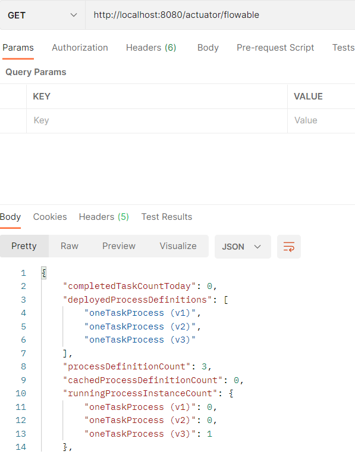
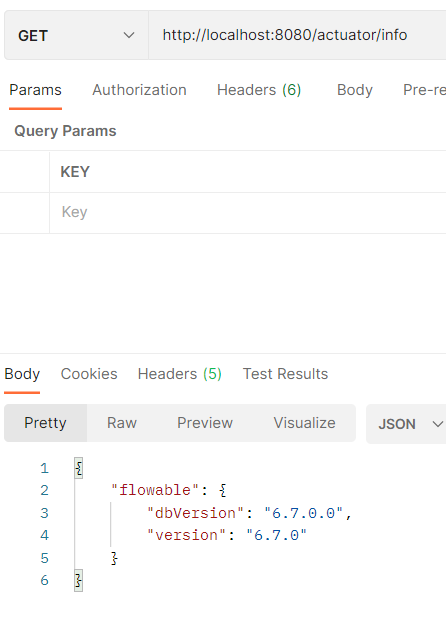

# 集成Spring Boot

### 兼容性

flowable的starter支持Spring Boot 2.0+ 和1.5。但它主要支持Spring Boot 2.0+，这就意味着 actuator endpoints 也只支持Spring Boot 2.0+。flowable的starter已经引用了Spring Boot Starter，如何你需要使用其它版本的Spring Boot Starter，你需要自己额外定义。

### 开始

在Spring Boot中使用flowable，你需要导入 `flowable-spring-boot-starter` 或者 `flowable-spring-boot-starter-rest` 的依赖：

```xml
<dependency>
    <groupId>org.flowable</groupId>
    <artifactId>flowable-spring-boot-starter</artifactId>
    <version>${flowable-version}</version>
</dependency>
```

```xml
<dependency>
    <groupId>org.flowable</groupId>
    <artifactId>flowable-spring-boot-starter-rest<artifactId>
    <version>${flowable-version}</version>
</dependency>
```

如果你不需要引入所有的引擎，你可以使用flowable其它的[starter](#flowable-starter)，这些将在后面讲到。

除了上面的依赖，你还需要导入你的数据库依赖或配置。

接下来你只需要简单地创建一个启动类，你的Spring Boot应用就可以跑起来了：

```java
package org.fade.demo.flowabledemo.springboot;

import org.springframework.boot.SpringApplication;
import org.springframework.boot.autoconfigure.SpringBootApplication;

/**
 * @author fade
 * @date 2021/10/07
 */
@SpringBootApplication
public class ExampleApplication {

    public static void main(String[] args) {
        SpringApplication.run(ExampleApplication.class, args);
    }

}
```

在你的Spring Boot应用启动的过程中，其实幕后发生了很多事(starter用的是 `flowable-spring-boot-starter` )：

* 数据源被自动创建，并被传递给 `ProcessEngineConfiguration` 
* `ProcessEngine` , `CmmnEngine` , `DmnEngine` , `FormEngine` , `ContentEngine` 和 `IdmEngine` bean被创建
* 所有的flowable service也以Spring Bean的方式暴露出来
* 创建了Spring Job Executor
* 所有processes目录下的BPMN 2.0 流程定义都被自动部署
* cases目录下的任何CMMN 1.1 事例都会被自动部署
* dmn目录下的任何DMN 1.1 dmn定义都会被自动部署
* forms目录下的任何Form定义都会被自动部署

下面是一个完整的例子：

```xml
<?xml version="1.0" encoding="UTF-8"?>
<definitions
        xmlns="http://www.omg.org/spec/BPMN/20100524/MODEL"
        xmlns:flowable="http://flowable.org/bpmn"
        targetNamespace="Examples">

    <process id="oneTaskProcess" name="The One Task Process">
        <startEvent id="theStart" />
        <sequenceFlow id="flow1" sourceRef="theStart" targetRef="theTask" />
        <userTask id="theTask" name="my task" flowable:assignee="kermit" />
        <sequenceFlow id="flow2" sourceRef="theTask" targetRef="theEnd" />
        <endEvent id="theEnd" />
    </process>

</definitions>
```

```java
package org.fade.demo.flowabledemo.springboot;

import org.flowable.engine.RepositoryService;
import org.flowable.engine.RuntimeService;
import org.flowable.engine.TaskService;
import org.springframework.boot.CommandLineRunner;
import org.springframework.boot.SpringApplication;
import org.springframework.boot.autoconfigure.SpringBootApplication;
import org.springframework.context.annotation.Bean;

/**
 * @author fade
 * @date 2021/10/07
 */
@SpringBootApplication
public class ExampleApplication {

    public static void main(String[] args) {
        SpringApplication.run(ExampleApplication.class, args);
    }

    @Bean
    public CommandLineRunner init(final RepositoryService repositoryService,
                                  final RuntimeService runtimeService,
                                  final TaskService taskService) {

        return new CommandLineRunner() {
            @Override
            public void run(String... strings) throws Exception {
                System.out.println("Number of process definitions : "
                        + repositoryService.createProcessDefinitionQuery().count());
                System.out.println("Number of tasks : " + taskService.createTaskQuery().count());
                runtimeService.startProcessInstanceByKey("oneTaskProcess");
                System.out.println("Number of tasks after process start: "
                        + taskService.createTaskQuery().count());
            }
        };
    }

}
```

注意上面的xml文件应该放置在resources/processes目录下，而启动类中的 `CommandLineRunner` 是用于在Spring Boot应用初始化后执行你所需要的代码逻辑

### 改变数据库和连接池

通过在配置文件中进行配置和添加相关的依赖可以实现改变数据库和连接池：

```yml
spring:
  datasource:
    url: jdbc:mysql:///flowable?characterEncoding=UTF-8&serverTimezone=UTC
    driver-class-name: com.mysql.cj.jdbc.Driver
    username: your-own-username
    password: your-own-password
    # 指定数据源或连接池类型
    type: com.alibaba.druid.pool.DruidDataSource
```

上面的例子就将数据库改为了MySQL，数据源改为了Druid

但是需要注意的是，在使用非内存数据库时，每次重启应用你对任务等查询的结果与使用内存数据库时是有可能不同的。并且在第一次启动应用时，如果你的数据库未初始化，flowable还会自动进行初始化操作（如：建表）。

### REST 支持

简单的REST支持，你只需要添加 `spring-boot-starter-web` 依赖即可：

```xml
<dependency>
    <groupId>org.springframework.boot</groupId>
    <artifactId>spring-boot-starter-web</artifactId>
    <version>${spring-boot-version}</version>
</dependency>
```

下面我们将模仿一个简单flowable REST 应用（启动流程实例和查询任务数量）：

* service

```java
package org.fade.demo.flowabledemo.springboot.service;

import org.flowable.engine.RuntimeService;
import org.flowable.engine.TaskService;
import org.flowable.task.api.Task;
import org.springframework.stereotype.Service;
import org.springframework.transaction.annotation.Transactional;

import javax.annotation.Resource;
import java.util.List;

/**
 * @author fade
 * @date 2021/10/07
 */
@Service
public class MyService {

    @Resource
    private RuntimeService runtimeService;

    @Resource
    private TaskService taskService;

    @Transactional(rollbackFor = Throwable.class)
    public void startProcess() {
        runtimeService.startProcessInstanceByKey("oneTaskProcess");
    }

    @Transactional(rollbackFor = Throwable.class)
    public List<Task> getTasks(String assignee) {
        return taskService.createTaskQuery().taskAssignee(assignee).list();
    }

}
```

* controller

```java
package org.fade.demo.flowabledemo.springboot.controller;

import org.fade.demo.flowabledemo.springboot.service.MyService;
import org.flowable.task.api.Task;
import org.springframework.http.MediaType;
import org.springframework.web.bind.annotation.*;

import javax.annotation.Resource;
import java.util.ArrayList;
import java.util.List;

/**
 * @author fade
 * @date 2021/10/07
 */
@RestController
public class MyRestController {

    @Resource
    private MyService myService;

    @PostMapping(value="/process")
    public void startProcessInstance() {
        myService.startProcess();
    }

    @RequestMapping(value="/tasks", method= RequestMethod.GET, produces= MediaType.APPLICATION_JSON_VALUE)
    public List<TaskRepresentation> getTasks(@RequestParam String assignee) {
        List<Task> tasks = myService.getTasks(assignee);
        List<TaskRepresentation> dtos = new ArrayList<>();
        for (Task task : tasks) {
            dtos.add(new TaskRepresentation(task.getId(), task.getName()));
        }
        return dtos;
    }

    static class TaskRepresentation {

        private String id;
        private String name;

        public TaskRepresentation(String id, String name) {
            this.id = id;
            this.name = name;
        }

        public String getId() {
            return id;
        }
        public void setId(String id) {
            this.id = id;
        }
        public String getName() {
            return name;
        }
        public void setName(String name) {
            this.name = name;
        }

    }

}
```

重新启动应用，调用controller中提供的REST API即可。


### JPA 支持

为了在Spring Boot中添加flowable对JPA的支持，你需要添加以下依赖：

```xml
<dependency>
    <groupId>org.springframework.boot</groupId>
    <artifactId>spring-boot-starter-data-jpa</artifactId>
    <version>${spring-boot-version}</version>
</dependency>
```

`spring-boot-starter-data-jpa` 会默认使用Hibernate作为JPA提供者

下面是一个例子：

* 实体类

```java
package org.fade.demo.flowabledemo.springboot.entity;

import javax.persistence.Entity;
import javax.persistence.GeneratedValue;
import javax.persistence.Id;
import java.util.Date;

/**
 * @author fade
 * @date 2021/10/08
 */
@Entity
public class Person {

    @Id
    @GeneratedValue
    private Long id;

    private String username;

    private String firstName;

    private String lastName;

    private Date birthDate;

    public Person() {
    }

    public Person(String username, String firstName, String lastName, Date birthDate) {
        this.username = username;
        this.firstName = firstName;
        this.lastName = lastName;
        this.birthDate = birthDate;
    }

    public Long getId() {
        return id;
    }

    public void setId(Long id) {
        this.id = id;
    }

    public String getUsername() {
        return username;
    }

    public void setUsername(String username) {
        this.username = username;
    }

    public String getFirstName() {
        return firstName;
    }

    public void setFirstName(String firstName) {
        this.firstName = firstName;
    }

    public String getLastName() {
        return lastName;
    }

    public void setLastName(String lastName) {
        this.lastName = lastName;
    }

    public Date getBirthDate() {
        return birthDate;
    }

    public void setBirthDate(Date birthDate) {
        this.birthDate = birthDate;
    }

}
```

* 配置文件

```yml
spring:
  datasource:
    url: jdbc:mysql:///flowable?characterEncoding=UTF-8&serverTimezone=UTC
    driver-class-name: com.mysql.cj.jdbc.Driver
    username: your-own-username
    password: your-own-password
    # 指定数据源或连接池类型
    type: com.alibaba.druid.pool.DruidDataSource
  jpa:
    hibernate:
      ddl-auto: update
```

其中 `spring.jpa.hibernate.ddl-auto=update` 的作用是让JPA自动建表

* repository

```java
package org.fade.demo.flowabledemo.springboot.dao;

import org.fade.demo.flowabledemo.springboot.entity.Person;
import org.springframework.data.jpa.repository.JpaRepository;
import org.springframework.stereotype.Repository;

/**
 * @author fade
 * @date 2021/10/08
 */
@Repository
public interface PersonRepository extends JpaRepository<Person, Long> {

    /**
     * 根据用户名查找Person
     * @param username 用户名
     * @return {@link Person}
     */
    Person findByUsername(String username);

}
```

* service

```java
package org.fade.demo.flowabledemo.springboot.service;

import org.fade.demo.flowabledemo.springboot.dao.PersonRepository;
import org.fade.demo.flowabledemo.springboot.entity.Person;
import org.flowable.engine.RuntimeService;
import org.flowable.engine.TaskService;
import org.flowable.task.api.Task;
import org.springframework.stereotype.Service;
import org.springframework.transaction.annotation.Transactional;

import javax.annotation.Resource;
import java.util.Date;
import java.util.HashMap;
import java.util.List;
import java.util.Map;

/**
 * @author fade
 * @date 2021/10/07
 */
@Service
@Transactional(rollbackFor = Throwable.class)
public class MyService {

    @Resource
    private RuntimeService runtimeService;

    @Resource
    private TaskService taskService;

    @Resource
    private PersonRepository personRepository;

    public void startProcess(String assignee) {

        Person person = personRepository.findByUsername(assignee);

        Map<String, Object> variables = new HashMap<>(16);
        variables.put("person", person);
        runtimeService.startProcessInstanceByKey("oneTaskProcess", variables);
    }

    public List<Task> getTasks(String assignee) {
        return taskService.createTaskQuery().taskAssignee(assignee).list();
    }

    public void createDemoUsers() {
        if (personRepository.findAll().size() == 0) {
            personRepository.save(new Person("jbarrez", "Joram", "Barrez", new Date()));
            personRepository.save(new Person("trademakers", "Tijs", "Rademakers", new Date()));
        }
    }

}
```

* 主启动类

```java
package org.fade.demo.flowabledemo.springboot;

import org.fade.demo.flowabledemo.springboot.service.MyService;
import org.springframework.boot.CommandLineRunner;
import org.springframework.boot.SpringApplication;
import org.springframework.boot.autoconfigure.SpringBootApplication;
import org.springframework.context.annotation.Bean;

/**
 * @author fade
 * @date 2021/10/07
 */
@SpringBootApplication
public class ExampleApplication {

    public static void main(String[] args) {
        SpringApplication.run(ExampleApplication.class, args);
    }

    @Bean
    public CommandLineRunner init(final MyService myService) {
        return strings -> myService.createDemoUsers();
    }

}
```

* controller

```java
package org.fade.demo.flowabledemo.springboot.controller;

import org.fade.demo.flowabledemo.springboot.service.MyService;
import org.flowable.task.api.Task;
import org.springframework.http.MediaType;
import org.springframework.web.bind.annotation.*;

import javax.annotation.Resource;
import java.util.ArrayList;
import java.util.List;

/**
 * @author fade
 * @date 2021/10/07
 */
@RestController
public class MyRestController {

    @Resource
    private MyService myService;

    @PostMapping(value="/process")
    public void startProcessInstance(@RequestBody StartProcessRepresentation startProcessRepresentation) {
        myService.startProcess(startProcessRepresentation.getAssignee());
    }

    @RequestMapping(value="/tasks", method= RequestMethod.GET, produces= MediaType.APPLICATION_JSON_VALUE)
    public List<TaskRepresentation> getTasks(@RequestParam String assignee) {
        List<Task> tasks = myService.getTasks(assignee);
        List<TaskRepresentation> dtos = new ArrayList<>();
        for (Task task : tasks) {
            dtos.add(new TaskRepresentation(task.getId(), task.getName()));
        }
        return dtos;
    }

    static class TaskRepresentation {

        private String id;
        private String name;

        public TaskRepresentation(String id, String name) {
            this.id = id;
            this.name = name;
        }

        public String getId() {
            return id;
        }
        public void setId(String id) {
            this.id = id;
        }
        public String getName() {
            return name;
        }
        public void setName(String name) {
            this.name = name;
        }

    }

    static class StartProcessRepresentation {

        private String assignee;

        public String getAssignee() {
            return assignee;
        }

        public void setAssignee(String assignee) {
            this.assignee = assignee;
        }
    }

}
```

* 流程定义

```xml
<?xml version="1.0" encoding="UTF-8"?>
<definitions
        xmlns="http://www.omg.org/spec/BPMN/20100524/MODEL"
        xmlns:flowable="http://flowable.org/bpmn"
        targetNamespace="Examples">

    <process id="oneTaskProcess" name="The One Task Process">
        <startEvent id="theStart" />
        <sequenceFlow id="flow1" sourceRef="theStart" targetRef="theTask" />
        <userTask id="theTask" name="my task" flowable:assignee="${person.id}"/>
        <sequenceFlow id="flow2" sourceRef="theTask" targetRef="theEnd" />
        <endEvent id="theEnd" />
    </process>

</definitions>
```

### Flowable Actuator Endpoints

为了使用Actuator Endpoints，你需要导入以下依赖：

```xml
<dependency>
    <groupId>org.flowable</groupId>
    <artifactId>flowable-spring-boot-starter-actuator</artifactId>
    <version>${flowable-version}</version>
</dependency>
```

flowable为正在运行的流程提供了 `Spring Boot Actuator Endpoint` 。默认情况下flowable的endpoint被映射为 `/actuator/flowable` ，但是Spring Boot默认只暴露少许endpoint。为了让flowable的endpoint可以生效，你需要在配置环境中做一些配置：

* yml

```yml
management:
 endpoints:
   web:
     exposure:
       include: '*'
```

* properties

```properties
#management.endpoint.flowable.enabled=true
management.endpoints.web.exposure.include=*
```

重启应用，此时便可以通过暴露的endpoint查看flowable正在运行的流程信息了。




### Flowable Info Contributor

flowable也提供了Spring Boot的 InfoContributor



### 配置flowable应用

下面是flowable Spring Boot 支持的配置参数列表：

```properties
# [core](https://github.com/flowable/flowable-engine/blob/main/modules/flowable-spring-boot/flowable-spring-boot-starters/flowable-spring-boot-autoconfigure/src/main/java/org/flowable/spring/boot/FlowableProperties.java)
# 是否需要自动部署流程定义
flowable.check-process-definitions=true
# 是否需要把自定义的Mybatis映射文件添加进引擎（// TODO: 待验证）
flowable.custom-mybatis-mappers= 
# 需要添加进引擎的Mybatis映射文件的位置
flowable.custom-mybatis-x-m-l-mappers= 
# 如果数据库返回的元数据不正确，可以在这里设置schema用于检测/生成表
flowable.database-schema= 
# 数据库schema更新时所使用的策略
flowable.database-schema-update=true 
# 是否要使用db历史
flowable.db-history-used=true # Whether db history should be used.
# 自动部署的名称
flowable.deployment-name=SpringBootAutoDeployment
# 要使用的历史级别
flowable.history-level=audit 
# 自动部署时存放流程定义的目录
flowable.process-definition-location-prefix=classpath*:/processes/ 
# 路径为 `processDefinitionLocationPrefix` 的值下流程定义文件的后缀名
flowable.process-definition-location-suffixes=**.bpmn20.xml,**.bpmn 

# [process](https://github.com/flowable/flowable-engine/blob/main/modules/flowable-spring-boot/flowable-spring-boot-starters/flowable-spring-boot-autoconfigure/src/main/java/org/flowable/spring/boot/process/FlowableProcessProperties.java)
# 流程定义缓存中保存流程定义的最大数量。默认值为-1（缓存所有流程定义）
flowable.process.definition-cache-limit=-1 
# 在解析BPMN XML文件时进行额外检查，详情参考 // TODO: 补充 。但是在有些平台（如 JDK 6 、 JBoss）并不支持此特性，在这种情况下，你需要关闭这个特性
flowable.process.enable-safe-xml=true 
# 启动时加载Process servlet 的顺序（// TODO: 待验证）
flowable.process.servlet.load-on-startup=-1 
# Process servlet的名字
flowable.process.servlet.name=Flowable BPMN Rest API 
# Process servelet的context path
flowable.process.servlet.path=/process-api 

# [Process Async Executor]
# 是否启用异步执行器
flowable.process.async-executor-activate=true 
# 异步作业在被异步执行器取走后的锁定时间。在这段时间内，其它异步执行器不会尝试获取及锁定这个任务
flowable.process.async.executor.async-job-lock-time=PT5M 
# 异步作业获取线程在进行下次获取查询前的等待时间。只在当次没有取到新的异步作业，或者只取到很少的异步作业时生效。默认值 = 10秒
flowable.process.async.executor.default-async-job-acquire-wait-time=PT10S 
# 异步作业（包括定时器作业与异步执行）获取线程在队列满时，等待执行下次查询的等待时间
flowable.process.async.executor.default-queue-size-full-wait-time=PT5S 
# 定时器作业获取线程在进行下次获取查询前的等待时间。只在当次没有取到新的定时器作业，或者只取到很少的定时器作业时生效。默认值 = 10秒
flowable.process.async.executor.default-timer-job-acquire-wait-time=PT10S 
# ？？？
flowable.process.async.executor.max-async-jobs-due-per-acquisition=1 
# 定时器作业在被异步执行器取走后的锁定时间。在这段时间内，其它异步执行器不会尝试获取及锁定这个任务。
flowable.process.async.executor.timer-lock-time=PT5M 

# [CMMN](https://github.com/flowable/flowable-engine/blob/main/modules/flowable-spring-boot/flowable-spring-boot-starters/flowable-spring-boot-autoconfigure/src/main/java/org/flowable/spring/boot/cmmn/FlowableCmmnProperties.java)
# 是否部署资源。默认值为'true'
flowable.cmmn.deploy-resources=true 
# CMMN资源部署的名字
flowable.cmmn.deployment-name=SpringBootAutoDeployment 
# 在解析CMMN XML文件时进行额外检查，同样也有一些平台不支持此特性
flowable.cmmn.enable-safe-xml=true 
# 是否启用CMMN引擎
flowable.cmmn.enabled=true 
# CMMN资源的路径
flowable.cmmn.resource-location=classpath*:/cases/ 
# CMMN资源的后缀名
flowable.cmmn.resource-suffixes=**.cmmn,**.cmmn11,**.cmmn.xml,**.cmmn11.xml 
# 启动时加载CMMN servlet 的顺序
flowable.cmmn.servlet.load-on-startup=-1 
# CMMN servlet的名字
flowable.cmmn.servlet.name=Flowable CMMN Rest API 
# CMMN servlet的context path
flowable.cmmn.servlet.path=/cmmn-api 

# [CMMN Async Executor]
# 是否启用异步执行器
flowable.cmmn.async-executor-activate=true 
# 异步作业在被异步执行器取走后的锁定时间。在这段时间内，其它异步执行器不会尝试获取及锁定这个任务。
flowable.cmmn.async.executor.async-job-lock-time=PT5M 
# 异步作业获取线程在进行下次获取查询前的等待时间。只在当次没有取到新的异步作业，或者只取到很少的异步作业时生效。默认值 = 10秒
flowable.cmmn.async.executor.default-async-job-acquire-wait-time=PT10S 
# 异步作业（包括定时器作业与异步执行）获取线程在队列满时，等待执行下次查询的等待时间
flowable.cmmn.async.executor.default-queue-size-full-wait-time=PT5S 
# 定时器作业获取线程在进行下次获取查询前的等待时间。只在当次没有取到新的定时器作业，或者只取到很少的定时器作业时生效。默认值 = 10秒
flowable.cmmn.async.executor.default-timer-job-acquire-wait-time=PT10S 
# ???
flowable.cmmn.async.executor.max-async-jobs-due-per-acquisition=1 
# 定时器作业在被异步执行器取走后的锁定时间。在这段时间内，其它异步执行器不会尝试获取及锁定这个任务。
flowable.cmmn.async.executor.timer-lock-time=PT5M 

# [Content](https://github.com/flowable/flowable-engine/blob/main/modules/flowable-spring-boot/flowable-spring-boot-starters/flowable-spring-boot-autoconfigure/src/main/java/org/flowable/spring/boot/content/FlowableContentProperties.java)
flowable.content.enabled=true 
flowable.content.servlet.load-on-startup=-1 
flowable.content.servlet.name=Flowable Content Rest API 
flowable.content.servlet.path=/content-api 
# 如果根路径不存在，是否需要创建
flowable.content.storage.create-root=true 
# 存储content文件（如上传的任务附件，或表单文件）的根路径
flowable.content.storage.root-folder= 

# [DMN](https://github.com/flowable/flowable-engine/blob/main/modules/flowable-spring-boot/flowable-spring-boot-starters/flowable-spring-boot-autoconfigure/src/main/java/org/flowable/spring/boot/dmn/FlowableDmnProperties.java)
flowable.dmn.deploy-resources=true 
flowable.dmn.deployment-name=SpringBootAutoDeployment 
flowable.dmn.enable-safe-xml=true 
flowable.dmn.enabled=true 
flowable.dmn.history-enabled=true 
flowable.dmn.resource-location=classpath*:/dmn/ 
flowable.dmn.resource-suffixes=**.dmn,**.dmn.xml,**.dmn11,**.dmn11.xml 
flowable.dmn.servlet.load-on-startup=-1 
flowable.dmn.servlet.name=Flowable DMN Rest API 
flowable.dmn.servlet.path=/dmn-api 
# 如果希望避免抉择表命中策略检查导致的失败，可以将本参数设置为false。如此检查发现了错误，会直接返回错误前一刻的中间结果
flowable.dmn.strict-mode=true 

# [Form](https://github.com/flowable/flowable-engine/blob/main/modules/flowable-spring-boot/flowable-spring-boot-starters/flowable-spring-boot-autoconfigure/src/main/java/org/flowable/spring/boot/form/FlowableFormProperties.java)
flowable.form.deploy-resources=true .
flowable.form.deployment-name=SpringBootAutoDeployment 
flowable.form.enabled=true 
flowable.form.resource-location=classpath*:/forms/ 
flowable.form.resource-suffixes=**.form 
flowable.form.servlet.load-on-startup=-1 
flowable.form.servlet.name=Flowable Form Rest API 
flowable.form.servlet.path=/form-api 

# [IDM](https://github.com/flowable/flowable-engine/blob/main/modules/flowable-spring-boot/flowable-spring-boot-starters/flowable-spring-boot-autoconfigure/src/main/java/org/flowable/spring/boot/idm/FlowableIdmProperties.java)
flowable.idm.enabled=true 
# 使用的密码编码类型
flowable.idm.password-encoder= 
flowable.idm.servlet.load-on-startup=-1 
flowable.idm.servlet.name=Flowable IDM Rest API 
flowable.idm.servlet.path=/idm-api 

# [pIDM Ldap](https://github.com/flowable/flowable-engine/blob/main/modules/flowable-spring-boot/flowable-spring-boot-starters/flowable-spring-boot-autoconfigure/src/main/java/org/flowable/spring/boot/ldap/FlowableLdapProperties.java)
# 用户email的属性名
flowable.idm.ldap.attribute.email= 
# 用户名字的属性名
flowable.idm.ldap.attribute.first-name= 
# 用户组ID的属性名
flowable.idm.ldap.attribute.group-id= 
# 用户组名的属性名
flowable.idm.ldap.attribute.group-name= 
# 用户组类型的属性名
flowable.idm.ldap.attribute.group-type= 
# 用户姓的属性名
flowable.idm.ldap.attribute.last-name= 
# 用户ID的属性名
flowable.idm.ldap.attribute.user-id= 
# 查找用户与组的DN（标志名称 distinguished name）
flowable.idm.ldap.base-dn= 
# 设置`org.flowable.ldap.LDAPGroupCache`的大小。这是LRU缓存，用于缓存用户及组，以避免每次都查询LDAP系统
flowable.idm.ldap.cache.group-size=-1 
# 用于设置所有没有专用setter的LDAP连接参数。查看 http://docs.oracle.com/javase/tutorial/jndi/ldap/jndi.html 介绍的自定义参数。参数包括配置链接池，安全设置，等等
flowable.idm.ldap.custom-connection-parameters= 
# 是否启用LDAP IDM 服务
flowable.idm.ldap.enabled=false 
# 组查找的DN
flowable.idm.ldap.group-base-dn= 
# 初始化上下文工厂的类名
flowable.idm.ldap.initial-context-factory=com.sun.jndi.ldap.LdapCtxFactory 
# 连接LDAP系统的密码
flowable.idm.ldap.password= 
# LDAP系统的端口
flowable.idm.ldap.port=-1 
# 查询所有组所用的语句
flowable.idm.ldap.query.all-groups= 
# 查询所有用户所用的语句
flowable.idm.ldap.query.all-users= 
# 按照指定用户查询所属组所用的语句
flowable.idm.ldap.query.groups-for-user= 
# 按照给定全名查找用户所用的语句
flowable.idm.ldap.query.user-by-full-name-like= 
# 按照userId查找用户所用的语句
flowable.idm.ldap.query.user-by-id= 
# 按照groupId查找组所用的语句
flowable.idm.ldap.query.group-by-id= 
# 查询LDAP的超时时间（以毫秒计）。默认值为'0'，即“一直等待”
flowable.idm.ldap.search-time-limit=0 
# 连接LDAP系统所用的 `java.naming.security.authentication` 参数的值
flowable.idm.ldap.security-authentication=simple 
# LDAP系统的主机名
flowable.idm.ldap.server= 
# 连接LDAP系统的用户ID
flowable.idm.ldap.user= 
# 查找用户的DN
flowable.idm.ldap.user-base-dn= 

# [Flowable Mail](https://github.com/flowable/flowable-engine/blob/main/modules/flowable-spring-boot/flowable-spring-boot-starters/flowable-spring-boot-autoconfigure/src/main/java/org/flowable/spring/boot/FlowableMailProperties.java)
# 发送邮件时使用的默认发信人地址
flowable.mail.server.default-from=flowable@localhost 
# 强制的收信地址，如果这个配置被设置了，在 `MailActivity` 里配置的收信地址将不会生效
flowable.mail.server.force-to= 
# 邮件服务器
flowable.mail.server.host=localhost 
# 邮件服务器的登录密码
flowable.mail.server.password= 
# 邮件服务器的端口号
flowable.mail.server.port=1025 
# SSL邮件服务器的端口号
flowable.mail.server.ssl-port=1465 
# 是否使用SSL加密SMTP传输连接（即SMTPS/POPS)
flowable.mail.server.use-ssl=false 
# 使用或禁用STARTTLS加密
flowable.mail.server.use-tls=false 
# 邮件服务器的登录用户名。如果为空，则不需要登录
flowable.mail.server.username= 

# [Flowable Http](https://github.com/flowable/flowable-engine/blob/main/modules/flowable-spring-boot/flowable-spring-boot-starters/flowable-spring-boot-autoconfigure/src/main/java/org/flowable/spring/boot/FlowableHttpProperties.java)
# 是否使用系统属性 (e.g. http.proxyPort)
flowable.http.user-system-properties=false
# 连接http客户端的超时时间
flowable.http.connect-timeout=5s 
# http客户端的Socket超时时间
flowable.http.socket-timeout=5s 
# http客户端的连接请求超时时间
flowable.http.connection-request-timeout=5s 
# 请求http客户端的重试限制
flowable.http.request-retry-limit=3 
# 是否禁用http客户端的证书验证
flowable.http.disable-cert-verify=false 

# [Flowable REST]
# 是否开启跨域设置，如果设置为false，下面的配置都将失效
flowable.rest.app.cors.enabled=true 
# 是否运行在跨域请求中携带凭证
flowable.rest.app.cors.allow-credentials=true 
# 跨域所允许的远程主机，用逗号分隔
flowable.rest.app.cors.allowed-origins=* 
# 跨域请求所允许的headers，用逗号分隔
flowable.rest.app.cors.allowed-headers=* 
# 跨域请求所允许的请求方法，取值为DELETE,GET,PATCH,POST,PUT，用逗号分隔
flowable.rest.app.cors.allowed-methods=DELETE,GET,PATCH,POST,PUT 
# 跨域响应暴露的headers，用逗号分隔
flowable.rest.app.cors.exposed-headers=* 

# [Actuator]
# 缓存响应的最大时间
management.endpoint.flowable.cache.time-to-live=0ms 
# 是否开启flowable endpoint
management.endpoint.flowable.enabled=true 
```

### flowable自动配置类

* [ContentEngineAutoConfiguration](https://github.com/flowable/flowable-engine/blob/main/modules/flowable-spring-boot/flowable-spring-boot-starters/flowable-spring-boot-autoconfigure/src/main/java/org/flowable/spring/boot/content/ContentEngineAutoConfiguration.java)
* [ContentEngineServicesAutoConfiguration](https://github.com/flowable/flowable-engine/blob/main/modules/flowable-spring-boot/flowable-spring-boot-starters/flowable-spring-boot-autoconfigure/src/main/java/org/flowable/spring/boot/content/ContentEngineServicesAutoConfiguration.java)
* [CmmnEngineAutoConfiguration](https://github.com/flowable/flowable-engine/blob/main/modules/flowable-spring-boot/flowable-spring-boot-starters/flowable-spring-boot-autoconfigure/src/main/java/org/flowable/spring/boot/cmmn/CmmnEngineAutoConfiguration.java)
* [CmmnEngineServicesAutoConfiguration](https://github.com/flowable/flowable-engine/blob/main/modules/flowable-spring-boot/flowable-spring-boot-starters/flowable-spring-boot-autoconfigure/src/main/java/org/flowable/spring/boot/cmmn/CmmnEngineServicesAutoConfiguration.java)
* [DmnEngineAutoConfiguration](https://github.com/flowable/flowable-engine/blob/main/modules/flowable-spring-boot/flowable-spring-boot-starters/flowable-spring-boot-autoconfigure/src/main/java/org/flowable/spring/boot/dmn/DmnEngineAutoConfiguration.java)
* [DmnEngineServicesAutoConfiguration](https://github.com/flowable/flowable-engine/blob/main/modules/flowable-spring-boot/flowable-spring-boot-starters/flowable-spring-boot-autoconfigure/src/main/java/org/flowable/spring/boot/dmn/DmnEngineServicesAutoConfiguration.java)
* [EndpointAutoConfiguration](https://github.com/flowable/flowable-engine/blob/main/modules/flowable-spring-boot/flowable-spring-boot-starters/flowable-spring-boot-autoconfigure/src/main/java/org/flowable/spring/boot/EndpointAutoConfiguration.java)
* [FlowableInfoAutoConfiguration](https://github.com/flowable/flowable-engine/blob/main/modules/flowable-spring-boot/flowable-spring-boot-starters/flowable-spring-boot-autoconfigure/src/main/java/org/flowable/spring/boot/actuate/info/FlowableInfoAutoConfiguration.java)
* [FlowableLdapAutoConfiguration](https://github.com/flowable/flowable-engine/blob/main/modules/flowable-spring-boot/flowable-spring-boot-starters/flowable-spring-boot-autoconfigure/src/main/java/org/flowable/spring/boot/ldap/FlowableLdapAutoConfiguration.java)
* [FormEngineAutoConfiguration](https://github.com/flowable/flowable-engine/blob/main/modules/flowable-spring-boot/flowable-spring-boot-starters/flowable-spring-boot-autoconfigure/src/main/java/org/flowable/spring/boot/form/FormEngineAutoConfiguration.java)
* [FormEngineServicesAutoConfiguration](https://github.com/flowable/flowable-engine/blob/main/modules/flowable-spring-boot/flowable-spring-boot-starters/flowable-spring-boot-autoconfigure/src/main/java/org/flowable/spring/boot/form/FormEngineServicesAutoConfiguration.java)
* [IdmEngineAutoConfiguration](https://github.com/flowable/flowable-engine/blob/main/modules/flowable-spring-boot/flowable-spring-boot-starters/flowable-spring-boot-autoconfigure/src/main/java/org/flowable/spring/boot/idm/IdmEngineAutoConfiguration.java)
* [IdmEngineServicesAutoConfiguration](https://github.com/flowable/flowable-engine/blob/main/modules/flowable-spring-boot/flowable-spring-boot-starters/flowable-spring-boot-autoconfigure/src/main/java/org/flowable/spring/boot/idm/IdmEngineServicesAutoConfiguration.java)
* [ProcessEngineAutoConfiguration](https://github.com/flowable/flowable-engine/blob/main/modules/flowable-spring-boot/flowable-spring-boot-starters/flowable-spring-boot-autoconfigure/src/main/java/org/flowable/spring/boot/ProcessEngineAutoConfiguration.java)
* [RestApiAutoConfiguration](https://github.com/flowable/flowable-engine/blob/main/modules/flowable-spring-boot/flowable-spring-boot-starters/flowable-spring-boot-autoconfigure/src/main/java/org/flowable/spring/boot/RestApiAutoConfiguration.java)

### flowable starter

| starter | 描述 |
|----|----|
| `flowable-spring-boot-starter-cmmn` | 提供以独立运行模式启动CMMN引擎的依赖 |
| `flowable-spring-boot-starter-cmmn-rest` | 提供以独立运行模式启动CMMN引擎，并提供其REST API的依赖 |
| `flowable-spring-boot-starter-dmn` | 提供以独立运行模式启动DMN引擎的依赖 |
| `flowable-spring-boot-starter-dmn-rest` | 提供以独立运行模式启动DMN引擎，并提供其REST API的依赖 |
| `flowable-spring-boot-starter-process` | 提供以独立运行模式启动流程引擎的依赖 |
| `flowable-spring-boot-starter-process-rest` | 提供以独立运行模式启动流程引擎，并提供其REST API的依赖 |
| `flowable-spring-boot-starter` | 提供启动所有Flowable引擎（流程，CMMN，DMN，Form，Content及IDM）的依赖 |
| `flowable-spring-boot-starter-rest` | 提供启动所有Flowable引擎，并提供其REST API的依赖 |
| `flowable-spring-boot-starter-actuator` | 提供Spring Boot Actuator所需的依赖 |

### 使用Liquibase

Flowable引擎使用Liquibase管理数据库版本。这意味着会启用Spring Boot的 `LiquibaseAutoConfiguration` 。如果你通过设置 `spring.liquibase.enabled=false` 关闭了Liquibase，你的flowable应用将无法正常启动并抛出一个异常。

### 高级配置

###### 自定义引擎配置

如果你想要自定义引擎配置，你可以实现 `org.flowable.spring.boot.EngineConfigurationConfigurer<T>` 接口。其中泛型T是Spring环境下的引擎配置

// TODO: 补充示例

在纳入Spring管理后， `configure` 方法会在流程引擎创建前调用

###### 配置异步执行器

默认情况下， `AsyncExecutor` 共享同一个Spring `TaskExecutor` 及 `SpringRejectedJobsHandler` 。 如果需要为引擎提供专门的执行器，则需要使用 `@Process` 及 `@Cmmn` 注解定义的bean，如：

```java
@Configuration
public class MyConfiguration {

    @Process 
    @Bean
    public TaskExecutor processTaskExecutor() {
        return new SimpleAsyncTaskExecutor();
    }

    @Cmmn 
    @Bean
    public TaskExecutor cmmnTaskExecutor() {
        return new SyncTaskExecutor();
    }
}
```

如果使用了自定义的 `TaskExecutor` bean，则Flowable将不会再创建自己的bean。 也就是说如果使用 `@Process` 注解定义了bean，也需要使用 `@Cmmn` 或 `@Primary` 再定义一个bean。否则Cmmn异步执行器将使用流程引擎所用的bean。