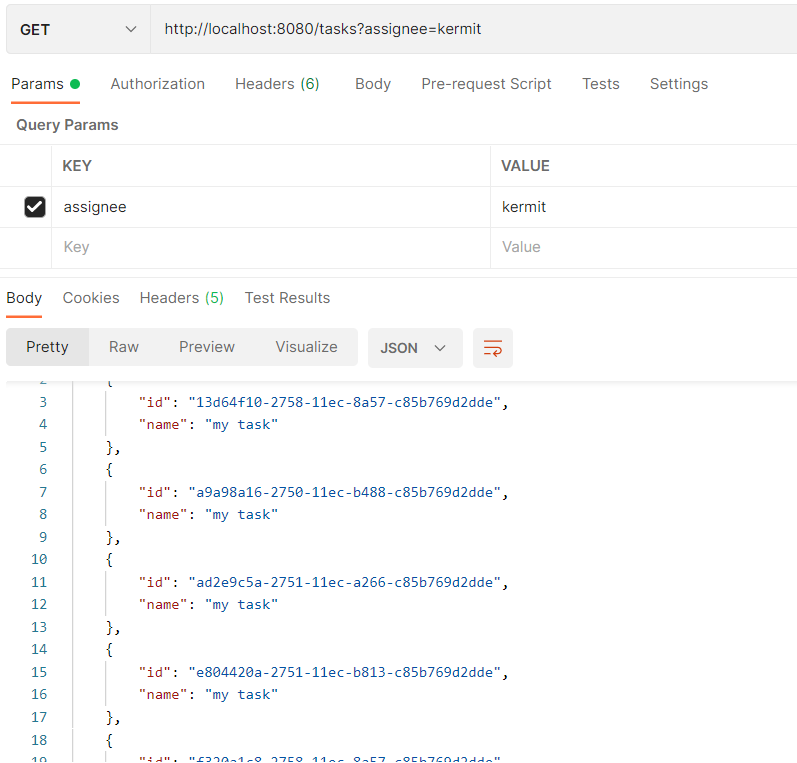

# 集成Spring Boot

### 兼容性

flowable的starter支持Spring Boot 2.0+ 和1.5。但它主要支持Spring Boot 2.0+，这就意味着 actuator endpoints 也只支持Spring Boot 2.0+。flowable的starter已经引用了Spring Boot Starter，如何你需要使用其它版本的Spring Boot Starter，你需要自己额外定义。

### 开始

在Spring Boot中使用flowable，你需要导入 `flowable-spring-boot-starter` 或者 `flowable-spring-boot-starter-rest` 的依赖：

```xml
<dependency>
    <groupId>org.flowable</groupId>
    <artifactId>flowable-spring-boot-starter</artifactId>
    <version>${flowable-version}</version>
</dependency>
```

```xml
<dependency>
    <groupId>org.flowable</groupId>
    <artifactId>flowable-spring-boot-starter-rest<artifactId>
    <version>${flowable-version}</version>
</dependency>
```

如果你不需要引入所有的引擎，你可以使用flowable其它的starter，这些将在后面讲到。

// TODO: 补充starter选择

除了上面的依赖，你还需要导入你的数据库依赖或配置。

接下来你只需要简单地创建一个启动类，你的Spring Boot应用就可以跑起来了：

```java
package org.fade.demo.flowabledemo.springboot;

import org.springframework.boot.SpringApplication;
import org.springframework.boot.autoconfigure.SpringBootApplication;

/**
 * @author fade
 * @date 2021/10/07
 */
@SpringBootApplication
public class ExampleApplication {

    public static void main(String[] args) {
        SpringApplication.run(ExampleApplication.class, args);
    }

}
```

在你的Spring Boot应用启动的过程中，其实幕后发生了很多事(starter用的是 `flowable-spring-boot-starter` )：

* 数据源被自动创建，并被传递给 `ProcessEngineConfiguration` 
* `ProcessEngine` , `CmmnEngine` , `DmnEngine` , `FormEngine` , `ContentEngine` 和 `IdmEngine` bean被创建
* 所有的flowable service也以Spring Bean的方式暴露出来
* 创建了Spring Job Executor
* 所有processes目录下的BPMN 2.0 流程定义都被自动部署
* cases目录下的任何CMMN 1.1 事例都会被自动部署
* dmn目录下的任何DMN 1.1 dmn定义都会被自动部署
* forms目录下的任何Form定义都会被自动部署

下面是一个完整的例子：

```xml
<?xml version="1.0" encoding="UTF-8"?>
<definitions
        xmlns="http://www.omg.org/spec/BPMN/20100524/MODEL"
        xmlns:flowable="http://flowable.org/bpmn"
        targetNamespace="Examples">

    <process id="oneTaskProcess" name="The One Task Process">
        <startEvent id="theStart" />
        <sequenceFlow id="flow1" sourceRef="theStart" targetRef="theTask" />
        <userTask id="theTask" name="my task" flowable:assignee="kermit" />
        <sequenceFlow id="flow2" sourceRef="theTask" targetRef="theEnd" />
        <endEvent id="theEnd" />
    </process>

</definitions>
```

```java
package org.fade.demo.flowabledemo.springboot;

import org.flowable.engine.RepositoryService;
import org.flowable.engine.RuntimeService;
import org.flowable.engine.TaskService;
import org.springframework.boot.CommandLineRunner;
import org.springframework.boot.SpringApplication;
import org.springframework.boot.autoconfigure.SpringBootApplication;
import org.springframework.context.annotation.Bean;

/**
 * @author fade
 * @date 2021/10/07
 */
@SpringBootApplication
public class ExampleApplication {

    public static void main(String[] args) {
        SpringApplication.run(ExampleApplication.class, args);
    }

    @Bean
    public CommandLineRunner init(final RepositoryService repositoryService,
                                  final RuntimeService runtimeService,
                                  final TaskService taskService) {

        return new CommandLineRunner() {
            @Override
            public void run(String... strings) throws Exception {
                System.out.println("Number of process definitions : "
                        + repositoryService.createProcessDefinitionQuery().count());
                System.out.println("Number of tasks : " + taskService.createTaskQuery().count());
                runtimeService.startProcessInstanceByKey("oneTaskProcess");
                System.out.println("Number of tasks after process start: "
                        + taskService.createTaskQuery().count());
            }
        };
    }

}
```

注意上面的xml文件应该放置在resources/processes目录下，而启动类中的 `CommandLineRunner` 是用于在Spring Boot应用初始化后执行你所需要的代码逻辑

### 改变数据库和连接池

通过在配置文件中进行配置和添加相关的依赖可以实现改变数据库和连接池：

```yml
spring:
  datasource:
    url: jdbc:mysql:///flowable?characterEncoding=UTF-8&serverTimezone=UTC
    driver-class-name: com.mysql.cj.jdbc.Driver
    username: root
    password: 1120.ypzpoi
    # 指定数据源或连接池类型
    type: com.alibaba.druid.pool.DruidDataSource
```

上面的例子就将数据库改为了MySQL，数据源改为了Druid

但是需要注意的是，在使用非内存数据库时，每次重启应用你对任务等查询的结果与使用内存数据库时是有可能不同的。并且在第一次启动应用时，如果你的数据库未初始化，flowable还会自动进行初始化操作（如：建表）。

### REST 支持

简单的REST支持，你只需要添加 `spring-boot-starter-web` 依赖即可：

```xml
<dependency>
    <groupId>org.springframework.boot</groupId>
    <artifactId>spring-boot-starter-web</artifactId>
    <version>${spring-boot-version}</version>
</dependency>
```

下面我们将模仿一个简单flowable REST 应用（启动流程实例和查询任务数量）：

* service

```java
package org.fade.demo.flowabledemo.springboot.service;

import org.flowable.engine.RuntimeService;
import org.flowable.engine.TaskService;
import org.flowable.task.api.Task;
import org.springframework.stereotype.Service;
import org.springframework.transaction.annotation.Transactional;

import javax.annotation.Resource;
import java.util.List;

/**
 * @author fade
 * @date 2021/10/07
 */
@Service
public class MyService {

    @Resource
    private RuntimeService runtimeService;

    @Resource
    private TaskService taskService;

    @Transactional(rollbackFor = Throwable.class)
    public void startProcess() {
        runtimeService.startProcessInstanceByKey("oneTaskProcess");
    }

    @Transactional(rollbackFor = Throwable.class)
    public List<Task> getTasks(String assignee) {
        return taskService.createTaskQuery().taskAssignee(assignee).list();
    }

}
```

* controller

```java
package org.fade.demo.flowabledemo.springboot.controller;

import org.fade.demo.flowabledemo.springboot.service.MyService;
import org.flowable.task.api.Task;
import org.springframework.http.MediaType;
import org.springframework.web.bind.annotation.*;

import javax.annotation.Resource;
import java.util.ArrayList;
import java.util.List;

/**
 * @author fade
 * @date 2021/10/07
 */
@RestController
public class MyRestController {

    @Resource
    private MyService myService;

    @PostMapping(value="/process")
    public void startProcessInstance() {
        myService.startProcess();
    }

    @RequestMapping(value="/tasks", method= RequestMethod.GET, produces= MediaType.APPLICATION_JSON_VALUE)
    public List<TaskRepresentation> getTasks(@RequestParam String assignee) {
        List<Task> tasks = myService.getTasks(assignee);
        List<TaskRepresentation> dtos = new ArrayList<>();
        for (Task task : tasks) {
            dtos.add(new TaskRepresentation(task.getId(), task.getName()));
        }
        return dtos;
    }

    static class TaskRepresentation {

        private String id;
        private String name;

        public TaskRepresentation(String id, String name) {
            this.id = id;
            this.name = name;
        }

        public String getId() {
            return id;
        }
        public void setId(String id) {
            this.id = id;
        }
        public String getName() {
            return name;
        }
        public void setName(String name) {
            this.name = name;
        }

    }

}
```

重新启动应用，调用controller中提供的REST API即可。

