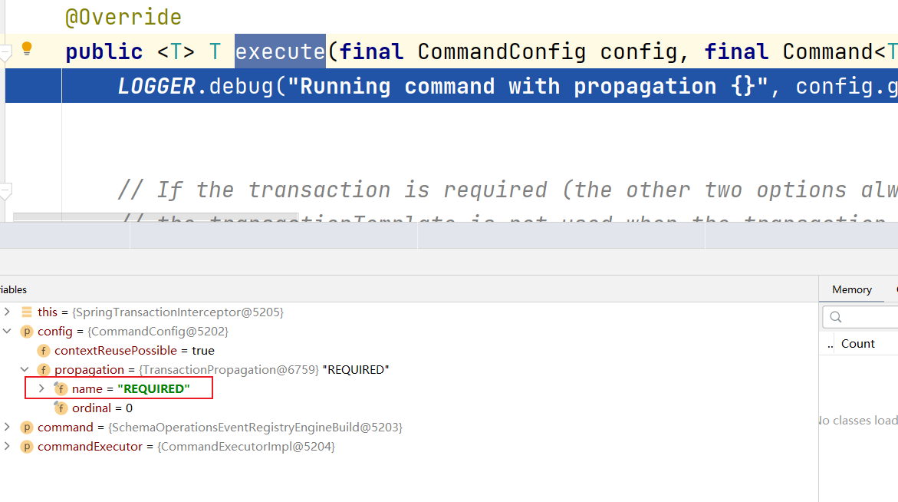
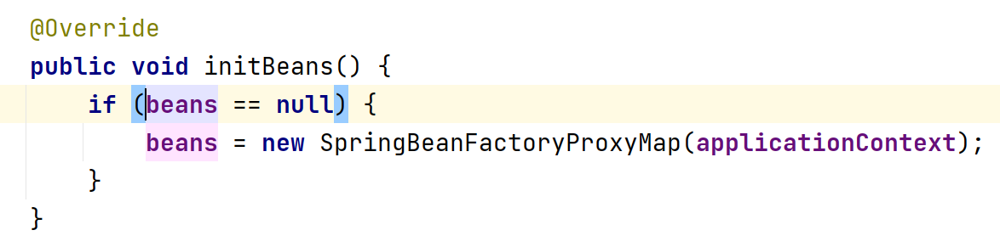

# 集成Spring

### `ProcessEngineFactoryBean`

通过配置 `org.flowable.spring.ProcessEngineFactoryBean` 来处理流程引擎配置和创建引擎。

下面是一个示例：

```xml
<bean id="processEngineConfiguration" class="org.flowable.spring.SpringProcessEngineConfiguration">
    <property name="jdbcUrl" value="jdbc:h2:mem:flowable;DB_CLOSE_DELAY=1000" />
    <property name="jdbcDriver" value="org.h2.Driver" />
    <property name="jdbcUsername" value="sa" />
    <property name="jdbcPassword" value="" />
    <property name="databaseSchemaUpdate" value="true" />
</bean>

<bean id="processEngine" class="org.flowable.spring.ProcessEngineFactoryBean">
    <property name="processEngineConfiguration" ref="processEngineConfiguration" />
</bean>
```

注意这里的 `ProcessEngineConfiguration` 使用的是 `org.flowable.spring.SpringProcessEngineConfiguration`

### 事务

```xml
<?xml version="1.0" encoding="UTF-8"?>
<beans xmlns="http://www.springframework.org/schema/beans"
       xmlns:xsi="http://www.w3.org/2001/XMLSchema-instance" xmlns:tx="http://www.springframework.org/schema/tx"
       xsi:schemaLocation="http://www.springframework.org/schema/beans http://www.springframework.org/schema/beans/spring-beans.xsd http://www.springframework.org/schema/tx http://www.springframework.org/schema/tx/spring-tx.xsd">

    <bean id="processEngineConfiguration" class="org.flowable.spring.SpringProcessEngineConfiguration">
        <property name="dataSource" ref="dataSource" />
        <property name="transactionManager" ref="transactionManager" />
        <property name="databaseSchemaUpdate" value="true" />
    </bean>

    <bean id="processEngine" class="org.flowable.spring.ProcessEngineFactoryBean">
        <property name="processEngineConfiguration" ref="processEngineConfiguration" />
    </bean>

    <bean id="dataSource" class="org.springframework.jdbc.datasource.SimpleDriverDataSource">
        <property name="driverClass" value="org.h2.Driver" />
        <property name="url" value="jdbc:h2:mem:flowable;DB_CLOSE_DELAY=1000" />
        <property name="username" value="sa" />
        <property name="password" value="" />
    </bean>

    <bean id="transactionManager" class="org.springframework.jdbc.datasource.DataSourceTransactionManager">
        <property name="dataSource" ref="dataSource" />
    </bean>

    <bean id="repositoryService" factory-bean="processEngine" factory-method="getRepositoryService" />

    <bean id="runtimeService" factory-bean="processEngine" factory-method="getRuntimeService" />

    <bean id="taskService" factory-bean="processEngine" factory-method="getTaskService" />

    <bean id="historyService" factory-bean="processEngine" factory-method="getHistoryService" />

    <bean id="managementService" factory-bean="processEngine" factory-method="getManagementService" />

    <tx:annotation-driven />

</beans>
```

上面的xml代码中，当给 `SpringProcessEngineConfiguration` 设置数据源时， `SpringProcessEngineConfiguration` 内部将会使用 `org.springframework.jdbc.datasource.TransactionAwareDataSourceProxy` 代理数据源，这是为了保证从数据源获取的SQL连接与Spring的事务可以协同工作。


如果自行在Spring配置中声明了 `TransactionAwareDataSourceProxy` ，最好不要将它用在已经配置Spring事务的资源上（例如 `DataSourceTransactionManager` 与 `JPATransactionManager` ）。即使你配置了，这些事务资源还是使用的未代理数据源。


`<tx:annotation-driven />` 是用于开启事务注解

你可以使用下面的代码创建由上面的配置文件配置的Spring应用上下文：

```java
ApplicationContext applicationContext = new ClassPathXmlApplicationContext("flowable.cfg.xml");
```

接下来你可以通过 `ApplicationContext` 获取你所需要的service bean，并利用这些bean完成前面我们说到的一系列操作：

```java
RepositoryService repositoryService = applicationContext.getBean("repositoryService", RepositoryService.class);
Deployment deployment = repositoryService.createDeployment()
                .addClasspathResource("holiday-request.bpmn20.xml")
                .deploy();
```

上面的代码就用 `RepositoryService` 完成了流程定义的部署

或者如果你想要在单元测试中使用Spring应用上下文你可以：

// FIXME: debug调试有正常语句输出，直接run或者debug返回后无法查找日志记录
// FIXME: 已尝试@FlowableTest 和 extends SpringFlowableTestCase 皆无法实现预期效果，后者甚至会报错

```java
package org.fade.demo.flowabledemo.springintegration.test;

import org.flowable.engine.RepositoryService;
import org.flowable.engine.test.Deployment;
import org.flowable.engine.test.FlowableTest;
import org.junit.jupiter.api.Test;
import org.slf4j.Logger;
import org.slf4j.LoggerFactory;
import org.springframework.test.context.ContextConfiguration;

@FlowableTest
@ContextConfiguration("classpath:flowable.cfg.xml")
public class TransactionTest {

    private static final Logger logger = LoggerFactory.getLogger(TransactionTest.class);

    private RepositoryService repositoryService;

    public TransactionTest(RepositoryService repositoryService) {
        this.repositoryService = repositoryService;
    }

    @Test
    @Deployment(resources = {"holiday-request.bpmn20.xml"})
    public void test() {
        org.flowable.engine.repository.Deployment deployment = repositoryService.createDeployment()
                .addClasspathResource("holiday-request.bpmn20.xml")
                .deploy();
        String deploymentId = deployment.getId();
        logger.info("Deployment id is " + deploymentId);
    }

}
```

这样你就可以在单元测试中注入一些你所需要的bean

上面的service bean， `ProcessEngineFactoryBean` 会为它们添加额外的拦截器，为它们的方法设置事务的传播行为为 `Propagation.REQUIRED` 的事务。我们可以在 `org.flowable.common.spring.SpringTransactionInterceptor` 的 `execute` 方法中设置断点验证：



### 表达式

在使用 `ProcessEngineFactoryBean` 时，所有的Spring bean对BPMN流程里的表达式默认是暴露的。



你可以通过给 `SpringProcessEngineConfiguration` 的beans属性配置map来配置表达式可以访问的bean。

下面是一个示例：

* 上下文配置文件

```xml
<?xml version="1.0" encoding="UTF-8"?>
<beans xmlns="http://www.springframework.org/schema/beans"
       xmlns:xsi="http://www.w3.org/2001/XMLSchema-instance" xmlns:tx="http://www.springframework.org/schema/tx"
       xsi:schemaLocation="http://www.springframework.org/schema/beans http://www.springframework.org/schema/beans/spring-beans.xsd http://www.springframework.org/schema/tx http://www.springframework.org/schema/tx/spring-tx.xsd">

    <bean id="processEngineConfiguration" class="org.flowable.spring.SpringProcessEngineConfiguration">
        <property name="dataSource" ref="dataSource" />
        <property name="transactionManager" ref="transactionManager" />
        <property name="databaseSchemaUpdate" value="true" />
        <!--禁止表达式访问serviceTask1-->
        <property name="beans">
            <map>
                <entry key="serviceTask2" value-ref="serviceTask2" />
            </map>
        </property>
    </bean>

    ......

    <bean id="serviceTask1" class="org.fade.demo.flowabledemo.springintegration.ServiceTask" />

    <bean id="serviceTask2" class="org.fade.demo.flowabledemo.springintegration.ServiceTask" />

</beans>
```

* 流程定义

```xml
<?xml version="1.0" encoding="UTF-8"?>
<definitions xmlns="http://www.omg.org/spec/BPMN/20100524/MODEL"
             xmlns:xsi="http://www.w3.org/2001/XMLSchema-instance"
             xmlns:xsd="http://www.w3.org/2001/XMLSchema"
             xmlns:bpmndi="http://www.omg.org/spec/BPMN/20100524/DI"
             xmlns:omgdc="http://www.omg.org/spec/DD/20100524/DC"
             xmlns:omgdi="http://www.omg.org/spec/DD/20100524/DI"
             xmlns:flowable="http://flowable.org/bpmn"
             typeLanguage="http://www.w3.org/2001/XMLSchema"
             expressionLanguage="http://www.w3.org/1999/XPath"
             targetNamespace="http://www.flowable.org/processdef">

    <process id="holidayRequest" name="Holiday Request" isExecutable="true">

        ......

        <serviceTask id="externalSystemCall" name="Enter holidays in external system"
                     flowable:expression="${serviceTask1.externalSystemCall(employee)}"/>
        
        ......

        <serviceTask id="sendRejectionMail" name="Send out rejection email"
                     flowable:expression="#{serviceTask1.sendRejectionMail(employee)}"/>
        
        ......

    </process>

</definitions>
```

* serviceTask使用到的bean

```java
package org.fade.demo.flowabledemo.springintegration;

import org.slf4j.Logger;
import org.slf4j.LoggerFactory;

import java.util.UUID;

/**
 * @author fade
 * @date 2021/10/06
 */
public class ServiceTask {

    private String id;

    private static final Logger logger = LoggerFactory.getLogger(ServiceTask.class);

    public ServiceTask() {
        this.id = UUID.randomUUID().toString();
    }

    public void externalSystemCall(String employee) {
        logger.info(this.id + ": Calling the external system for employee "
                + employee);
    }

    public void sendRejectionMail(String employee) {
        logger.info(this.id + ": Sending rejection email for employee "
                + employee);
    }

}
```

上面的示例中，在serviceTask中使用了id为 `serviceTask1` 的bean，以方法表达式的形式调用了bean的方法。

### 自动部署资源

可以通过在上下文配置的 `SpringProcessEngineConfiguration` 中设置 `deploymentResources` 来实现流程定义的自动部署。

```xml
<?xml version="1.0" encoding="UTF-8"?>
<beans xmlns="http://www.springframework.org/schema/beans"
       xmlns:xsi="http://www.w3.org/2001/XMLSchema-instance" xmlns:tx="http://www.springframework.org/schema/tx"
       xsi:schemaLocation="http://www.springframework.org/schema/beans http://www.springframework.org/schema/beans/spring-beans.xsd http://www.springframework.org/schema/tx http://www.springframework.org/schema/tx/spring-tx.xsd">

    <bean id="processEngineConfiguration" class="org.flowable.spring.SpringProcessEngineConfiguration">
        
        ......

        <property name="deploymentResources" value="classpath:holiday-request.bpmn20.xml" />
    </bean>

    ......

</beans>
```

这时可以把Java代码里部署流程定义的部分注释掉，可以发现程序是可以正常运行的。

默认情况下，这种自动部署会将符合我们所配置的所有流程定义组织在一起作为一个部署。

当然我们可以通过设置 `SpringProcessEngineConfiguration` 的 `deploymentMode` 属性自定义部署的方式。 `deploymentMode` 可以取值为：

* default 

  默认值，将所有资源组织在一个部署中，并对该部署进行重复过滤。如此当一组资源中的一个发生改变，便会进行重新部署

* single-resource

  为每个资源创建一个单独的部署，对每个部署都进行重复过滤。

* resource-parent-folder

  为同一个目录下的每个资源创建一个单独的部署，并对每个部署都进行重复过滤，但此时资源仍可以放在同一个目录被组织起来。

下面是一个指定部署模式的例子：

```xml
<?xml version="1.0" encoding="UTF-8"?>
<beans xmlns="http://www.springframework.org/schema/beans"
       xmlns:xsi="http://www.w3.org/2001/XMLSchema-instance" xmlns:tx="http://www.springframework.org/schema/tx"
       xsi:schemaLocation="http://www.springframework.org/schema/beans http://www.springframework.org/schema/beans/spring-beans.xsd http://www.springframework.org/schema/tx http://www.springframework.org/schema/tx/spring-tx.xsd">

    <bean id="processEngineConfiguration" class="org.flowable.spring.SpringProcessEngineConfiguration">
        
        ......

        <!--测试流程定义自动部署-->
        <property name="deploymentResources" value="classpath:holiday-request.bpmn20.xml" />
        <!--测试设置部署模式-->
        <property name="deploymentMode" value="single-resource" />
    </bean>

    ......

</beans>
```

如何你希望自定义部署模式，你可以继承 `org.flowable.spring.SpringProcessEngineConfiguration` 类并重写其 `getAutoDeploymentStrategy` 方法实现

// TODO: 验证

### 单元测试

###### JUnit 5

// TODO: 补充示例

###### JUnit 4

// TODO: 补充示例

### 在Hibernate 4.2.x+上使用JPA

在服务任务或者监听器里使用Hibernate 4.2.x+ JPA时，需要导入以下依赖（4.1.x-无须添加此依赖）：

```xml
<dependency>
  <groupId>org.springframework</groupId>
  <artifactId>spring-orm</artifactId>
  <version>${org.springframework.version}</version>
</dependency>
```

// TODO: 待验证