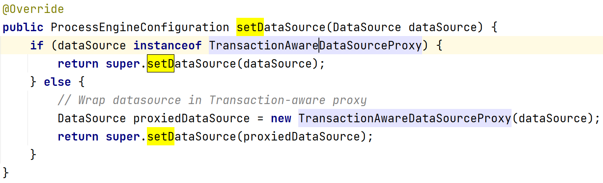
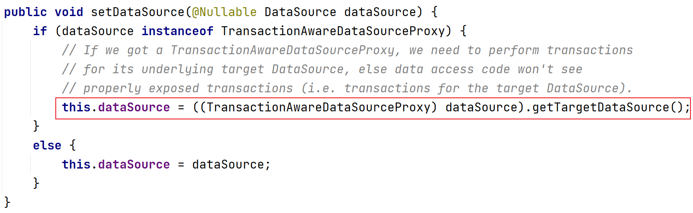

# 集成Spring

### `ProcessEngineFactoryBean`

通过配置 `org.flowable.spring.ProcessEngineFactoryBean` 来处理流程引擎配置和创建引擎。

下面是一个示例：

```xml
<bean id="processEngineConfiguration" class="org.flowable.spring.SpringProcessEngineConfiguration">
    <property name="jdbcUrl" value="jdbc:h2:mem:flowable;DB_CLOSE_DELAY=1000" />
    <property name="jdbcDriver" value="org.h2.Driver" />
    <property name="jdbcUsername" value="sa" />
    <property name="jdbcPassword" value="" />
    <property name="databaseSchemaUpdate" value="true" />
</bean>

<bean id="processEngine" class="org.flowable.spring.ProcessEngineFactoryBean">
    <property name="processEngineConfiguration" ref="processEngineConfiguration" />
</bean>
```

注意这里的 `ProcessEngineConfiguration` 使用的是 `org.flowable.spring.SpringProcessEngineConfiguration`

### 事务

```xml
<?xml version="1.0" encoding="UTF-8"?>
<beans xmlns="http://www.springframework.org/schema/beans"
       xmlns:xsi="http://www.w3.org/2001/XMLSchema-instance" xmlns:tx="http://www.springframework.org/schema/tx"
       xsi:schemaLocation="http://www.springframework.org/schema/beans http://www.springframework.org/schema/beans/spring-beans.xsd http://www.springframework.org/schema/tx http://www.springframework.org/schema/tx/spring-tx.xsd">

    <bean id="processEngineConfiguration" class="org.flowable.spring.SpringProcessEngineConfiguration">
        <property name="dataSource" ref="dataSource" />
        <property name="transactionManager" ref="transactionManager" />
        <property name="databaseSchemaUpdate" value="true" />
    </bean>

    <bean id="processEngine" class="org.flowable.spring.ProcessEngineFactoryBean">
        <property name="processEngineConfiguration" ref="processEngineConfiguration" />
    </bean>

    <bean id="dataSource" class="org.springframework.jdbc.datasource.SimpleDriverDataSource">
        <property name="driverClass" value="org.h2.Driver" />
        <property name="url" value="jdbc:h2:mem:flowable;DB_CLOSE_DELAY=1000" />
        <property name="username" value="sa" />
        <property name="password" value="" />
    </bean>

    <bean id="transactionManager" class="org.springframework.jdbc.datasource.DataSourceTransactionManager">
        <property name="dataSource" ref="dataSource" />
    </bean>

    <bean id="repositoryService" factory-bean="processEngine" factory-method="getRepositoryService" />

    <bean id="runtimeService" factory-bean="processEngine" factory-method="getRuntimeService" />

    <bean id="taskService" factory-bean="processEngine" factory-method="getTaskService" />

    <bean id="historyService" factory-bean="processEngine" factory-method="getHistoryService" />

    <bean id="managementService" factory-bean="processEngine" factory-method="getManagementService" />

    <tx:annotation-driven />

</beans>
```

上面的xml代码中，当给 `SpringProcessEngineConfiguration` 设置数据源时， `SpringProcessEngineConfiguration` 内部将会使用 `org.springframework.jdbc.datasource.TransactionAwareDataSourceProxy` 代理数据源，这是为了保证从数据源获取的SQL连接与Spring的事务可以协同工作。



如果自行在Spring配置中声明了 `TransactionAwareDataSourceProxy` ，最好不要将它用在已经配置Spring事务的资源上（例如 `DataSourceTransactionManager` 与 `JPATransactionManager` ）。即使你配置了，这些事务资源还是使用的未代理数据源。



`<tx:annotation-driven />` 是用于开启事务注解

你可以使用下面的代码创建由上面的配置文件配置的Spring应用上下文：

```java
ApplicationContext applicationContext = new ClassPathXmlApplicationContext("flowable.cfg.xml");
```

接下来你可以通过 `ApplicationContext` 获取你所需要的service bean，并利用这些bean完成前面我们说到的一系列操作：

```java
RepositoryService repositoryService = applicationContext.getBean("repositoryService", RepositoryService.class);
Deployment deployment = repositoryService.createDeployment()
                .addClasspathResource("holiday-request.bpmn20.xml")
                .deploy();
```

上面的代码就用 `RepositoryService` 完成了流程定义的部署

或者如果你想要在单元测试中使用Spring应用上下文你可以：

// FIXME: debug调试有正常语句输出，直接run或者debug返回后无法查找日志记录
// FIXME: 已尝试@FlowableTest 和 extends SpringFlowableTestCase 皆无法实现预期效果，后者甚至会报错

```java
package org.fade.demo.flowabledemo.springintegration.test;

import org.flowable.engine.RepositoryService;
import org.flowable.engine.test.Deployment;
import org.flowable.engine.test.FlowableTest;
import org.junit.jupiter.api.Test;
import org.slf4j.Logger;
import org.slf4j.LoggerFactory;
import org.springframework.test.context.ContextConfiguration;

@FlowableTest
@ContextConfiguration("classpath:flowable.cfg.xml")
public class TransactionTest {

    private static final Logger logger = LoggerFactory.getLogger(TransactionTest.class);

    private RepositoryService repositoryService;

    public TransactionTest(RepositoryService repositoryService) {
        this.repositoryService = repositoryService;
    }

    @Test
    @Deployment(resources = {"holiday-request.bpmn20.xml"})
    public void test() {
        org.flowable.engine.repository.Deployment deployment = repositoryService.createDeployment()
                .addClasspathResource("holiday-request.bpmn20.xml")
                .deploy();
        String deploymentId = deployment.getId();
        logger.info("Deployment id is " + deploymentId);
    }

}
```

这样你就可以在单元测试中注入一些你所需要的bean

//TODO: 待验证： 上面的service bean， `ProcessEngineFactoryBean` 会为它们添加额外的拦截器，为它们的方法设置事务的传播行为为 `Propagation.REQUIRED` 的事务。


